# AMP Email Interactive Shopping Experience - System Design

## 1. Overview

### 1.1 Purpose
Transform the current AMP email template generation flow into an **AI-powered interactive shopping experience builder** that creates dynamic, in-email shopping environments where users can browse products, customize options, add to cart, and initiate checkout without leaving their email client.

### 1.2 Vision
Build an intelligent agent-based system (inspired by bolt.new's architecture) that analyzes scraped product data and brand guidelines to generate fully interactive AMP email templates featuring product carousels, real-time inventory, dynamic pricing, interactive forms, and seamless checkout flows.

### 1.3 Core Value Proposition
- **Zero-Click Commerce**: Complete shopping journey within email inbox
- **AI-Generated Interactivity**: Automated creation of complex AMP components
- **Brand-Aware Design**: Templates that respect and reflect brand guidelines
- **Enhanced Product Imagery**: Background-removed and regenerated product photos
- **Dynamic Content**: Real-time product data, pricing, and availability

### 1.4 Key Differentiators
| Traditional Flow | New Interactive Flow |
|-----------------|---------------------|
| Static product images | Background-removed, AI-enhanced imagery |
| Single CTA to website | Multi-step shopping within email |
| Generic templates | Brand-aware, custom interactive experiences |
| Manual template coding | AI agent-generated AMP components |
| Static content | Dynamic, real-time product data |

## 2. System Architecture

### 2.1 High-Level Architecture

``mermaid
graph TB
    subgraph Input Layer
        A[Product URL] --> B[Product Scraper Service]
        A --> C[Extract Images API]
    end
    
    subgraph Data Enrichment Layer
        B --> D[Product Data<br/>Name, Price, Description]
        B --> E[Brand Guidelines<br/>Colors, Fonts, Tone]
        C --> F[Product Images Array]
    end
    
    subgraph AI Processing Layer
        F --> G[Image Background Removal]
        G --> H[Background Regeneration]
        H --> I[Labeled Product Images]
        
        D --> J[App Agent Core]
        E --> J
        I --> J
    end
    
    subgraph Interactive Template Generation
        J --> K[AMP Component Generator]
        K --> L[Product Carousel]
        K --> M[Interactive Forms]
        K --> N[Add to Cart]
        K --> O[Checkout Initiator]
        K --> P[Dynamic Pricing]
    end
    
    subgraph Output Layer
        L --> Q[Complete AMP Email Template]
        M --> Q
        N --> Q
        O --> Q
        P --> Q
        Q --> R[Template Validation]
        R --> S[Deployment Ready]
    end
```

### 2.2 Component Architecture

``mermaid
graph LR
    subgraph Core Services
        A[Product Scraper] 
        B[Image Extraction]
        C[Brand Analyzer]
        D[Image AI Service]
        E[App Agent Engine]
    end
    
    subgraph Agent System
        E --> F[Template Architect]
        E --> G[Component Builder]
        E --> H[Style Generator]
        E --> I[Validation Engine]
    end
    
    subgraph Output Generation
        F --> J[AMP Structure]
        G --> K[Interactive Components]
        H --> L[Brand Styling]
        I --> M[Compliance Check]
    end
```

## 3. Workflow Design

### 3.1 End-to-End Flow

``mermaid
sequenceDiagram
    participant User
    participant API
    participant Scraper as Product Scraper
    participant ImageAPI as Extract Images API
    participant ImageAI as Image AI Service
    participant Agent as App Agent Engine
    participant Validator as AMP Validator
    participant CDN
    
    User->>API: POST /generate-interactive<br/>{productUrl, options}
    API->>Scraper: Scrape product page
    API->>ImageAPI: Extract product images
    
    par Data Collection
        Scraper-->>API: Product data + Brand guidelines
        ImageAPI-->>API: Array of product images
    end
    
    API->>ImageAI: Process images (remove/regenerate backgrounds)
    ImageAI->>ImageAI: Remove backgrounds
    ImageAI->>ImageAI: Generate new backgrounds
    ImageAI->>ImageAI: Apply proper labeling
    ImageAI-->>API: Enhanced, labeled images
    
    API->>Agent: Generate interactive template<br/>{productData, brandGuidelines, images}
    
    Agent->>Agent: Analyze shopping flow requirements
    Agent->>Agent: Design AMP component structure
    Agent->>Agent: Generate interactive elements
    Agent->>Agent: Apply brand styling
    Agent-->>API: Interactive AMP template
    
    API->>Validator: Validate AMP compliance
    Validator-->>API: Validation result
    
    alt Valid
        API->>CDN: Upload images
        CDN-->>API: CDN URLs
        API-->>User: Complete interactive template
    else Invalid
        API->>Agent: Regenerate with corrections
        Agent-->>API: Corrected template
    end
```

### 3.2 Image Processing Workflow

``mermaid
flowchart TD
    A[Product Images Array] --> B{For Each Image}
    B --> C[Background Removal AI]
    C --> D[Extract Subject]
    D --> E{Background Type Selection}
    
    E -->|Professional| F[White/Gradient Background]
    E -->|Lifestyle| G[Contextual Scene Background]
    E -->|Premium| H[Luxury Setting Background]
    
    F --> I[Apply New Background]
    G --> I
    H --> I
    
    I --> J[Image Labeling]
    J --> K{Label Type}
    K -->|Product Name| L[Add Product Name Overlay]
    K -->|Feature Tag| M[Add Feature Highlights]
    K -->|Price Tag| N[Add Dynamic Price Label]
    
    L --> O[Enhanced Image Set]
    M --> O
    N --> O
    
    O --> P[Upload to CDN]
    P --> Q[Return CDN URLs with Metadata]
```

## 4. Core Components

### 4.1 Product Scraper Enhancement

**Purpose**: Extract comprehensive product data and brand guidelines from product pages

**Data Extraction Schema**:

| Data Category | Fields | Source |
|--------------|--------|--------|
| Product Info | name, SKU, price, currency, description, variants, inventory | JSON-LD, Meta tags, DOM |
| Brand Guidelines | primary colors, secondary colors, font families, logo URL, tone | CSS analysis, Brand page |
| Product Images | hero images, gallery images, 360° views, lifestyle shots | IMG tags, Srcset |
| Shopping Features | size chart, color options, customization fields | Interactive elements |
| Business Rules | min/max quantity, shipping info, return policy | Product metadata |

**Enhancement Requirements**:
- Deep DOM analysis for variant options (size, color, material)
- Brand guideline extraction from homepage and style sheets
- Structured data parsing for real-time inventory
- Category and tag identification for template personalization

### 4.2 Image Extraction & Enhancement

**Image Extraction Flow**:
1. Use Extract.pics API to retrieve all product images
2. Filter and categorize images (hero, gallery, lifestyle, detail shots)
3. Prioritize high-resolution images (>800px width)
4. Extract image metadata (alt text, titles, captions)

**Image AI Processing Pipeline**:

``mermaid
stateDiagram-v2
    [*] --> ImageIngestion
    ImageIngestion --> BackgroundRemoval
    BackgroundRemoval --> SubjectIsolation
    SubjectIsolation --> QualityCheck
    
    QualityCheck --> BackgroundGeneration: Pass
    QualityCheck --> ManualFallback: Fail
    
    BackgroundGeneration --> StyleSelection
    StyleSelection --> Professional: Default
    StyleSelection --> Lifestyle: Context Aware
    StyleSelection --> Seasonal: Campaign Based
    
    Professional --> BackgroundRendering
    Lifestyle --> BackgroundRendering
    Seasonal --> BackgroundRendering
    
    BackgroundRendering --> LabelApplication
    LabelApplication --> MetadataEnrichment
    MetadataEnrichment --> CDNUpload
    
    ManualFallback --> OriginalImage
    OriginalImage --> CDNUpload
    
    CDNUpload --> [*]
```

**Image Labeling Strategy**:

| Label Type | Trigger Condition | Visual Treatment |
|-----------|------------------|------------------|
| Product Name | All images | Top-left overlay, brand font |
| Price Tag | Primary product image | Bottom-right, dynamic pricing |
| Discount Badge | Price drop detected | Top-right corner, animated |
| Feature Tag | Variant with unique feature | Bottom banner, accent color |
| New Arrival | Product age < 30 days | Top ribbon, highlight color |
| Low Stock | Inventory < threshold | Urgency indicator |

### 4.3 App Agent Engine (Bolt-Inspired)

**Agent Architecture**:

``mermaid
graph TB
    subgraph Agent Core
        A[Orchestrator] --> B[Template Architect Agent]
        A --> C[Component Builder Agent]
        A --> D[Style Generator Agent]
        A --> E[Validation Agent]
    end
    
    subgraph Knowledge Base
        F[AMP Component Library]
        G[Brand Pattern Database]
        H[Template Best Practices]
        I[Shopping UX Patterns]
    end
    
    subgraph Execution Environment
        J[Code Generator]
        K[Component Assembler]
        L[Style Compiler]
        M[Validator]
    end
    
    B --> F
    B --> H
    C --> F
    C --> I
    D --> G
    D --> H
    
    B --> J
    C --> K
    D --> L
    E --> M
    
    J --> N[AMP Template Output]
    K --> N
    L --> N
    M --> N
```

**Agent Responsibilities**:

1. **Template Architect Agent**
   - Analyzes product data to determine optimal template structure
   - Selects appropriate AMP components for shopping flow
   - Designs information hierarchy and user journey
   - Creates responsive layout blueprint

2. **Component Builder Agent**
   - Generates AMP carousel for product images
   - Creates interactive form components for variants
   - Builds add-to-cart functionality with amp-bind
   - Implements dynamic pricing displays
   - Constructs checkout initiation flow

3. **Style Generator Agent**
   - Applies brand colors to all components
   - Generates typography system from brand fonts
   - Creates consistent spacing and layout
   - Ensures mobile-first responsive design
   - Applies micro-interactions and animations

4. **Validation Agent**
   - Validates AMP specification compliance
   - Checks email client compatibility
   - Tests interactive component functionality
   - Verifies accessibility standards (WCAG 2.1)
   - Ensures fallback HTML for non-AMP clients

**Agent Decision Matrix**:

| Product Type | Template Structure | Key Components | Interaction Pattern |
|-------------|-------------------|----------------|---------------------|
| Single Product | Hero + Details + CTA | Carousel, Form, Add to Cart | Linear flow |
| Product Collection | Grid + Filters + Multi-CTA | List, Accordion, Multi-select | Browse and compare |
| Configurable Product | Builder Interface | Step form, Live preview, Summary | Step-by-step configuration |
| Subscription | Feature comparison | Pricing table, Toggle, CTA | Plan selection |

### 4.4 Interactive AMP Components

**Component Catalog**:

| Component | AMP Element | Purpose | Data Binding |
|-----------|------------|---------|--------------|
| Product Carousel | amp-carousel | Image gallery navigation | Static images array |
| Variant Selector | amp-selector | Size/color selection | amp-bind state |
| Quantity Picker | amp-bind + input | Quantity adjustment | Cart state |
| Add to Cart Button | amp-form + amp-bind | Cart action trigger | Product state |
| Price Display | amp-bind | Dynamic price updates | Variant state |
| Inventory Indicator | amp-list | Real-time stock status | API endpoint |
| Size Chart | amp-accordion | Expandable sizing info | Static content |
| Product Recommendations | amp-list | Related products | Recommendation API |
| Checkout Initiator | amp-link | Website cart deep link | URL with encoded data |
| Success Message | amp-bind | Confirmation display | Form submission state |

**Interactive Shopping Flow Example**:

``mermaid
stateDiagram-v2
    [*] --> EmailOpen
    EmailOpen --> BrowseProducts: View carousel
    BrowseProducts --> SelectVariant: Choose size/color
    SelectVariant --> AdjustQuantity: Set quantity
    AdjustQuantity --> ViewPrice: See updated total
    ViewPrice --> AddToCart: Click add to cart
    
    AddToCart --> CartConfirmation: Show success message
    CartConfirmation --> ContinueShopping: Browse more
    CartConfirmation --> InitiateCheckout: Proceed to checkout
    
    ContinueShopping --> BrowseProducts
    
    InitiateCheckout --> BuildCartURL: Encode selections
    BuildCartURL --> RedirectToLanding: Open smart landing page
    RedirectToLanding --> ExecuteCartAdd: Auto add-to-cart
    ExecuteCartAdd --> RedirectToWebsite: Navigate to cart
    
    RedirectToWebsite --> [*]
```

## 5. Data Models

### 5.1 Enhanced Product Schema

| Field | Type | Description | Source |
|-------|------|-------------|--------|
| id | string | Unique product identifier | Scraper |
| name | string | Product name | Scraper |
| brand | string | Brand name | Scraper / Brand analyzer |
| description | string | Product description | Scraper |
| price | object | {amount, currency, compareAt} | Scraper |
| variants | array | Size, color, material options | Scraper |
| images | array | {url, type, label, alt} | Image API + AI |
| inventory | object | {available, lowStockThreshold} | Scraper / API |
| features | array | Key product features | Scraper |
| specifications | object | Technical details | Scraper |
| shippingInfo | object | Delivery details | Scraper |
| brandGuidelines | object | Visual identity rules | Brand analyzer |

### 5.2 Brand Guidelines Schema

| Field | Type | Description | Extraction Method |
|-------|------|-------------|-------------------|
| primaryColor | string | Main brand color (hex) | CSS analysis |
| secondaryColors | array | Supporting colors | CSS analysis |
| accentColor | string | CTA/highlight color | Button analysis |
| fontFamily | object | {heading, body} | CSS font-family |
| logoUrl | string | Brand logo image | Header/footer extraction |
| tone | string | Brand voice (formal/casual/playful) | Content analysis |
| spacing | string | Layout density (compact/comfortable/spacious) | CSS spacing analysis |

### 5.3 Interactive Template Schema

| Field | Type | Description |
|-------|------|-------------|
| templateId | string | Unique template identifier |
| productId | string | Associated product |
| ampComponents | array | List of AMP elements used |
| interactiveFeatures | array | Interactive capabilities enabled |
| brandStyling | object | Applied brand guidelines |
| images | array | Enhanced images with CDN URLs |
| state | object | amp-bind state variables |
| apiEndpoints | object | Dynamic data sources |
| fallbackHtml | string | Non-AMP version |
| metadata | object | Generation details |

### 5.4 Cart Selections Schema

| Field | Type | Description |
|-------|------|-------------|
| productId | string | Product identifier |
| variantId | string | Selected variant identifier |
| color | string | Selected color |
| size | string | Selected size |
| quantity | number | Selected quantity |
| customizations | object | User-selected options (engraving, etc.) |
| productUrl | string | Original product URL |
| storeDomain | string | E-commerce site domain |

## 6. AMP Component Generation Logic

### 6.1 Component Selection Rules

**Decision Tree**:

``mermaid
flowchart TD
    A[Product Data Analysis] --> B{Has Variants?}
    B -->|Yes| C[Include amp-selector]
    B -->|No| D[Simple CTA]
    
    C --> E{Multiple Images?}
    D --> E
    
    E -->|Yes| F[Include amp-carousel]
    E -->|No| G[Single amp-img]
    
    F --> H{Real-time Inventory?}
    G --> H
    
    H -->|Yes| I[Include amp-list]
    H -->|No| J[Static content]
    
    I --> K{Customization Options?}
    J --> K
    
    K -->|Yes| L[Include amp-form with amp-bind]
    K -->|No| M[Simple add-to-cart]
    
    L --> N{Multiple Products?}
    M --> N
    
    N -->|Yes| O[Include product grid]
    N -->|No| P[Single product focus]
    
    O --> Q[Generate Template]
    P --> Q
```

### 6.2 AMP Component Specifications

**Product Carousel Structure**:
- Component: amp-carousel type="slides"
- Layout: responsive, auto-advance disabled
- Controls: arrows + indicators
- Image optimization: srcset for responsive images
- Interaction: swipe gestures, keyboard navigation

**Variant Selector Structure**:
- Component: amp-selector with amp-bind
- State management: selected variant updates price and inventory
- Visual feedback: selected state highlighting
- Validation: ensure selection before add-to-cart

**Add to Cart Form**:
- Component: amp-bind (state collection)
- Fields: product ID, variant ID, quantity
- Validation: required fields, quantity limits
- Success/Error handling: amp-bind state updates
- Cart state persistence: Store selections in amp-state

**Dynamic Pricing Display**:
- Component: amp-bind with calculation logic
- Triggers: variant selection, quantity change
- Format: currency symbol + formatted price
- Comparison: show original price if discounted
- Tax/shipping: conditional display based on locale

### 6.3 State Management Strategy

**amp-bind State Schema**:

| State Variable | Type | Purpose | Update Trigger |
|---------------|------|---------|----------------|
| selectedVariant | object | Current variant selection | amp-selector change |
| quantity | number | Selected quantity | Input field change |
| currentPrice | number | Calculated price | Variant or quantity change |
| inventory | number | Available stock | amp-list update |
| cartSelections | object | Complete cart data for URL | Any selection change |
| showCheckout | boolean | Checkout button visibility | Cart interaction |
| formValid | boolean | Form validation state | Input validation |

**State Update Flow**:

``mermaid
sequenceDiagram
    participant User
    participant Selector as amp-selector
    participant State as amp-bind State
    participant Display as Price Display
    participant Inventory as amp-list
    participant Link as Checkout Link
    
    User->>Selector: Select variant
    Selector->>State: Update selectedVariant
    State->>Display: Recalculate currentPrice
    State->>Inventory: Fetch variant inventory
    Inventory-->>State: Update inventory count
    State->>State: Update cartSelections
    
    User->>Link: Change quantity
    Link->>State: Update quantity
    State->>Display: Recalculate currentPrice
    State->>State: Update cartSelections
    
    User->>Link: Click "Buy Now"
    Link->>Link: Encode cartSelections
    Link->>Link: Generate landing page URL
    Link->>User: Navigate to landing page
```

## 7. AI-Powered Template Generation Process

### 7.1 Agent Workflow

**Phase 1: Analysis**
1. Parse product data structure
2. Identify product type and category
3. Analyze brand guidelines
4. Determine required interactivity level
5. Assess image quality and quantity

**Phase 2: Planning**
1. Select optimal template structure
2. Choose AMP components based on features
3. Design state management architecture
4. Plan cart handoff strategy
5. Create responsive layout strategy

**Phase 3: Generation**
1. Generate AMP boilerplate structure
2. Build component hierarchy
3. Implement amp-bind state logic
4. Apply brand styling system
5. Insert enhanced product images
6. Create fallback HTML

**Phase 4: Optimization**
1. Validate AMP specification compliance
2. Optimize for email client compatibility
3. Test interactive functionality
4. Ensure accessibility compliance
5. Minify and optimize output

### 7.2 Template Patterns Library

**Pattern 1: Single Product Focus**
- Hero image carousel (3-5 images)
- Product name and description
- Variant selector (size, color)
- Quantity picker
- Dynamic price display
- Add to cart button
- Product details accordion

**Pattern 2: Product Collection**
- Grid layout (2-3 columns)
- Product cards with hover states
- Quick view overlays
- Multi-select capabilities
- Bulk add to cart
- Filter/sort options

**Pattern 3: Customizable Product**
- Step-by-step configuration form
- Live preview with amp-bind
- Configuration summary
- Progressive disclosure
- Add to cart with full specs
- Price calculation at each step

**Pattern 4: Flash Sale / Limited Time**
- Countdown timer (amp-date-countdown)
- Urgent messaging
- Stock indicator
- Quick checkout flow
- Social proof elements
- Single-click add to cart

### 7.3 Brand Guideline Application

**Color System Generation**:
- Primary color → Main CTAs and headers
- Secondary colors → Accents and highlights
- Accent color → Interactive elements
- Background → Derived from brand or white
- Text colors → Contrast-compliant derivation

**Typography System**:
- Heading font → Product names, section headers
- Body font → Descriptions, details
- Fallback fonts → Web-safe alternatives
- Font sizes → Mobile-first responsive scale
- Line heights → Optimal readability

**Spacing System**:
- Compact → Dense information display
- Comfortable → Balanced layout (default)
- Spacious → Luxury/premium products
- Consistent units → 4px/8px grid system

## 8. API Endpoints Design

### 8.1 Interactive Template Generation Endpoint

**Endpoint**: `POST /api/v1/interactive/generate`

**Request Schema**:

| Field | Type | Required | Description |
|-------|------|----------|-------------|
| productUrl | string | Yes | Product page URL to scrape |
| templateType | enum | No | single, collection, configurable, flash-sale |
| imageEnhancement | object | No | Background removal and regeneration options |
| interactivityLevel | enum | No | basic, standard, advanced |
| brandOverrides | object | No | Manual brand guideline overrides |
| cartHandoffConfig | object | Yes | Landing page and cart configuration |

**cartHandoffConfig Schema**:

| Field | Type | Required | Description |
|-------|------|----------|-------------|
| landingPageUrl | string | Yes | Smart landing page base URL |
| storeDomain | string | Yes | E-commerce site domain |
| platform | enum | No | shopify, woocommerce, magento, custom |
| fallbackUrl | string | No | Direct product link if cart fails |

**Response Schema**:

| Field | Type | Description |
|-------|------|-------------|
| templateId | string | Unique template identifier |
| ampHtml | string | Complete AMP email template |
| fallbackHtml | string | Non-AMP version |
| productData | object | Scraped product information |
| brandGuidelines | object | Applied brand styling |
| enhancedImages | array | Processed images with CDN URLs |
| components | array | List of AMP components used |
| stateVariables | object | amp-bind state schema |
| metadata | object | Generation details and cost |

### 8.2 Image Enhancement Endpoint

**Endpoint**: `POST /api/v1/images/enhance`

**Request Schema**:

| Field | Type | Required | Description |
|-------|------|----------|-------------|
| imageUrls | array | Yes | Array of image URLs to enhance |
| productId | string | Yes | Product identifier |
| backgroundStyle | enum | No | professional, lifestyle, seasonal, luxury |
| labelingOptions | object | No | Labels to apply to images |
| outputFormat | enum | No | webp, jpeg, png |

**Response Schema**:

| Field | Type | Description |
|-------|------|-------------|
| enhancedImages | array | Processed images with metadata |
| cdnUrls | array | CDN URLs for email use |
| processingCost | number | AI processing cost |
| labels | array | Applied labels per image |

### 8.3 Brand Guidelines Extraction Endpoint

**Endpoint**: `POST /api/v1/brand/analyze`

**Request Schema**:

| Field | Type | Required | Description |
|-------|------|----------|-------------|
| domain | string | Yes | Brand website domain |
| analyzeDepth | enum | No | shallow, standard, deep |

**Response Schema**:

| Field | Type | Description |
|-------|------|-------------|
| brandGuidelines | object | Extracted brand identity |
| confidence | number | Extraction confidence score |
| sources | array | Pages analyzed for extraction |

## 9. Cart Handoff Strategy: URL Parameter Method

### 9.1 Approach Overview

**Strategy**: Deep Link with Encoded Cart Data

Use a lightweight URL parameter approach where all user selections are encoded in a deep link that triggers automatic cart population via a smart landing page.

**Key Advantages**:
- ✅ **Universal**: Works with any e-commerce platform
- ✅ **Simple**: No backend sessions or browser automation
- ✅ **Fast**: Instant redirect (<5 seconds total)
- ✅ **Reliable**: No API dependencies or complex integrations
- ✅ **Low Cost**: No compute resources for automation
- ✅ **Easy Maintenance**: Minimal code, high reliability

**Comparison with Alternative Approaches**:

| Aspect | URL Parameter Method | API Integration | Browser Automation |
|--------|---------------------|-----------------|--------------------|
| Universal Support | ✅ Any platform | ❌ Platform-specific | ✅ Any platform |
| Implementation | Simple | Medium | Complex |
| Reliability | 90%+ | 95%+ | 70-80% |
| Latency | 2-5 seconds | 1-3 seconds | 20-40 seconds |
| Cost | $0 | $0-50/10K | $200+/10K |
| Maintenance | Low | Medium | High |

### 9.2 Architecture

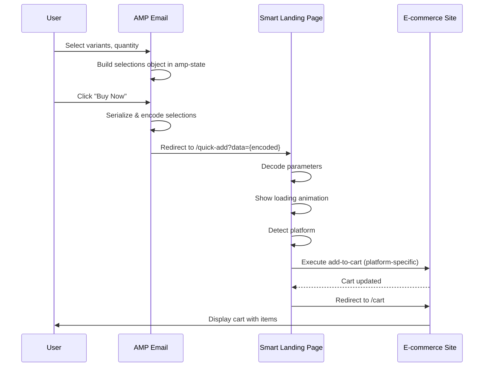

### 9.3 Selection Data Structure

**Cart Selections Object**:

| Field | Type | Required | Description | Example |
|-------|------|----------|-------------|--------|
| p | string | Yes | Product ID | "12345" |
| v | string | No | Variant ID | "var_67890" |
| c | string | No | Selected color | "blue" |
| s | string | No | Selected size | "L" |
| q | number | Yes | Quantity | 2 |
| cu | object | No | Customizations | {"m": "ABC"} |
| u | string | Yes | Product URL | "https://..." |

**Note**: Short key names keep URLs under 2000 character limit

**Encoding Process**:

1. Collect all selections in AMP email amp-state
2. Serialize to JSON with minimal keys
3. Encode JSON string as base64
4. Append to landing page URL
5. Add store domain as separate parameter

**Example**:

Selections object:
```json
{"p":"12345","v":"67890","c":"blue","s":"L","q":2}
```

Base64 encoded:
```
eyJwIjoiMTIzNDUiLCJ2IjoiNjc4OTAiLCJjIjoiYmx1ZSIsInMiOiJMIiwicSI6Mn0=
```

Final URL:
```
https://cart.yourplatform.com/quick-add?data=eyJwIjoiMTIzNDUiLCJ2IjoiNjc4OTAiLCJjIjoiYmx1ZSIsInMiOiJMIiwicSI6Mn0=&store=shop.example.com
```

### 9.4 Smart Landing Page Implementation

**Purpose**: Intermediate page that auto-executes cart actions and redirects to website

**Landing Page Flow**:

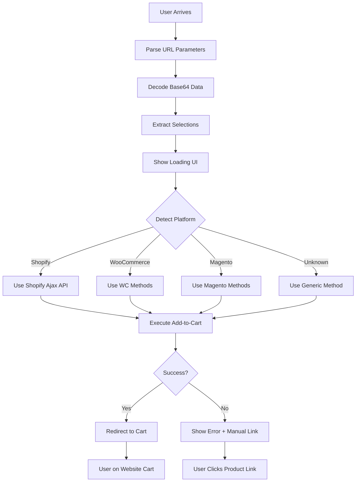

**Key Features**:

1. **Platform Detection**
   - Parse store domain from URL
   - Check for platform signatures (e.g., `.myshopify.com`)
   - Look up platform in database (from prior scraping)
   - Default to generic method if unknown

2. **Loading State**
   - Branded loading spinner
   - "Preparing your cart..." message
   - Progress indication (if possible)
   - Typical duration: 2-5 seconds

3. **Error Handling**
   - 10-second timeout
   - Friendly error messages
   - "View Product" fallback button
   - Analytics tracking for failures

### 9.5 Platform-Specific Cart Methods

**Shopify Implementation**:

```javascript
// Landing page JavaScript (conceptual)
const addToShopifyCart = async (selections) => {
  const response = await fetch(`https://${storeDomain}/cart/add.js`, {
    method: 'POST',
    headers: {'Content-Type': 'application/json'},
    body: JSON.stringify({
      items: [{
        id: selections.v,  // variant ID
        quantity: selections.q,
        properties: selections.cu || {}
      }]
    })
  });
  
  if (response.ok) {
    window.location.href = `https://${storeDomain}/cart`;
  }
};
```

**WooCommerce Implementation**:

```javascript
// Form submission approach
const addToWooCart = (selections) => {
  const form = document.createElement('form');
  form.method = 'POST';
  form.action = `https://${storeDomain}/?add-to-cart=${selections.p}`;
  
  // Add form fields
  const qtyInput = document.createElement('input');
  qtyInput.name = 'quantity';
  qtyInput.value = selections.q;
  form.appendChild(qtyInput);
  
  // Add variation attributes if present
  if (selections.c) {
    const colorInput = document.createElement('input');
    colorInput.name = 'attribute_pa_color';
    colorInput.value = selections.c;
    form.appendChild(colorInput);
  }
  
  document.body.appendChild(form);
  form.submit();
};
```

**Generic/Universal Fallback**:

```javascript
const genericAddToCart = (selections) => {
  // Redirect to product page with query params
  const params = new URLSearchParams({
    variant: selections.v,
    quantity: selections.q,
    color: selections.c,
    size: selections.s
  });
  
  window.location.href = `${selections.u}?${params.toString()}`;
};
```

**Platform Detection Logic**:

| Platform | Detection Signal | Cart Method |
|----------|-----------------|-------------|
| Shopify | `.myshopify.com` domain | Ajax API `/cart/add.js` |
| WooCommerce | `/wp-content/` in product URL | POST `/?add-to-cart={id}` |
| Magento | `/catalog/product/` in URL | POST `/checkout/cart/add` |
| BigCommerce | `.mybigcommerce.com` | API or form submission |
| Unknown | No signature | Direct product link with params |

### 9.6 URL Encoding Specification

**Browser URL Length Limits**:

| Browser | Maximum Length | Recommended Safe Limit |
|---------|---------------|------------------------|
| Chrome | 2MB (practical: ~32K) | 2000 characters |
| Firefox | ~65,000 characters | 2000 characters |
| Safari | ~80,000 characters | 2000 characters |
| Edge | ~2083 characters | 2000 characters |

**Data Optimization Strategies**:

1. **Minimal Schema**
   - Use 1-2 character keys instead of descriptive names
   - `p` instead of `productId`
   - `v` instead of `variantId`
   - `q` instead of `quantity`

2. **Omit Defaults**
   - Don't include quantity if it's 1
   - Skip fields with null values
   - Only include customizations if present

3. **Compression** (for large carts)
   - Use LZ-string compression library
   - Fallback to backend session if still too large
   - Monitor encoded string length before redirect

**Fallback for Large Data**:

If encoded data exceeds 1800 characters:
1. Create temporary backend session
2. Store cart selections with short TTL (5 minutes)
3. Use session ID in URL instead of full data
4. Landing page retrieves from session

### 9.7 AMP Email Integration

**State Collection in Email**:

AMP email uses `amp-bind` to track user selections:

```html
<!-- Conceptual AMP structure -->
<amp-state id="cartSelections">
  <script type="application/json">
    {
      "p": "12345",
      "v": "",
      "c": "",
      "s": "",
      "q": 1
    }
  </script>
</amp-state>

<!-- Variant selectors update state -->
<amp-selector on="select:AMP.setState({cartSelections: {c: event.targetOption}})">
  <div option="blue">Blue</div>
  <div option="red">Red</div>
</amp-selector>

<!-- Buy Now button with dynamic URL -->
<a [href]="generateCartUrl(cartSelections)"
   href="https://cart.platform.com/quick-add?data=..."
   target="_blank"
   class="buy-now-btn">
  Buy Now
</a>
```

**URL Generation Logic**:

Natural language description:
- When "Buy Now" clicked, amp-bind expression triggers
- Serialize `cartSelections` object to JSON
- Encode JSON string as base64 using amp-bind expression
- Construct landing page URL with encoded data
- Add store domain parameter
- User navigates to constructed URL

**Alternative: Form-Based Submission**:

If amp-bind URL generation is restricted:
```html
<form method="GET" 
      action="https://cart.platform.com/quick-add"
      target="_blank">
  <input type="hidden" 
         name="data" 
         [value]="base64Encode(JSON.stringify(cartSelections))">
  <input type="hidden" name="store" value="shop.example.com">
  <button type="submit">Buy Now</button>
</form>
```

### 9.8 Landing Page Technical Specification

**URL Structure**:
```
https://cart.yourplatform.com/quick-add?data={encodedSelections}&store={domain}
```

**HTML/CSS/JavaScript Components**:

1. **Loading UI**
   - Centered spinner animation
   - Brand logo (if available)
   - Progress text
   - Clean, minimal design

2. **JavaScript Execution**
   - URL parameter parsing
   - Base64 decoding
   - Platform detection
   - Cart method selection
   - Add-to-cart execution
   - Error handling
   - Redirect logic

3. **Error States**
   - Timeout (> 10s): "Taking too long. Try manually?"
   - Cart failed: "Couldn't add to cart. View product instead?"
   - Invalid data: "Something went wrong. View product?"
   - All show fallback product link button

**Performance Targets**:

| Metric | Target | Acceptable |
|--------|--------|------------|
| Page Load | <1s | <2s |
| Cart Execution | <3s | <7s |
| Total Time | <5s | <10s |
| Success Rate | >90% | >80% |

### 9.9 Backend Support Services (Optional)

**URL Shortener** (for long encoded data):

**Endpoint**: `POST /api/v1/cart/shorten`

**Purpose**: Create short URLs when encoded data exceeds limits

**Request**:
```json
{
  "selections": {"p": "12345", "v": "67890", ...},
  "storeDomain": "shop.example.com"
}
```

**Response**:
```json
{
  "shortCode": "abc123",
  "fullUrl": "https://cart.platform.com/quick-add/abc123",
  "expiresAt": "2025-01-15T12:00:00Z"
}
```

**TTL**: 24 hours

**Session Storage** (for very large carts):

**Endpoint**: `POST /api/v1/cart/temp-session`

**Purpose**: Store cart data server-side when URL encoding not feasible

**Request**: Same as shorten endpoint

**Response**: Session ID and landing URL

**TTL**: 1 hour (aggressive cleanup)

**Analytics Tracking**:

| Event | Data Captured | Purpose |
|-------|--------------|---------|  
| Landing Page Load | Source, timestamp | Track usage |
| Platform Detected | Domain, platform type | Success by platform |
| Cart Success | Time taken, platform | Performance metrics |
| Cart Failure | Error type, platform | Identify issues |
| Fallback Used | Reason | Optimization opportunities |

### 9.10 Security & Privacy

**Data Security**:
- No sensitive user information in URLs
- No email addresses, names, or payment data
- Only product selections (publicly available data)
- HTTPS required for all transfers
- Short TTL on any backend sessions

**CORS Configuration**:
- Landing page needs cross-origin access to store domains
- Proper CORS headers configured
- Fallback to form submission if CORS blocked
- Handle various browser security policies

**Rate Limiting**:
- Landing page: 100 requests/hour per IP
- URL shortener: 50 requests/hour per API key
- Session storage: 20 sessions/hour per campaign
- Analytics: Track unusual patterns

**Privacy Considerations**:
- No tracking of individual users
- Aggregate analytics only
- No persistent storage of cart data
- GDPR compliant (data minimization)
- Clear data retention policies

## 10. AMP Email Best Practices Integration

### 10.1 Salesforce AMP Best Practices Compliance

**Essential Requirements**:

1. **Valid AMP Structure**
   - Include proper AMP email doctype
   - Include required AMP scripts
   - Use only approved AMP components
   - Maintain proper nesting hierarchy

2. **Email Client Compatibility**
   - Gmail support (primary target)
   - Yahoo Mail support
   - Outlook.com support
   - Fallback HTML for non-supporting clients

3. **Performance Optimization**
   - Limit document size to <100KB
   - Optimize image loading with lazy-loading
   - Minimize CSS (max 50KB inline)
   - Reduce component complexity

4. **Security & Privacy**
   - Use HTTPS for all resources
   - Implement CORS for API endpoints
   - Validate all user inputs
   - No third-party scripts

5. **Accessibility**
   - ARIA labels for interactive elements
   - Keyboard navigation support
   - Screen reader compatibility
   - Color contrast compliance (WCAG 2.1 AA)

### 10.2 Interactive Component Best Practices

**Product Carousel Guidelines**:
- Maximum 10 slides per carousel
- Auto-advance disabled (user control)
- Clear navigation indicators
- Touch gesture support
- Accessibility labels

**Form Design Principles**:
- Progressive enhancement
- Clear validation messages
- Submit success/error states
- Required field indicators
- Inline error display

**Add to Cart Implementation**:
- Visual feedback on action
- Disable during processing (amp-bind)
- Show cart count update
- Error handling with retry
- Success confirmation

**Dynamic Content Updates**:
- Use amp-list for real-time data
- Implement loading states
- Handle API errors gracefully
- Cache responses appropriately
- Refresh intervals (if needed)

## 11. Testing Strategy

### 11.1 Template Validation

**Validation Layers**:

| Layer | Tool/Method | Success Criteria |
|-------|------------|------------------|
| AMP Compliance | amphtml-validator | No errors |
| Email Client Rendering | Litmus / Email on Acid | Consistent display |
| Interactive Functionality | Manual testing | All interactions work |
| Accessibility | aXe / WAVE | WCAG 2.1 AA compliance |
| Performance | Lighthouse | Email size <100KB |

### 11.2 Component Testing

**Test Scenarios**:

1. **Carousel Navigation**
   - Swipe left/right on mobile
   - Arrow click on desktop
   - Keyboard navigation (arrows)
   - Indicator click navigation

2. **Variant Selection**
   - Single selection works
   - Price updates correctly
   - Inventory updates
   - Visual feedback shows
   - State updates in amp-bind

3. **Add to Cart (State Collection)**
   - State populated correctly
   - All selections captured
   - URL encoding successful
   - Landing page link generated

4. **Dynamic Pricing**
   - Variant changes update price
   - Quantity changes update total
   - Discounts apply correctly
   - Currency formatting correct

5. **Cart Handoff Flow**
   - URL generation successful
   - Landing page loads quickly
   - Platform detected correctly
   - Add-to-cart executes
   - Redirect to cart works
   - Items appear in cart
   - Error states handled gracefully

### 11.3 End-to-End Cart Handoff Testing

**Test Matrix**:

| Test Case | Steps | Expected Result |
|-----------|-------|----------------|
| Single Item | Select variant → Buy Now → Landing → Cart | Item in website cart <10s |
| Multiple Variants | Select size, color → Buy Now | Correct variant in cart |
| Unknown Platform | Test on custom site | Generic method succeeds |
| Shopify Site | Test on Shopify store | Ajax API cart success |
| WooCommerce Site | Test on WooCommerce | Form submission success |
| Large Data | Many customizations | URL shortener fallback |
| Network Error | Simulate timeout | Error message + fallback |
| Landing Page Error | Cart API fails | Manual product link shown |

**Platform-Specific Tests**:

| Platform | Test Store | Method | Success Target |
|----------|------------|--------|----------------|
| Shopify | demo.myshopify.com | Ajax API | >95% |
| WooCommerce | woocommerce-demo.com | Form POST | >90% |
| Magento | magento-demo.com | Form POST | >85% |
| Custom | various | Generic fallback | >80% |

### 11.4 Cross-Client Testing

**Email Client Matrix**:

| Client | Version | AMP Support | Fallback Required |
|--------|---------|------------|-------------------|
| Gmail Web | Current | Full | No |
| Gmail Mobile | Current | Full | No |
| Yahoo Mail | Current | Partial | Yes |
| Outlook.com | Current | None | Yes |
| Apple Mail | Any | None | Yes |

## 12. Integration Architecture

### 12.1 Service Integration Map

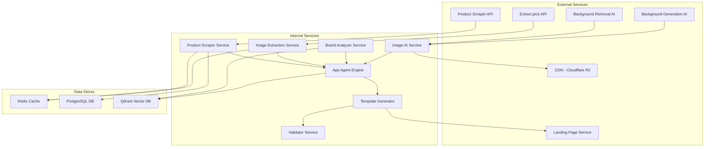

### 12.2 Data Flow Diagram

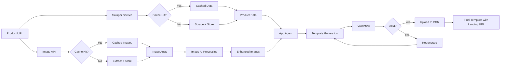

## 13. Cost & Performance Considerations

### 13.1 AI Processing Cost Estimation

| Operation | Provider | Cost per Unit | Estimated Volume | Monthly Cost |
|-----------|----------|--------------|------------------|--------------||
| Background Removal | Replicate / ClipDrop API | $0.002/image | 50,000 images | $100 |
| Background Generation | Ideogram / Stable Diffusion | $0.01/image | 50,000 images | $500 |
| Template Generation | DeepSeek R1 / Claude | $0.05/template | 10,000 templates | $500 |
| Image Enhancement | Replicate | $0.005/image | 20,000 images | $100 |
| **Landing Page Hosting** | **Cloud Provider** | **$20/month** | **Unlimited** | **$20** |
| **URL Shortener (Optional)** | **Redis + Compute** | **$0.0001/URL** | **5,000 URLs** | **$0.50** |
| **Total Monthly Cost** | - | - | - | **$1,220.50** |

### 13.2 Performance Targets

| Metric | Target | Measurement |
|--------|--------|-------------|
| Template Generation Time | <60 seconds | End-to-end API response |
| Image Processing Time | <10 seconds per image | Background removal + regeneration |
| Landing Page Load | <2 seconds | Time to interactive |
| Cart Execution | <5 seconds | Add-to-cart completion |
| Total Handoff Time | <8 seconds | Email click to website cart |
| AMP Validation Time | <2 seconds | Validation check |
| Email Size | <100KB | Final HTML size |
| Cache Hit Rate | >70% | Product data cache |
| Cart Success Rate | >85% | Successful cart additions |
| API Uptime | 99.5% | Service availability |

### 13.3 Caching Strategy

**Cache Layers**:

1. **Product Data Cache** (Redis)
   - TTL: 24 hours
   - Key pattern: `product:{url_hash}`
   - Invalidation: Manual or on product update

2. **Image Cache** (Redis)
   - TTL: 7 days
   - Key pattern: `images:{url_hash}`
   - Invalidation: On source change

3. **Brand Guidelines Cache** (Redis)
   - TTL: 7 days
   - Key pattern: `brand:{domain}`
   - Invalidation: Manual or weekly

4. **Template Cache** (Redis)
   - TTL: 1 hour
   - Key pattern: `template:{product_id}:{options_hash}`
   - Invalidation: On product/brand update

5. **URL Shortener Cache** (Redis)
   - TTL: 24 hours
   - Key pattern: `short:{code}`
   - Invalidation: On expiration

## 14. Migration Strategy

### 14.1 Phased Rollout

**Phase 1: Foundation (Weeks 1-2)**
- Enhance product scraper with brand guideline extraction
- Integrate background removal AI service
- Integrate background generation AI service
- Implement image labeling logic

**Phase 2: Agent Development (Weeks 3-5)**
- Build App Agent core architecture
- Develop Template Architect agent
- Develop Component Builder agent
- Develop Style Generator agent
- Implement Validation agent

**Phase 3: Component Library & Cart Handoff (Weeks 6-7)**
- Create AMP component templates
- Build state management patterns
- Develop interactive flow templates
- **Build smart landing page**
- **Implement platform detection**
- **Develop cart execution methods**
- Implement fallback HTML generation

**Phase 4: Integration & Testing (Week 8)**
- End-to-end integration testing
- Cart handoff testing across platforms
- Email client compatibility testing
- Performance optimization
- Cost monitoring setup

**Phase 5: Production Release (Week 9)**
- Beta release to select users
- Monitor performance and costs
- Track cart success rates
- Gather user feedback
- Iterate based on learnings

### 14.2 Backward Compatibility

**Legacy Support**:
- Maintain existing template generation endpoints
- Provide migration tool for old templates
- Support gradual feature adoption
- Ensure fallback to simple templates if interactive generation fails

## 15. Monitoring & Observability

### 15.1 Key Metrics

**Business Metrics**:
- Templates generated per day
- Interactive component usage rate
- Email engagement rate (opens, clicks, interactions)
- Add-to-cart rate from emails
- Landing page visit rate
- Cart handoff success rate
- Conversion rate (email to purchase)
- Platform-specific success rates

**Technical Metrics**:
- Template generation success rate
- Average generation time
- AI processing cost per template
- Cache hit rate
- API error rate
- Image enhancement success rate
- Landing page load time
- Cart execution time
- Cart success rate by platform

**Quality Metrics**:
- AMP validation pass rate
- Email client compatibility score
- Accessibility compliance rate
- User-reported issues
- Platform detection accuracy

### 15.2 Alerting Strategy

**Critical Alerts**:
- Template generation failure rate >5%
- API response time >120 seconds
- AI service downtime
- Cache system failure
- Landing page downtime
- Cart success rate <70%

**Warning Alerts**:
- Generation time >90 seconds
- Cost exceeds budget by 20%
- Cache hit rate <60%
- Validation failure rate >2%
- Landing page load time >3s
- Platform detection failures >10%

## 16. Security Considerations

### 16.1 Data Security

**Protection Measures**:
- Sanitize all scraped product data
- Validate image URLs before processing
- Implement rate limiting on all endpoints
- Encrypt sensitive brand data in cache
- Use signed URLs for CDN access
- Validate landing page parameters

### 16.2 AMP Security Requirements

**Compliance**:
- All resources loaded via HTTPS
- CORS headers configured for amp-list endpoints
- No inline JavaScript execution
- CSP headers for AMP compliance
- Validated email sender domain

### 16.3 API Security

**Authentication & Authorization**:
- API key authentication for all endpoints
- Rate limiting per API key
- Usage quota enforcement
- Request signature validation
- IP whitelist for sensitive operations

### 16.4 Landing Page Security

**Protection Measures**:
- Input validation on all parameters
- XSS prevention (sanitize decoded data)
- CSRF protection
- Rate limiting per IP (100 req/hour)
- Monitor for abuse patterns
- No storage of sensitive data
- Short-lived sessions (if any)

   - BigCommerce: Use Cart API with redirect
   - Most reliable but platform-dependent

4. **Universal Cart Link**
   - Format: `https://website.com/cart/add?variant={id}&quantity={qty}`
   - Standard across many platforms
   - May require JavaScript to handle multiple items

### 8.2 Interactive Template Generation Endpoint

**Endpoint**: `POST /api/v1/interactive/generate`

**Request Schema**:

| Field | Type | Required | Description |
|-------|------|----------|-------------|
| productUrl | string | Yes | Product page URL to scrape |
| templateType | enum | No | single, collection, configurable, flash-sale |
| imageEnhancement | object | No | Background removal and regeneration options |
| interactivityLevel | enum | No | basic, standard, advanced |
| brandOverrides | object | No | Manual brand guideline overrides |
| apiConfig | object | No | Dynamic data endpoint configuration |
| cartHandoffConfig | object | Yes | Website cart integration settings |

**cartHandoffConfig Schema**:

| Field | Type | Required | Description |
|-------|------|----------|-------------|
| strategy | enum | Yes | shadow_agent, api, hybrid (default: hybrid) |
| platform | enum | No | shopify, woocommerce, custom, magento, bigcommerce |
| cartApiEndpoint | string | No | Custom cart API URL (for API strategy) |
| sessionEndpoint | string | No | Backend session creation endpoint |
| cartPageUrl | string | Yes | Website cart page base URL |
| agentTimeout | number | No | Shadow agent timeout in seconds (default: 60) |
| sessionTTL | number | No | Session expiration in seconds (default: 1800) |
| fallbackStrategy | enum | No | api, direct_link (default: direct_link) |

**Response Schema**:

| Field | Type | Description |
|-------|------|-------------|
| templateId | string | Unique template identifier |
| ampHtml | string | Complete AMP email template |
| fallbackHtml | string | Non-AMP version |
| productData | object | Scraped product information |
| brandGuidelines | object | Applied brand styling |
| enhancedImages | array | Processed images with CDN URLs |
| components | array | List of AMP components used |
| stateVariables | object | amp-bind state schema |
| apiEndpoints | object | Required dynamic endpoints |
| cartSessionConfig | object | Cart handoff configuration (Shadow Agent or API) |
| metadata | object | Generation details and cost |

### 8.3 Shadow Cart Proxy Redirect Endpoint

**Endpoint**: `GET /api/v1/cart/redirect/:sessionId`

**Purpose**: Proxy endpoint that restores cart session cookies and redirects user to website cart

**Flow**:
1. User clicks cart link in email
2. Redirects to proxy URL with session ID
3. Backend retrieves stored cookies for session
4. Responds with 302 redirect + Set-Cookie headers
5. User lands on website with active cart session

**Response**:
- Status: 302 Found
- Location: Website cart URL
- Set-Cookie: Session cookies from Shadow Agent
- Cache-Control: no-store, no-cache

### 8.4 Cart Session Status Endpoint

**Endpoint**: `GET /api/v1/shadow-cart/status/:sessionId`

**Purpose**: Poll Shadow Agent progress (for long-running operations)

**Response Schema**:

| Field | Type | Description |
|-------|------|-------------|
| status | enum | pending, preparing, ready, failed |
| progress | number | 0-100 completion percentage |
| currentStep | string | "Navigating to product", "Selecting variants", etc. |
| estimatedTimeRemaining | number | Seconds until ready |
| cartUrl | string | Available when status=ready |
| error | object | Error details if failed |

### 8.5 Cart Session Creation Endpoint (API Fallback)

**Endpoint**: `POST /api/v1/cart/session`

**Purpose**: Create cart session via platform API (fallback when Shadow Agent unavailable)

**Request Schema**:

| Field | Type | Required | Description |
|-------|------|----------|-------------|
| items | array | Yes | Array of cart items |
| metadata | object | No | Additional context (email campaign, user ID) |
| platform | string | Yes | Target e-commerce platform |
| ttl | number | No | Custom session expiration (seconds) |

**items Array Schema**:

| Field | Type | Required | Description |
|-------|------|----------|-------------|
| productId | string | Yes | Product identifier |
| variantId | string | No | Variant identifier (size, color) |
| quantity | number | Yes | Item quantity |
| customizations | object | No | Custom options (engraving, etc.) |
| price | number | No | Item price (for validation) |

**Response Schema**:

| Field | Type | Description |
|-------|------|-------------|
| sessionToken | string | Unique session identifier |
| cartUrl | string | Complete URL to website cart |
| expiresAt | timestamp | Session expiration time |
| itemCount | number | Total items in session |

**Session Storage Example**:

```json
{
  "sessionToken": "cart_abc123xyz",
  "expiresAt": "2025-01-15T12:30:00Z",
  "platform": "shopify",
  "items": [
    {
      "productId": "prod_12345",
      "variantId": "var_67890",
      "quantity": 2,
      "customizations": {
        "size": "L",
        "color": "Blue"
      }
    }
  ],
  "metadata": {
    "source": "amp_email",
    "campaignId": "summer_sale_2025",
    "templateId": "tmpl_interactive_001"
  }
}
```

### 8.4 Cart Session Retrieval Endpoint

**Endpoint**: `GET /api/v1/cart/session/:token`

**Purpose**: Allow website to retrieve cart data and pre-populate user's cart

**Response Schema**:

| Field | Type | Description |
|-------|------|-------------|
| valid | boolean | Session validity status |
| items | array | Cart items |
| expiresAt | timestamp | Session expiration |
| metadata | object | Session metadata |

**Error Responses**:

| Status | Condition | Response |
|--------|-----------|----------|
| 404 | Session not found | {error: "Session not found or expired"} |
| 410 | Session expired | {error: "Session has expired"} |
| 200 | Valid session | {valid: true, items: [...]} |

### 8.5 Image Enhancement Endpoint

**Endpoint**: `POST /api/v1/images/enhance`

**Request Schema**:

| Field | Type | Required | Description |
|-------|------|----------|-------------|
| imageUrls | array | Yes | Array of image URLs to enhance |
| productId | string | Yes | Product identifier |
| backgroundStyle | enum | No | professional, lifestyle, seasonal, luxury |
| labelingOptions | object | No | Labels to apply to images |
| outputFormat | enum | No | webp, jpeg, png |

**Response Schema**:

| Field | Type | Description |
|-------|------|-------------|
| enhancedImages | array | Processed images with metadata |
| cdnUrls | array | CDN URLs for email use |
| processingCost | number | AI processing cost |
| labels | array | Applied labels per image |

### 8.6 Brand Guidelines Extraction Endpoint

**Endpoint**: `POST /api/v1/brand/analyze`

**Request Schema**:

| Field | Type | Required | Description |
|-------|------|----------|-------------|
| domain | string | Yes | Brand website domain |
| analyzeDepth | enum | No | shallow, standard, deep |

**Response Schema**:

| Field | Type | Description |
|-------|------|-------------|
| brandGuidelines | object | Extracted brand identity |
| confidence | number | Extraction confidence score |
| sources | array | Pages analyzed for extraction |

## 9. Cart Handoff Strategy: URL Parameter Method

### 9.1 Approach Overview

**Strategy**: Deep Link with Encoded Cart Data

Instead of complex API integrations or browser automation, use a lightweight URL parameter approach where all user selections are encoded in a deep link that triggers automatic cart population via a smart landing page.

**Key Advantages**:
- ✅ **Universal**: Works with any e-commerce platform
- ✅ **Simple**: No backend sessions or browser automation
- ✅ **Fast**: Instant redirect, no waiting
- ✅ **Reliable**: No API dependencies or element detection
- ✅ **Low Cost**: No compute resources for automation
- ✅ **Easy Maintenance**: Minimal code to maintain

### 9.2 Architecture

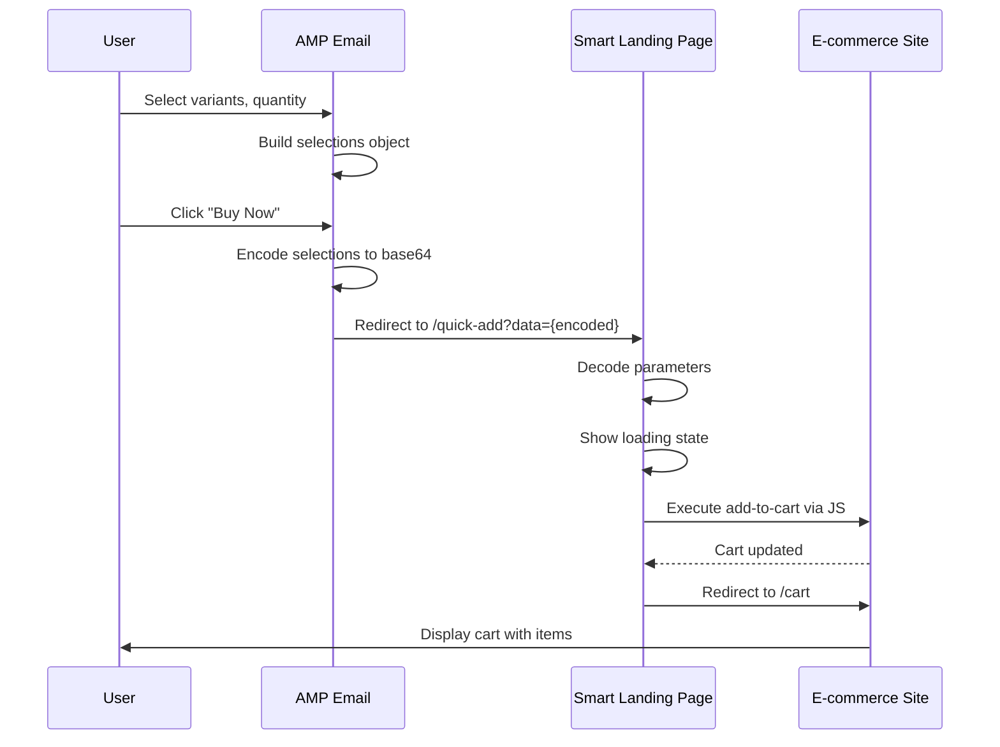

### 9.3 Selection Data Structure

**Selections Object Schema**:

| Field | Type | Description | Example |
|-------|------|-------------|--------|
| productId | string | Product identifier | "12345" |
| variantId | string | Variant identifier (optional) | "var_67890" |
| color | string | Selected color | "blue" |
| size | string | Selected size | "L" |
| quantity | number | Item quantity | 2 |
| customizations | object | Additional options | {"monogram": "ABC"} |
| productUrl | string | Original product URL | "https://site.com/product/..." |

**Encoding Example**:

Natural language description:
- Collect all user selections in email into JavaScript object
- Convert object to JSON string
- Encode JSON as base64 for URL safety
- Append to landing page URL as query parameter
- Landing page decodes and processes

### 9.4 Smart Landing Page Implementation

**Purpose**: Intermediate page hosted on our domain that auto-executes cart actions

**Landing Page Flow**:

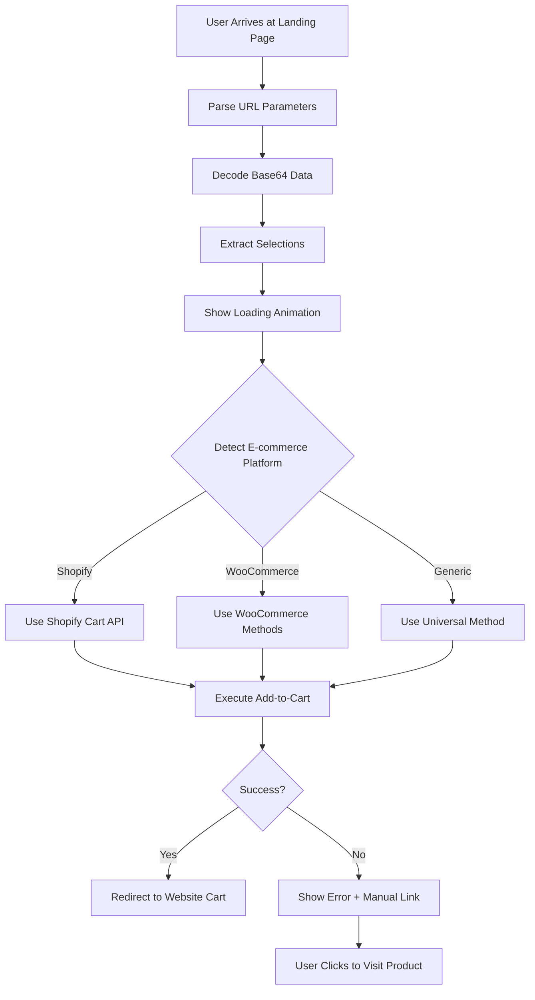

**Key Features**:

1. **Platform Detection**
   - Analyzes product URL domain
   - Identifies e-commerce platform (Shopify, WooCommerce, etc.)
   - Selects optimal cart method

2. **Loading State**
   - Shows branded loading animation
   - Displays "Preparing your cart..."
   - Progress indicator
   - Estimated time: 2-5 seconds

3. **Cart Execution Methods**
   - **Shopify**: Use Ajax Cart API `/cart/add.js`
   - **WooCommerce**: POST to cart endpoint
   - **Generic**: Form auto-submission
   - **Fallback**: Direct product page link

4. **Error Handling**
   - Timeout after 10 seconds
   - Display friendly error message
   - Provide manual "View Product" button
   - Track failure rate for monitoring

### 9.2 Shopify Integration

**Cart Session Creation Flow**:

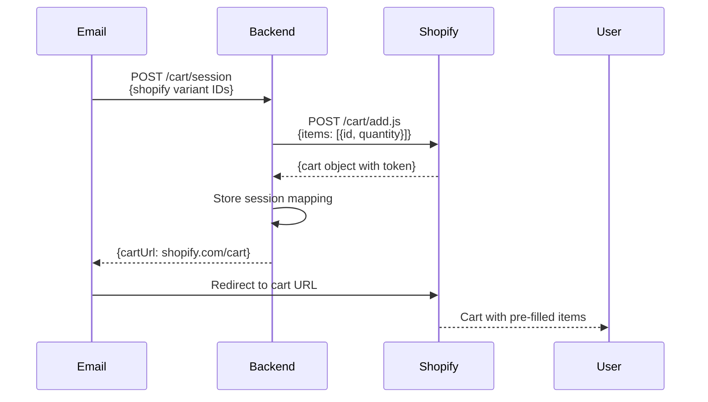

**Implementation Details**:

1. **Variant ID Mapping**
   - During scraping, extract Shopify variant IDs from product page
   - Store mapping: `email_product_variant` → `shopify_variant_id`
   - Use Shopify Admin API to validate variant IDs

2. **Cart Creation**
   - Use Shopify Ajax Cart API: `POST /cart/add.js`
   - Payload: `{items: [{id: variant_id, quantity: qty}]}`
   - Response includes cart token for session

3. **Deep Link URL**
   - Format: `https://{shop}.myshopify.com/cart/{cart_token}`
   - Alternative: `https://{shop}.myshopify.com/cart?c={token}`
   - Cart persists for 14 days in Shopify

### 9.3 WooCommerce Integration

**Session-Based Approach**:

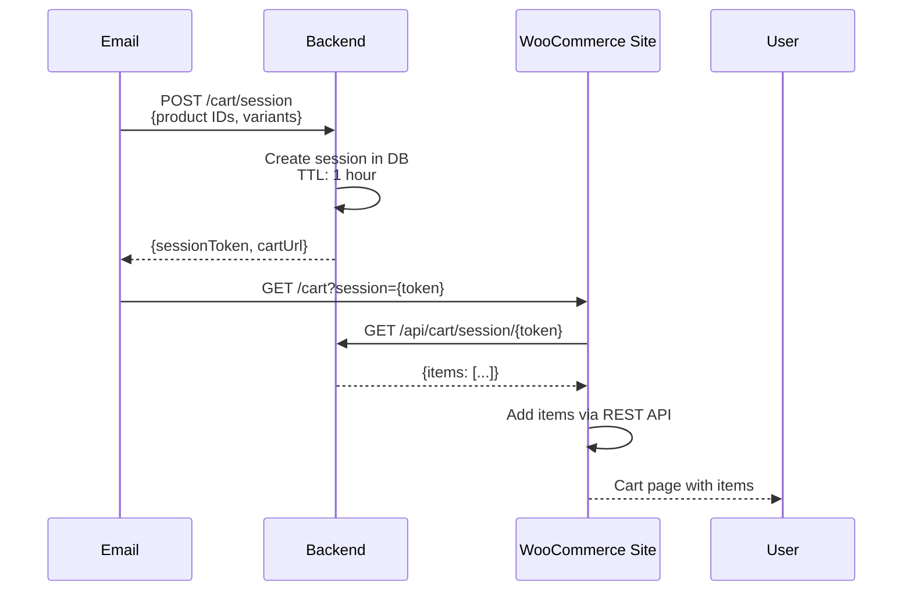

**Implementation Details**:

1. **Product ID Extraction**
   - Extract WooCommerce product ID and variation ID
   - Store in session: `{product_id, variation_id, quantity, attributes}`

2. **Cart Population**
   - Website retrieves session via API
   - Uses WooCommerce REST API: `POST /wp-json/wc/v3/cart/add-item`
   - Redirects to `/cart` after population

3. **Custom Integration**
   - Requires custom WordPress plugin or theme modification
   - Plugin handles session retrieval and cart population
   - Fallback: Query parameters for single items

### 9.4 Universal Cart Link Strategy

**For Unsupported Platforms**:

**Query Parameter Approach**:
- Format: `https://site.com/cart/add?sku={sku}&qty={quantity}&variant={variant}`
- Encode cart data in URL parameters
- Limitations: URL length (max 2048 chars), platform support

**Cart Session Fallback**:
- Generate simple landing page hosted on our domain
- Display cart summary with "Continue to {Brand}" button
- Button posts data to merchant site via form submission
- Works with any platform that accepts POST requests

### 9.5 Cart Session Database Schema

**Core Principle**:
An intelligent browser automation agent that mirrors user selections from the AMP email by navigating the actual e-commerce website, replicating every action (variant selection, quantity adjustment, add-to-cart), and preparing a ready-to-checkout cart before the user arrives.

**Agent Workflow**:

```mermaid
sequenceDiagram
    participant User
    participant Email as AMP Email
    participant Backend
    participant Agent as Shadow Agent<br/>(Playwright)
    participant Website as E-commerce Site
    
    User->>Email: Select variant, quantity
    Email->>Email: Track selections in amp-state
    User->>Email: Click "Buy Now"
    Email->>Backend: POST /shadow-cart/prepare<br/>{productUrl, selections}
    Backend->>Agent: Spawn browser session
    Agent->>Website: Navigate to product URL
    Agent->>Website: Detect and click variant selectors
    Agent->>Website: Set quantity
    Agent->>Website: Click "Add to Cart"
    Website-->>Agent: Cart updated
    Agent->>Agent: Extract cart session/token
    Agent-->>Backend: {cartUrl, sessionId, cookies}
    Backend-->>Email: {checkoutUrl, sessionToken}
    Email->>User: Redirect with session
    User->>Website: Land on cart page (pre-authenticated)
    Website->>User: Cart ready with items

### 9.2 Shopify Integration

**Cart Session Creation Flow**:

```mermaid
sequenceDiagram
    participant Email
    participant Backend
    participant Shopify
    
    Email->>Backend: POST /cart/session<br/>{shopify variant IDs}
    Backend->>Shopify: POST /cart/add.js<br/>{items: [{id, quantity}]}
    Shopify-->>Backend: {cart object with token}
    Backend->>Backend: Store session mapping
    Backend-->>Email: {cartUrl: shopify.com/cart}
    Email->>Shopify: Redirect to cart URL
    Shopify-->>User: Cart with pre-filled items
```

**Implementation Details**:

1. **Variant ID Mapping**
   - During scraping, extract Shopify variant IDs from product page
   - Store mapping: `email_product_variant` → `shopify_variant_id`
   - Use Shopify Admin API to validate variant IDs

2. **Cart Creation**
   - Use Shopify Ajax Cart API: `POST /cart/add.js`
   - Payload: `{items: [{id: variant_id, quantity: qty}]}`
   - Response includes cart token for session

3. **Deep Link URL**
   - Format: `https://{shop}.myshopify.com/cart/{cart_token}`
   - Alternative: `https://{shop}.myshopify.com/cart?c={token}`
   - Cart persists for 14 days in Shopify

### 9.3 WooCommerce Integration

**Session-Based Approach**:


**Implementation Details**:

1. **Product ID Extraction**
   - Extract WooCommerce product ID and variation ID
   - Store in session: `{product_id, variation_id, quantity, attributes}`

2. **Cart Population**
   - Website retrieves session via API
   - Uses WooCommerce REST API: `POST /wp-json/wc/v3/cart/add-item`
   - Redirects to `/cart` after population

3. **Custom Integration**
   - Requires custom WordPress plugin or theme modification
   - Plugin handles session retrieval and cart population
   - Fallback: Query parameters for single items

### 9.4 Universal Cart Link Strategy

**For Unsupported Platforms**:

**Query Parameter Approach**:
- Format: `https://site.com/cart/add?sku={sku}&qty={quantity}&variant={variant}`
- Encode cart data in URL parameters
- Limitations: URL length (max 2048 chars), platform support

**Cart Session Fallback**:
- Generate simple landing page hosted on our domain
- Display cart summary with "Continue to {Brand}" button
- Button posts data to merchant site via form submission
- Works with any platform that accepts POST requests

### 9.5 Cart Session Database Schema

**Table: cart_sessions**

| Column | Type | Description |
|--------|------|-------------|
| id | uuid | Primary key |
| session_token | string | Unique session identifier |
| platform | enum | E-commerce platform |
| items | jsonb | Cart items array |
| metadata | jsonb | Additional context |
| created_at | timestamp | Session creation time |
| expires_at | timestamp | Expiration time |
| accessed_at | timestamp | Last access time |
| status | enum | active, expired, completed |

**Indexes**:
- `session_token` (unique)
- `expires_at` (for cleanup job)
- `created_at` (for analytics)

**Cleanup Strategy**:
- Automated job runs every hour
- Deletes sessions where `expires_at < NOW()`
- Optional: Archive completed sessions for analytics

### 9.6 Shadow Agent Technology Stack

**Browser Automation Framework Comparison**:

| Framework | Pros | Cons | Recommendation |
|-----------|------|------|----------------|
| **Playwright** | Fast, reliable, multi-browser, auto-wait | Learning curve | ⭐ **Primary Choice** |
| Puppeteer | Mature, good community | Chrome-only, manual waits | Fallback |
| Selenium | Universal, language-agnostic | Slow, complex setup | Not recommended |
| Browserless | Cloud-hosted, scalable | Cost, vendor lock-in | Production option |

**Why Playwright?**
- Cross-browser support (Chromium, Firefox, WebKit)
- Auto-waiting for elements (reduces flakiness)
- Network interception for performance
- Parallel execution support
- Excellent TypeScript support
- Built-in retry mechanisms
- Screenshot and video recording for debugging

### 9.7 Shadow Agent Architecture

**Component Design**:

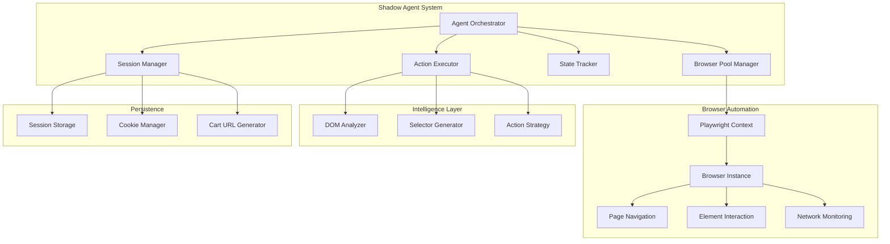

**Core Services**:

1. **Agent Orchestrator**
   - Receives user selections from email
   - Creates execution plan
   - Manages browser lifecycle
   - Handles errors and retries

2. **Browser Pool Manager**
   - Maintains pool of browser contexts
   - Reuses contexts for efficiency
   - Implements queue for concurrent requests
   - Auto-scales based on load

3. **Action Executor**
   - Translates user selections to browser actions
   - Intelligent element detection
   - Handles dynamic content
   - Validates action success

4. **DOM Analyzer**
   - Identifies add-to-cart buttons
   - Detects variant selectors
   - Finds quantity inputs
   - Adapts to different site structures

5. **Session Manager**
   - Extracts cart session tokens
   - Manages cookies and localStorage
   - Generates authenticated cart URLs
   - Handles session expiration

### 9.8 Shadow Agent Execution Flow

**Detailed Step-by-Step Process**:

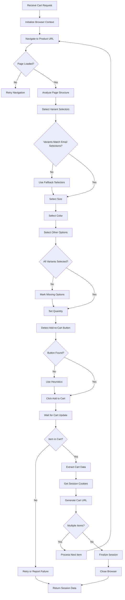

### 9.9 Intelligent Element Detection

**Adaptive Selector Strategy**:

The Shadow Agent uses a multi-layered approach to find elements on any e-commerce site:

**Variant Selector Detection**:

| Priority | Detection Method | Example Patterns |
|----------|-----------------|------------------|
| 1 | ARIA labels | `[aria-label*="size"]`, `[aria-label*="color"]` |
| 2 | Data attributes | `[data-option="size"]`, `[data-variant]` |
| 3 | Common class names | `.size-selector`, `.color-swatch`, `.variant-picker` |
| 4 | Label associations | `label:has-text("Size")` + sibling select |
| 5 | Semantic HTML | `select[name*="size"]`, `input[name*="color"]` |
| 6 | Position-based | Elements near product price/title |
| 7 | ML-based detection | Train model on common patterns |

**Add-to-Cart Button Detection**:

| Priority | Selector Strategy | Confidence |
|----------|------------------|------------|
| 1 | `button:has-text("Add to Cart")` (case-insensitive) | 95% |
| 2 | `[id*="add-to-cart"]`, `[class*="add-to-cart"]` | 90% |
| 3 | `button[type="submit"]` near product form | 80% |
| 4 | `button` with cart icon (SVG/image detection) | 75% |
| 5 | Largest primary button on page | 60% |
| 6 | Form submit button in product section | 70% |

**Quantity Input Detection**:
- `input[name*="quantity"]`
- `input[type="number"]` near add-to-cart
- `[data-quantity]` or `[aria-label*="quantity"]`
- Increment/decrement buttons with quantity display

### 9.10 Platform-Specific Optimizations

**Known Platform Detection**:

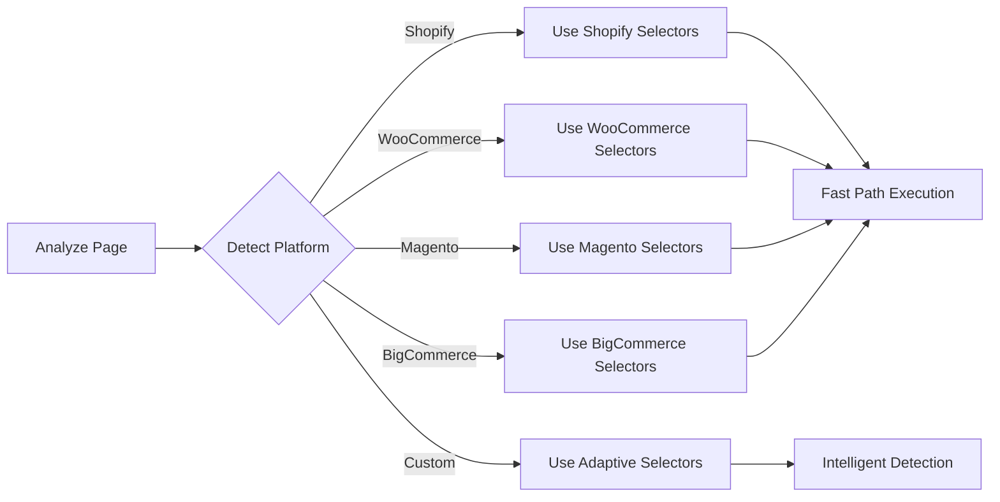

**Platform Fingerprints**:

| Platform | Detection Signal | Optimized Selectors |
|----------|-----------------|---------------------|
| Shopify | Meta tag `shopify`, `/cart/add.js` | `#AddToCart`, `.product-form__submit` |
| WooCommerce | `woocommerce` in HTML class | `.single_add_to_cart_button` |
| Magento | `Magento_` in script tags | `#product-addtocart-button` |
| BigCommerce | `.bigcommerce` class | `[data-button-type="add-cart"]` |
| Custom Shopify Theme | Specific theme classes | Theme-specific selectors |

### 9.11 Session & Cookie Management

**Cart Session Extraction Strategy**:

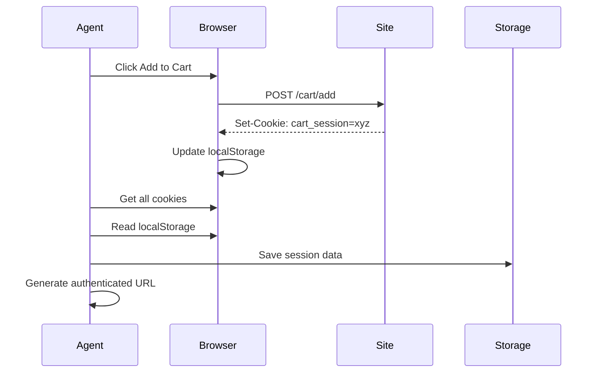

**Session Data Captured**:

| Data Type | Source | Purpose | TTL |
|-----------|--------|---------|-----|
| Session Cookies | HTTP headers | Maintain cart state | 30-60 min |
| Cart Token | Cookie/localStorage | Direct cart access | 1-24 hours |
| CSRF Token | Meta tag/cookie | Secure form submissions | Session |
| User Session | Cookie | Persistent cart | 7-14 days |
| Local Storage | Browser API | Client-side cart data | Until cleared |

**URL Generation Strategy**:

1. **Cookie-Based Session**
   - Store cookies in backend database
   - Generate signed URL with session reference
   - User lands on site, backend injects cookies via proxy
   - Alternative: Use browser extension to restore cookies

2. **Token-Based Session**
   - Extract cart token from cookie/localStorage
   - Format: `https://site.com/cart?token={cart_token}`
   - Works for platforms with URL-based cart access

3. **Proxy Approach** (Most Reliable)
   - User redirects through our proxy URL
   - Proxy restores cookies and redirects to cart
   - Format: `https://api.ourplatform.com/cart/session/{id}/redirect`
   - Proxy performs 302 redirect with Set-Cookie headers

### 9.12 Shadow Agent API Endpoints

**Endpoint**: `POST /api/v1/shadow-cart/prepare`

**Purpose**: Trigger Shadow Agent to build cart on target website

**Request Schema**:

| Field | Type | Required | Description |
|-------|------|----------|-------------|
| productUrl | string | Yes | Product page URL |
| selections | object | Yes | User selections from email |
| timeout | number | No | Max execution time (default: 60s) |
| priority | enum | No | low, normal, high (queue priority) |

**selections Object**:

| Field | Type | Description |
|-------|------|-------------|
| variants | array | [{type: "size", value: "L"}, {type: "color", value: "Blue"}] |
| quantity | number | Item quantity |
| customizations | object | Additional options (engraving, etc.) |

**Response Schema**:

| Field | Type | Description |
|-------|------|-------------|
| success | boolean | Operation success status |
| sessionId | string | Shadow session identifier |
| cartUrl | string | URL to pre-filled cart |
| cookies | array | Session cookies (encrypted) |
| expiresAt | timestamp | Session expiration |
| metadata | object | Execution details (time, retries, etc.) |

**Error Responses**:

| Status | Scenario | Response |
|--------|----------|----------|
| 408 | Timeout | {error: "Cart preparation timed out"} |
| 422 | Element not found | {error: "Could not find variant selector", fallback: true} |
| 500 | Site error | {error: "Target website returned error", retry: true} |
| 429 | Rate limit | {error: "Too many requests", retryAfter: 60} |

**Endpoint**: `GET /api/v1/shadow-cart/session/:id`

**Purpose**: Check status of shadow cart preparation

**Response**:

| Field | Type | Description |
|-------|------|-------------|
| status | enum | pending, preparing, ready, failed |
| progress | number | Completion percentage (0-100) |
| currentStep | string | Current execution step |
| cartUrl | string | Available when status = ready |
| error | string | Error message if failed |

### 9.13 Scalability & Resource Management

**Browser Pool Architecture**:

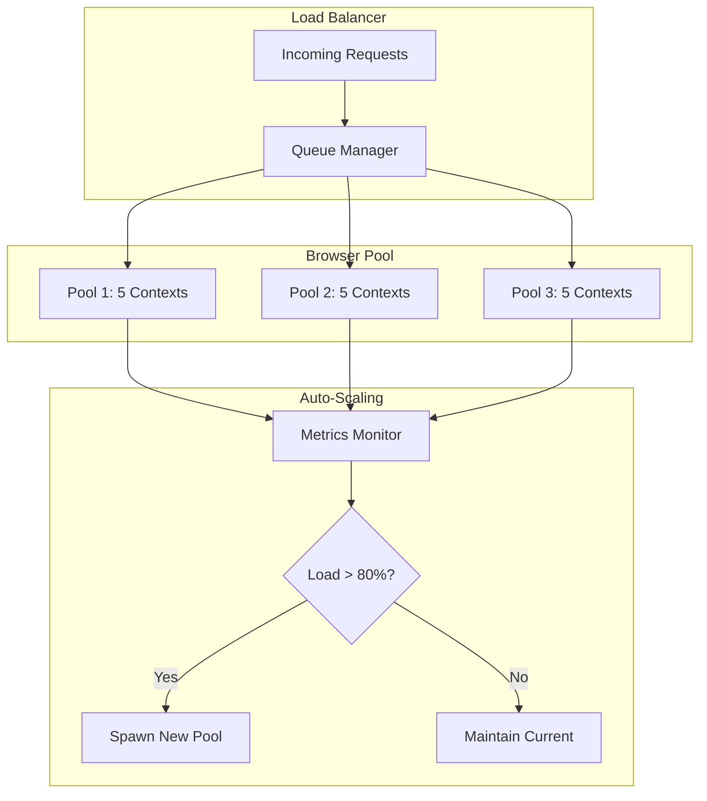

**Resource Configuration**:

| Configuration | Development | Production | High-Load |
|--------------|-------------|------------|----------|
| Browser Contexts | 2 | 10 | 50 |
| Max Concurrent | 2 | 10 | 50 |
| Context Reuse | Yes | Yes | Yes |
| Headless Mode | Yes | Yes | Yes |
| Request Timeout | 30s | 60s | 90s |
| Queue Size | 10 | 100 | 1000 |
| Context TTL | 5 min | 10 min | 5 min |

**Queueing Strategy**:

| Priority | Queue | Processing Order | Max Wait |
|----------|-------|------------------|----------|
| High | Real-time user request | FIFO | 10s |
| Normal | Standard email click | FIFO | 30s |
| Low | Batch/pre-warming | LIFO | 120s |

**Resource Limits**:
- Max 50 concurrent browser contexts per server
- Auto-scale when queue depth > 20
- Circuit breaker: Fail fast after 3 consecutive failures
- Memory limit: 4GB per browser context
- CPU throttling: 50% per context

### 9.14 Cost & Performance Analysis

**Browser Automation Cost Breakdown**:

| Resource | Unit Cost | Usage per Cart | Monthly (10K carts) |
|----------|-----------|----------------|---------------------|
| Compute (CPU) | $0.05/hour | 30s | $42 |
| Memory (4GB) | $0.01/GB/hour | 30s | $33 |
| Bandwidth | $0.10/GB | 5MB | $50 |
| Storage (sessions) | $0.023/GB | 1KB | $0.23 |
| **Total Shadow Agent Cost** | - | - | **$125** |

**Comparison with API Approach**:

| Method | Cost per 10K | Reliability | Maintenance | Universal Support |
|--------|--------------|-------------|-------------|-------------------|
| Shadow Agent | $125 | 75-85% | High | Yes (any site) |
| API Integration | $0 | 90-95% | Medium | No (platform-specific) |
| Hybrid | $60 | 90-95% | High | Yes |

**Performance Metrics**:

| Metric | Target | Measurement |
|--------|--------|-------------|
| Cart Preparation Time | <30s | P95 latency |
| Success Rate | >80% | Successful cart creations |
| Element Detection Rate | >90% | Correct selector matches |
| Browser Startup | <3s | Context initialization |
| Page Load | <10s | Product page ready |
| Action Execution | <5s | Variant selection + add-to-cart |

### 9.15 Error Handling & Retry Logic

**Failure Scenarios & Mitigation**:

| Scenario | Detection | Recovery Strategy | User Impact |
|----------|-----------|-------------------|-------------|
| Site Timeout | 60s wait | Retry once, then fallback | 30s delay |
| Element Not Found | No selector match | Try fallback selectors | Transparent |
| Add-to-Cart Failed | Cart count unchanged | Retry with different selector | 10s delay |
| CAPTCHA Detected | CAPTCHA element present | Fallback to product URL | Redirect to product |
| Site Error (500) | HTTP status | Wait 5s, retry | 15s delay |
| Out of Stock | "Out of stock" text | Report to user | Show message |
| Variant Unavailable | Disabled selector | Notify user, suggest alternatives | Show error |

**Retry Policy**:

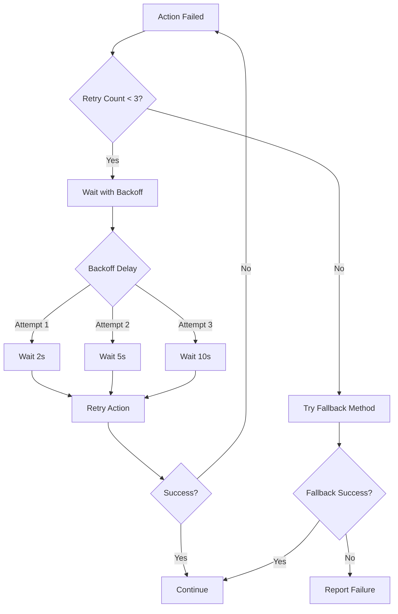

**Graceful Degradation**:

1. **Primary**: Shadow Agent prepares cart
2. **Fallback 1**: Use platform API (if available)
3. **Fallback 2**: Generate cart URL with query params
4. **Fallback 3**: Direct link to product page
5. **Final**: Generic website homepage

### 9.16 Monitoring & Debugging

**Telemetry Collection**:

| Metric | Purpose | Alert Threshold |
|--------|---------|----------------|
| Shadow Agent Success Rate | Track reliability | <75% |
| Average Execution Time | Performance monitoring | >60s |
| Browser Pool Utilization | Scaling decisions | >80% |
| Element Detection Failures | Selector maintenance | >20% |
| Site-Specific Failure Rate | Identify problematic sites | >50% for a domain |
| Cookie Extraction Success | Session reliability | <90% |

**Debug Artifacts**:

For failed sessions, capture:
- Screenshot at failure point
- HAR file (network activity)
- Console logs
- DOM snapshot
- Execution trace
- Selected elements (highlighted)

**Logging Strategy**:

Natural language description:
- DEBUG: Every action attempt (selector used, element found, click executed)
- INFO: Successful cart preparation, session created
- WARN: Fallback selector used, retry triggered
- ERROR: Session failed, CAPTCHA detected, site unreachable
- CRITICAL: Browser pool exhausted, service unavailable

### 9.17 Security Considerations for Shadow Agent

**Threat Model**:

| Threat | Risk | Mitigation |
|--------|------|------------|
| Cookie Theft | High | Encrypt cookies at rest, short TTL |
| Session Hijacking | Medium | Single-use session tokens |
| CSRF Attack | Low | Validate origin, signed requests |
| XSS in Captured Data | Medium | Sanitize all scraped content |
| Browser Fingerprinting | Low | Rotate user agents, randomize timing |
| IP Blocking | Medium | Use proxy rotation, rate limiting |

**Privacy Protection**:
- No user email or PII in shadow sessions
- Anonymous browser contexts (no persistent storage)
- Clear cookies after session completion
- No tracking pixels or analytics injection
- Respect robots.txt and site ToS

**Ethical Considerations**:
- Equivalent to user browsing (not scraping)
- No aggressive automation (respect rate limits)
- Transparent user agent identifier
- Honor site anti-bot measures (fallback gracefully)
- No credential stuffing or unauthorized access

## 9. AMP Email Best Practices Integration

### 9.1 AMP Template Structure for Cart Handoff

**Checkout Button Implementation**:

The AMP email template includes a "Buy Now" or "Proceed to Checkout" button that triggers the cart session creation and website redirect.

**AMP Component Structure**:

| Element | Purpose | Description |
|---------|---------|-------------|
| amp-form | Cart submission | Sends cart data to session API |
| amp-bind | State management | Tracks selected items and variants |
| submit-success | Success handler | Receives session token and cart URL |
| amp-redirect | Navigation | Redirects user to website cart |

**Template Flow Diagram**:

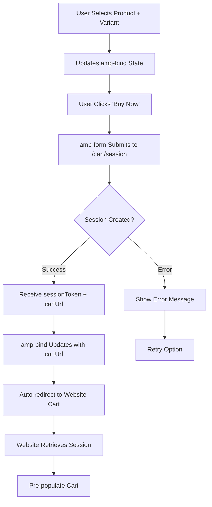

**AMP State Management for Cart**:

Natural language description of amp-bind state:

- State variable `cartState` tracks all selected items
- Each add-to-cart action appends to `cartItems` array
- State includes: product ID, variant ID, quantity, price
- When user clicks "Buy Now", entire `cartState` submitted via amp-form
- Success response updates state with `cartUrl` and triggers redirect

**Template Generation Logic**:

The App Agent generates the following structure:

1. **Product Selection Section**
   - Product carousel with enhanced images
   - Variant selector (size, color) with amp-selector
   - Quantity picker with amp-bind
   - Dynamic price display
   - Add to Cart button (adds to email cart state)

2. **Cart Summary Section** (amp-bind visibility)
   - Shows when items added to cart
   - Displays selected items with thumbnails
   - Shows total price
   - "Continue Shopping" button
   - "Buy Now" button (triggers checkout)

3. **Checkout Form** (hidden until Buy Now clicked)
   - amp-form element
   - Action: POST to backend /cart/session endpoint
   - Submits: cart items array with all selections
   - Success handler: receives cartUrl
   - Redirect mechanism: updates amp-state then navigates

4. **Redirect Mechanism**
   - Option A: amp-bind with hidden link, trigger click via state change
   - Option B: amp-form submit-success with JavaScript redirect
   - Option C: Server-side redirect via 302 response
   - Recommended: Option A for better UX

**Cart URL Construction Examples**:

| Scenario | Generated URL | Platform |
|----------|--------------|----------|
| Session Token | `https://shop.com/cart?session=cart_abc123` | All |
| Shopify Direct | `https://shop.myshopify.com/cart/c/abc123xyz` | Shopify |
| Query Params | `https://shop.com/cart?add=123:1,456:2` | Universal |
| Fallback | `https://api.ourplatform.com/cart/abc123/redirect` | Custom |

### 9.2 Salesforce AMP Best Practices Compliance

**Essential Requirements**:

1. **Valid AMP Structure**
   - Include proper AMP email doctype
   - Include required AMP scripts
   - Use only approved AMP components
   - Maintain proper nesting hierarchy

2. **Email Client Compatibility**
   - Gmail support (primary target)
   - Yahoo Mail support
   - Outlook.com support
   - Fallback HTML for non-supporting clients

3. **Performance Optimization**
   - Limit document size to <100KB
   - Optimize image loading with lazy-loading
   - Minimize CSS (max 50KB inline)
   - Reduce component complexity

4. **Security & Privacy**
   - Use HTTPS for all resources
   - Implement CORS for API endpoints
   - Validate all user inputs
   - No third-party scripts

5. **Accessibility**
   - ARIA labels for interactive elements
   - Keyboard navigation support
   - Screen reader compatibility
   - Color contrast compliance (WCAG 2.1 AA)

### 9.2 Interactive Component Best Practices

**Product Carousel Guidelines**:
- Maximum 10 slides per carousel
- Auto-advance disabled (user control)
- Clear navigation indicators
- Touch gesture support
- Accessibility labels

**Form Design Principles**:
- Progressive enhancement
- Clear validation messages
- Submit success/error states
- Required field indicators
- Inline error display

**Add to Cart Implementation**:
- Visual feedback on action
- Disable during processing
- Show cart count update
- Error handling with retry
- Success confirmation

**Dynamic Content Updates**:
- Use amp-list for real-time data
- Implement loading states
- Handle API errors gracefully
- Cache responses appropriately
- Refresh intervals (if needed)

## 10. Testing Strategy

### 10.1 Template Validation

**Validation Layers**:

| Layer | Tool/Method | Success Criteria |
|-------|------------|------------------|
| AMP Compliance | amphtml-validator | No errors |
| Email Client Rendering | Litmus / Email on Acid | Consistent display |
| Interactive Functionality | Manual testing | All interactions work |
| Accessibility | aXe / WAVE | WCAG 2.1 AA compliance |
| Performance | Lighthouse | Email size <100KB |

### 10.2 Component Testing

**Test Scenarios**:

1. **Carousel Navigation**
   - Swipe left/right on mobile
   - Arrow click on desktop
   - Keyboard navigation (arrows)
   - Indicator click navigation

2. **Variant Selection**
   - Single selection works
   - Price updates correctly
   - Inventory updates
   - Visual feedback shows

3. **Add to Cart**
   - Form submission succeeds
   - Error handling works
   - Success message displays
   - Cart count updates
   - Items persist in amp-state

4. **Dynamic Pricing**
   - Variant changes update price
   - Quantity changes update total
   - Discounts apply correctly
   - Currency formatting correct

5. **Cart Session & Handoff**
   - Shadow Agent browser spawns successfully
   - Browser navigates to product page
   - Variant selectors detected and clicked
   - Add-to-cart button found and clicked
   - Cart session cookies extracted
   - Session stored correctly
   - Proxy redirect works
   - Website cart pre-populated
   - Session expiration handled gracefully
   - Fallback to API/direct link on failure
   - Error states show appropriate messages

### 10.3 End-to-End Shadow Agent Testing

**Test Matrix**:

| Test Case | Steps | Expected Result |
|-----------|-------|----------------|
| Single Item Shadow Cart | Select product → Add to cart → Buy Now → Shadow Agent | Cart ready in <40s |
| Multiple Items | Add 3 products → Buy Now → Shadow Agent processes all | All items in website cart |
| Variant Selection | Select size L, color Blue → Shadow Agent replicates | Correct variant in cart |
| Unknown Platform | Test on custom site → Shadow Agent adapts | Agent detects elements |
| Shopify Site | Test on Shopify store → Fast path | Uses optimized selectors |
| WooCommerce Site | Test on WooCommerce → Detection | Finds WC-specific elements |
| Session Expiration | Wait past TTL → Click cart link | Show expired or recreate |
| CAPTCHA Detected | Site shows CAPTCHA → Agent fallback | Redirect to product page |
| Slow Page Load | Site loads in 20s → Agent waits | Success or timeout |
| Element Not Found | Selector fails → Fallback | Tries alternative methods |
| API Fallback | Shadow Agent fails → Try API | Seamless fallback |
| Direct Link Fallback | Both fail → Direct link | User lands on product page |

### 10.3 End-to-End Shadow Agent Testing

**Test Matrix**:

| Test Case | Steps | Expected Result |
|-----------|-------|----------------|
| Single Item Checkout | Select product → Add to cart → Buy Now | Redirect to website with 1 item in cart |
| Multiple Items | Add 3 products → Buy Now | All 3 items in website cart |
| Variant Selection | Select size L, color Blue → Buy Now | Cart shows correct variant |
| Session Expiration | Wait past TTL → Click cart link | Show expired message or recreate |
| Platform Integration | Test Shopify, WooCommerce | Each platform correctly populated |
| Fallback Scenario | Unsupported platform | Fallback landing page works |
| Error Handling | API failure | User-friendly error message |

**Integration Testing Flow**:

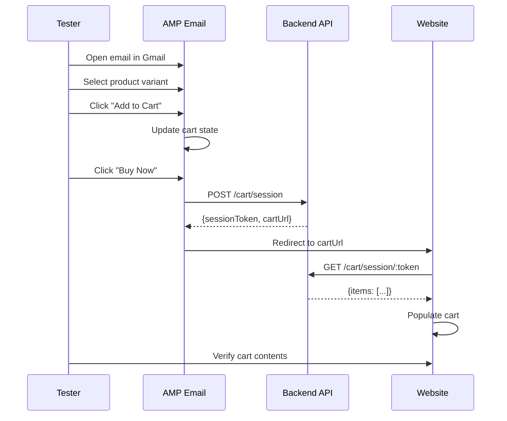

### 10.4 Cross-Client Testing

**Email Client Matrix**:

| Client | Version | AMP Support | Fallback Required |
|--------|---------|------------|-------------------|
| Gmail Web | Current | Full | No |
| Gmail Mobile | Current | Full | No |
| Yahoo Mail | Current | Partial | Yes |
| Outlook.com | Current | None | Yes |
| Apple Mail | Any | None | Yes |

## 11. Integration Architecture

### 11.1 Service Integration Map

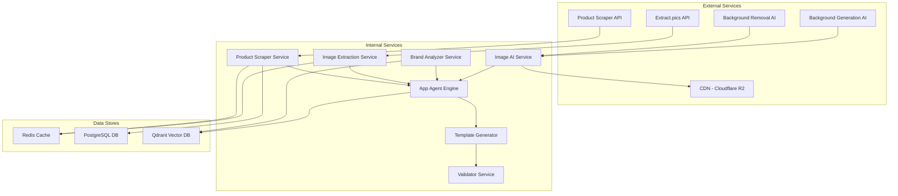

### 11.2 Data Flow Diagram

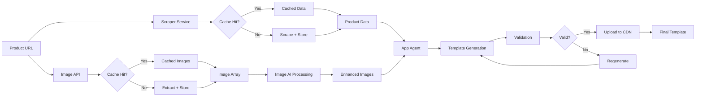

## 12. Cost & Performance Considerations

### 12.1 AI Processing Cost Estimation

| Operation | Provider | Cost per Unit | Estimated Volume | Monthly Cost |
|-----------|----------|--------------|------------------|--------------|
| Background Removal | Replicate / ClipDrop API | $0.002/image | 50,000 images | $100 |
| Background Generation | Ideogram / Stable Diffusion | $0.01/image | 50,000 images | $500 |
| Template Generation | DeepSeek R1 / Claude | $0.05/template | 10,000 templates | $500 |
| Image Enhancement | Replicate | $0.005/image | 20,000 images | $100 |
| **Shadow Agent (Compute)** | **Cloud VM / Container** | **$0.05/hour** | **~83 hours** | **$125** |
| **Shadow Agent (Memory)** | **4GB RAM** | **$0.01/GB/hour** | **~83 hours** | **$33** |
| **Shadow Agent (Bandwidth)** | **Data Transfer** | **$0.10/GB** | **50GB** | **$50** |
| **Total Monthly AI + Automation Cost** | - | - | - | **$1,408** |

### 12.2 Performance Targets

| Metric | Target | Measurement |
|--------|--------|-------------|
| Template Generation Time | <60 seconds | End-to-end API response |
| Image Processing Time | <10 seconds per image | Background removal + regeneration |
| Shadow Agent Execution | <40 seconds | Browser automation cart preparation |
| AMP Validation Time | <2 seconds | Validation check |
| Email Size | <100KB | Final HTML size |
| Cache Hit Rate | >70% | Product data cache |
| Shadow Agent Success Rate | >80% | Successful cart preparations |
| API Uptime | 99.5% | Service availability |

### 12.3 Caching Strategy

**Cache Layers**:

1. **Product Data Cache** (Redis)
   - TTL: 24 hours
   - Key pattern: `product:{url_hash}`
   - Invalidation: Manual or on product update

2. **Image Cache** (Redis)
   - TTL: 7 days
   - Key pattern: `images:{url_hash}`
   - Invalidation: On source change

3. **Brand Guidelines Cache** (Redis)
   - TTL: 7 days
   - Key pattern: `brand:{domain}`
   - Invalidation: Manual or weekly

4. **Template Cache** (Redis)
   - TTL: 1 hour
   - Key pattern: `template:{product_id}:{options_hash}`
   - Invalidation: On product/brand update

5. **Cart Session Cache** (Redis)
   - TTL: 30-60 minutes (configurable)
   - Key pattern: `cart_session:{token}`
   - Invalidation: On expiration or completion
   - Persistence: Optional PostgreSQL backup for analytics

## 13. Migration Strategy

### 13.1 Phased Rollout

**Phase 1: Foundation (Weeks 1-2)**
- Enhance product scraper with brand guideline extraction
- Integrate background removal AI service
- Integrate background generation AI service
- Implement image labeling logic

**Phase 2: Agent Development (Weeks 3-5)**
- Build App Agent core architecture
- Develop Template Architect agent
- Develop Component Builder agent
- Develop Style Generator agent
- Implement Validation agent

**Phase 3: Component Library & Shadow Agent (Weeks 6-8)**
- Create AMP component templates
- Build state management patterns
- Develop interactive flow templates
- **Implement Shadow Shopping Agent core**
- **Integrate Playwright browser automation**
- **Build intelligent element detection system**
- **Develop platform-specific optimizations**
- Implement API-based cart integration (fallback)
- Implement fallback HTML generation
- Create cart handoff proxy mechanism
- Build browser pool manager
- Implement cookie extraction and session management

**Phase 4: Integration & Testing (Weeks 9-10)**
- End-to-end integration testing
- Shadow Agent reliability testing across platforms
- Email client compatibility testing
- Performance optimization (browser pool, caching)
- Cost monitoring and optimization
- Load testing Shadow Agent infrastructure
- Security audit (cookie handling, session management)

**Phase 5: Production Release (Week 11)**
- Beta release to select users
- Monitor Shadow Agent performance and costs
- Gather user feedback
- Optimize element detection rules
- Iterate based on learnings
- Gradual rollout with fallback mechanisms

### 13.2 Backward Compatibility

**Legacy Support**:
- Maintain existing template generation endpoints
- Provide migration tool for old templates
- Support gradual feature adoption
- Ensure fallback to simple templates if interactive generation fails

## 14. Monitoring & Observability

### 14.1 Key Metrics

**Business Metrics**:
- Templates generated per day
- Interactive component usage rate
- Email engagement rate (opens, clicks, interactions)
- Add-to-cart rate from emails
- Cart session creation rate
- Website cart handoff success rate
- Conversion rate (email to purchase)
- Cart abandonment from email vs. website

**Technical Metrics**:
- Template generation success rate
- Average generation time
- AI processing cost per template
- Cache hit rate
- API error rate
- Image enhancement success rate
- Cart session creation latency
- Session expiration rate
- Platform integration success rate

**Quality Metrics**:
- AMP validation pass rate
- Email client compatibility score
- Accessibility compliance rate
- User-reported issues

### 14.2 Alerting Strategy

**Critical Alerts**:
- Template generation failure rate >5%
- API response time >120 seconds
- AI service downtime
- Cache system failure

**Warning Alerts**:
- Generation time >90 seconds
- Cost exceeds budget by 20%
- Cache hit rate <60%
- Validation failure rate >2%

## 15. Security & Privacy Considerations

### 15.1 Cart Session Security

**Token Generation**:
- Use cryptographically secure random tokens (minimum 32 bytes)
- Format: `cart_{timestamp}_{random_hash}`
- No personally identifiable information in token
- Unpredictable and non-sequential

**Session Protection**:

| Threat | Mitigation | Implementation |
|--------|------------|----------------|
| Token Guessing | Cryptographic randomness | crypto.randomBytes(32) |
| Session Hijacking | Short TTL + single-use tokens | 30-60 minute expiration |
| Replay Attacks | Token invalidation after use | Mark as 'completed' in DB |
| CSRF | Session origin validation | Store campaign/email metadata |
| Data Leakage | Minimal data in session | Only product IDs and quantities |

**Privacy Considerations**:
- No user email or personal data in cart session
- Anonymous session tokens
- Optional: User consent for session creation
- GDPR compliance: Auto-delete expired sessions
- No cross-site tracking

### 15.2 Data Security

**Protection Measures**:
- Sanitize all scraped product data
- Validate image URLs before processing
- Implement rate limiting on all endpoints
- Encrypt sensitive brand data in cache
- Use signed URLs for CDN access
- Validate cart session integrity before website handoff

### 15.3 AMP Security Requirements

**Compliance**:
- All resources loaded via HTTPS
- CORS headers configured for amp-list endpoints
- No inline JavaScript execution
- CSP headers for AMP compliance
- Validated email sender domain
- Secure cart session API endpoints

### 15.4 API Security

**Authentication & Authorization**:
- API key authentication for all endpoints
- Rate limiting per API key
- Usage quota enforcement
- Request signature validation
- IP whitelist for sensitive operations
- Cart session API requires authentication
- Website cart retrieval endpoint secured with domain validation

**Cart Session API Security**:

| Endpoint | Auth Method | Rate Limit | Additional Security |
|----------|-------------|------------|--------------------|
| POST /cart/session | API Key | 100/min | Validate product IDs |
| GET /cart/session/:token | Domain whitelist | 1000/min | Check referrer header |
| DELETE /cart/session/:token | API Key + Token | 100/min | Owner verification |

## 16. User Experience & Best Practices

### 16.1 Cart Handoff UX Flow

**Optimal User Journey**:

```mermaid
journey
    title Email to Purchase Journey
    section In Email
      Open Email: 5: User
      Browse Products: 5: User
      Select Variant: 4: User
      Add to Cart: 4: User
      Review Cart Summary: 5: User
      Click Buy Now: 5: User
    section Transition
      Session Creation: 3: System
      Loading State: 4: User
      Redirect to Website: 4: User
    section On Website
      Cart Pre-populated: 5: User
      Review Cart Items: 5: User
      Proceed to Checkout: 5: User
      Complete Purchase: 5: User
```

**Loading States & Feedback**:

| State | Visual Feedback | Duration | User Action |
|-------|----------------|----------|-------------|
| Cart Building | Spinner + "Preparing your cart..." | 1-2 seconds | Wait |
| Session Creating | Progress indicator | 2-3 seconds | Wait |
| Redirecting | "Taking you to {Brand}..." | 1 second | Auto-redirect |
| Error | Error message + Retry button | Until dismissed | Retry or cancel |

**Error Handling UX**:

1. **Session Creation Failed**
   - Message: "We couldn't create your cart. Please try again."
   - Action: Retry button + "Visit website manually" link
   - Fallback: Direct link to product page

2. **Session Expired**
   - Message: "Your cart link has expired. Let's rebuild it."
   - Action: Automatic retry with fresh session
   - Fallback: Return to email shopping experience

3. **Website Unreachable**
   - Message: "We're having trouble connecting. Opening {Brand} in a moment."
   - Action: Retry with exponential backoff
   - Fallback: Direct website link

### 16.2 Mobile-First Design Principles

**Touch Targets**:
- Minimum button size: 44x44px
- Adequate spacing between interactive elements
- Thumb-friendly placement of primary CTAs
- Swipe gestures for carousel navigation

**Performance Optimization**:
- Lazy load images below the fold
- Optimize carousel for smooth scrolling
- Minimize amp-bind state complexity
- Reduce API calls with smart caching

**Progressive Disclosure**:
- Show essential info first (product, price)
- Expandable sections for details (accordion)
- Minimize scroll depth for checkout button
- Collapsible cart summary

### 16.3 Accessibility Requirements

**WCAG 2.1 AA Compliance**:

| Requirement | Implementation | Verification |
|-------------|----------------|-------------|
| Keyboard Navigation | Tab order, focus states | Manual testing |
| Screen Reader Support | ARIA labels, semantic HTML | aXe audit |
| Color Contrast | 4.5:1 for text, 3:1 for UI | Contrast checker |
| Alternative Text | All images have alt text | AMP validator |
| Form Labels | Explicit label associations | Manual review |
| Focus Indicators | Visible focus rings | Visual inspection |

**ARIA Labels for Interactive Elements**:

Natural language description:
- Product carousel: "Product image gallery, use arrows to navigate"
- Variant selector: "Choose size and color options"
- Quantity picker: "Select quantity, current value {n}"
- Add to cart: "Add {product name} to cart"
- Buy Now: "Proceed to checkout on {brand} website"
- Cart summary: "Your cart, {n} items, total {price}"

### 16.4 Conversion Optimization

**Best Practices**:

1. **Reduce Friction**
   - Pre-select popular variants (most common size)
   - Default quantity to 1
   - Show estimated delivery time
   - Display trust badges (secure checkout, returns)

2. **Create Urgency**
   - Low stock indicators ("Only 3 left!")
   - Time-limited offers with countdown
   - Dynamic pricing ("Save $20 today")
   - Social proof ("500 purchased this week")

3. **Build Trust**
   - Brand-consistent design
   - Clear pricing (no hidden fees)
   - Transparent shipping costs
   - Easy return policy visibility

4. **Optimize Checkout Flow**
   - Minimal clicks to website cart
   - Cart persistence across devices
   - Guest checkout option mentioned
   - Saved payment methods (if applicable)

### 16.5 Analytics & Tracking

**Event Tracking**:

| Event | Trigger | Data Captured |
|-------|---------|---------------|
| Email Opened | Email client render | Timestamp, client type |
| Product Viewed | Carousel interaction | Product ID, position |
| Variant Selected | Selector change | Product ID, variant ID |
| Add to Cart | Button click | Product, variant, quantity |
| Cart Viewed | Cart summary shown | Cart items, total value |
| Buy Now Clicked | Checkout button | Cart state, timestamp |
| Session Created | API success | Session token, items |
| Redirect Completed | Website loaded | Redirect time, success |
| Cart Retrieved | Website API call | Session token, items matched |
| Purchase Completed | Order confirmation | Order ID, revenue (from website) |

**Attribution Model**:
- Track email campaign ID in cart session metadata
- Pass campaign parameter to website URL
- Cookie-based attribution on website
- UTM parameters for analytics platforms
- Cross-device attribution via session token

### 16.6 A/B Testing Opportunities

**Test Variations**:

| Element | Variation A | Variation B | Metric |
|---------|-------------|-------------|--------|
| CTA Copy | "Buy Now" | "Shop on {Brand}" | Click rate |
| Cart Summary | Always visible | Show after add | Conversion rate |
| Product Images | Original | AI-enhanced backgrounds | Engagement |
| Checkout Button | Single prominent | Multiple placements | Click-through |
| Loading Message | Generic | Brand-personalized | User perception |
| Session TTL | 30 minutes | 60 minutes | Completion rate |

**Success Metrics**:
- Email-to-cart conversion rate
- Cart handoff success rate
- Website cart completion rate
- Overall email-to-purchase conversion
- Average order value from email
- Time from email to purchase
