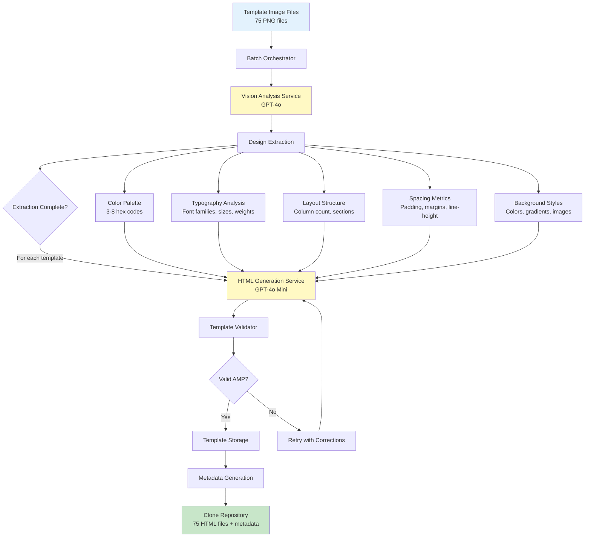
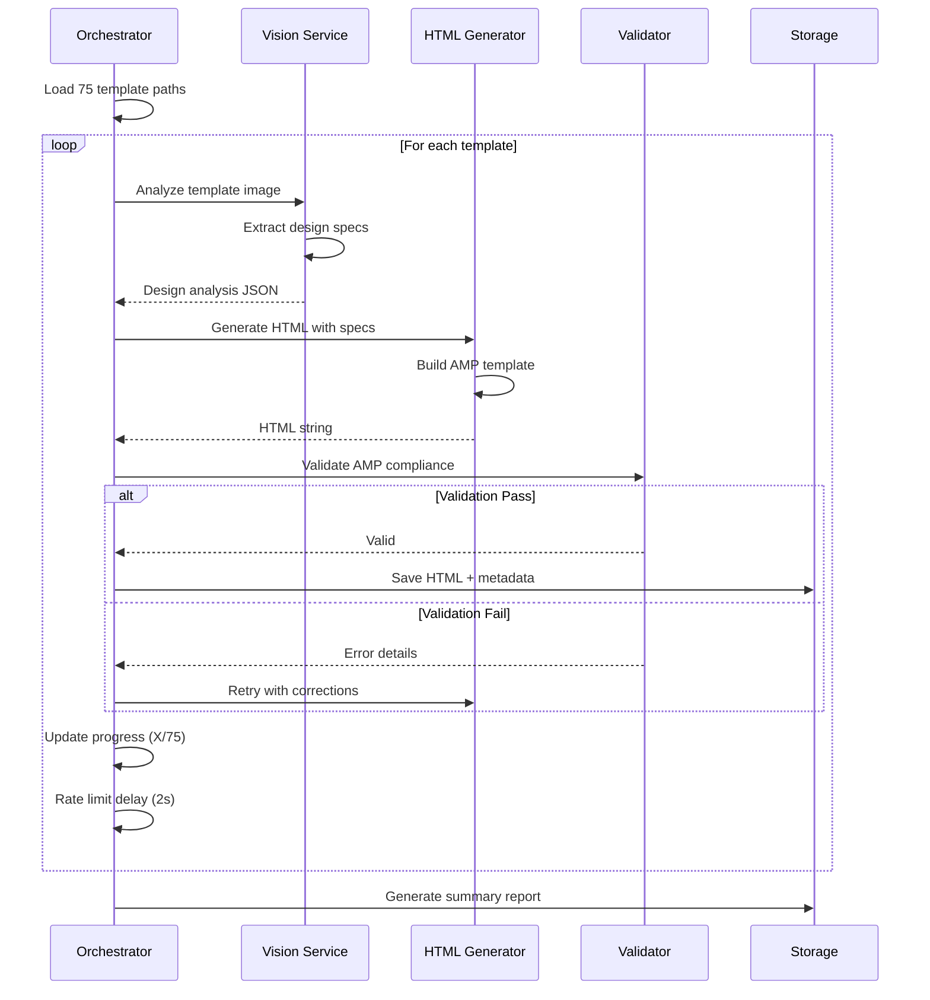

# Email Template Cloning System Design

## Overview

Design a comprehensive batch cloning system that generates pixel-perfect HTML reproductions of all 75 Flodesk email templates stored in the `flodesk_templates/` directory. The system must preserve exact visual fidelity across all design elements: fonts, structure, colors, backgrounds, spacing, and orientation.

**Strategic Goal**: Transform existing template images into production-ready AMP4Email HTML that can be used as the foundation for dynamic email generation with product insertion.

**Value Proposition**: 
- Eliminates manual template recreation effort
- Ensures design consistency across all 75 templates  
- Creates reusable library for personalized email campaigns
- Maintains professional design quality from proven templates

---

## Architecture

### Component Interaction Flow



### Batch Processing Strategy



---

## Design Extraction Engine

### Vision Analysis Parameters

The Vision Analysis Service extracts comprehensive design specifications from each template image.

**Analysis Dimensions**:

| Dimension | Extraction Target | Output Format |
|-----------|------------------|---------------|
| Color Palette | Primary, secondary, accent, background, text colors | Array of 3-8 hex codes |
| Layout Type | single-column, multi-column, hero-image, card-based, grid, minimal | String |
| Typography | Font families, sizes, weights, line-heights, letter-spacing | Structured object |
| Spacing System | Padding, margins, section gaps, element spacing | Pixel measurements |
| Background Styles | Solid colors, gradients, background images, patterns | CSS-compatible descriptors |
| Visual Elements | Buttons, dividers, icons, badges, images, borders | Component inventory |
| Content Sections | Header, hero, body, features, CTA, footer | Section hierarchy |
| Text Alignment | Left, center, right alignment per section | Alignment map |
| Responsive Breakpoints | Mobile vs desktop layout differences | Breakpoint specifications |

### Enhanced Vision Prompt Structure

The vision analysis prompt is designed to extract pixel-level precision:

**Prompt Framework**:
- Request exact hex color codes using color picker precision
- Identify specific font characteristics (family, weight, size in px, line-height ratio)
- Measure spacing in exact pixel values where visible
- Detect gradient directions and color stops
- Identify border radius, shadow specifications, and other CSS properties
- Map element hierarchy and positioning relationships

**Structured Output Schema**:

Table: Design Analysis Schema

| Field | Type | Description | Example |
|-------|------|-------------|---------|
| colors | Object | Primary, secondary, accent, background, text | `{primary: "#2563eb", secondary: "#f59e0b"}` |
| typography | Object | Font families, sizes, weights per element type | `{heading: {family: "Inter", size: "32px", weight: 700}}` |
| layout | Object | Type, column count, max-width | `{type: "single-column", maxWidth: "600px"}` |
| spacing | Object | Section padding, element margins | `{section: "40px", paragraph: "16px"}` |
| backgrounds | Object | Colors, gradients, images per section | `{hero: {type: "gradient", colors: ["#667eea", "#764ba2"]}}` |
| buttons | Array | Button styles with exact CSS properties | `[{bg: "#2563eb", color: "#fff", padding: "16px 32px"}]` |
| borders | Object | Border styles, radius, colors | `{radius: "8px", color: "#e5e7eb", width: "1px"}` |
| images | Array | Image placements, sizes, aspect ratios | `[{type: "hero", width: "600px", height: "400px"}]` |
| sections | Array | Section order and characteristics | `["header", "hero", "features", "cta", "footer"]` |

---

## HTML Generation Engine

### Template Generation Strategy

The HTML Generator creates AMP4Email-compliant templates based on extracted design specifications.

**Generation Approach**:

**Exact Color Matching**:
- Apply extracted hex codes to all matching elements
- Preserve gradient directions and color stops precisely  
- Maintain background-color, border-color, text-color consistency

**Typography Replication**:
- Use font families from typography analysis
- Apply exact font sizes, weights, line-heights
- Preserve text alignment and letter spacing
- Utilize web-safe fonts or standard web fonts

**Structural Fidelity**:
- Recreate exact section order from analysis
- Maintain column layouts (single vs multi-column)
- Preserve element hierarchy and nesting
- Apply correct max-widths and container structures

**Spacing Precision**:
- Use extracted padding values for sections
- Apply exact margin values between elements
- Maintain consistent line-height ratios
- Preserve white space distribution

**Background Reproduction**:
- Implement solid backgrounds with exact colors
- Recreate gradients with correct directions and stops
- Handle background images with proper sizing and positioning

**Component Accuracy**:
- Generate buttons with exact padding, border-radius, colors
- Create dividers with correct thickness, color, spacing
- Implement images with proper aspect ratios and layout
- Add icons or badges matching original positioning

### AMP4Email Compliance Rules

All generated templates must strictly adhere to AMP email specifications:

**Required Elements**:
- Document must start with `<!doctype html>`
- HTML tag must include `⚡4email` attribute
- Include required AMP script: `<script async src="https://cdn.ampproject.org/v0.js"></script>`
- Include AMP boilerplate: `<style amp4email-boilerplate>body{visibility:hidden}</style>`
- All CSS in single `<style amp-custom>` tag (max 75KB)

**Prohibited Elements**:
- No external stylesheets
- No inline scripts
- No form elements without AMP components
- No JavaScript except AMP components
- No external fonts via link tags (use @import or system fonts)

**Image Handling**:
- Use `<amp-img>` instead of ``
- Include `width`, `height`, and `layout` attributes
- Use `layout="responsive"` for fluid images
- Provide alt text for accessibility

**Responsive Design**:
- Use media queries within `<style amp-custom>`
- Target max-width 600px for email clients
- Implement mobile-first responsive patterns
- Test rendering at 320px, 375px, 414px, 600px widths

### Generation Prompt Architecture

The HTML generation prompt provides ultra-detailed specifications to ensure accuracy.

**Prompt Structure**:

**Section 1: Template Context**
- Original template filename and source
- Template category and use case
- Campaign types suitable for this design

**Section 2: Design Specifications**
- Complete design analysis JSON
- Detailed color palette with usage instructions
- Typography specifications for each element type
- Spacing system with exact pixel values
- Background styles per section
- Component styles (buttons, dividers, badges)

**Section 3: Structural Blueprint**
- Section order and hierarchy
- Layout type and column structure
- Container widths and alignment
- Element positioning and flow

**Section 4: CSS Requirements**
- Exact color values to use
- Font families, sizes, weights
- Padding and margin specifications
- Border, radius, shadow properties
- Gradient definitions
- Responsive breakpoints and adjustments

**Section 5: AMP Compliance**
- AMP4Email boilerplate requirements
- Component usage guidelines
- Image handling with amp-img
- CSS inlining requirements
- Prohibited patterns to avoid

**Section 6: Placeholder Content**
- Product name insertion point
- Product image placement
- Price display location
- CTA button text and link
- Merge tag positions ({{firstName}}, {{email}})

**Output Constraint**: Generate only HTML, no explanations or markdown code blocks

---

## Batch Processing Orchestrator

### Processing Flow

The Batch Orchestrator coordinates cloning all 75 templates with progress tracking and error handling.

**Initialization Phase**:
- Validate environment configuration (API keys, directories)
- Check Vision Service and HTML Generator availability
- Create output directories (`cloned_templates/`, `cloned_templates/metadata/`)
- Load list of all 75 template image paths
- Initialize progress tracker

**Processing Phase - For Each Template**:

Table: Per-Template Processing Steps

| Step | Action | Output | Error Handling |
|------|--------|--------|----------------|
| 1 | Load template image | Image buffer | Skip if file not found |
| 2 | Vision analysis via GPT-4o | Design specs JSON | Retry up to 3 times |
| 3 | Generate HTML via GPT-4o Mini | AMP HTML string | Retry with corrections |
| 4 | Validate AMP compliance | Pass/Fail + errors | Re-generate with fixes |
| 5 | Clean HTML (remove markdown) | Final HTML | Apply formatting rules |
| 6 | Save HTML file | Written to disk | Log save errors |
| 7 | Generate metadata | JSON metadata | Include all specs |
| 8 | Save metadata file | Written to disk | Log save errors |
| 9 | Update progress | X/75 complete | Display percentage |
| 10 | Rate limit delay | 2 second pause | Prevent API throttling |

**Completion Phase**:
- Generate summary report with statistics
- List successful clones (expected: 75)
- List failed clones (expected: 0)
- Calculate total processing time
- Output validation report

### Progress Tracking

**Console Output Pattern**:

```
Starting batch clone of 75 templates...
[1/75] Processing: 001_welcome.png
   Vision analysis... ✓ (1.2s)
   HTML generation... ✓ (3.4s)
   Validation... ✓
   Saved: cloned_templates/001_welcome.html
[2/75] Processing: 002_thank-you.png
   Vision analysis... ✓ (1.1s)
   ...
[75/75] Processing: 075_5f3e408507203a0026f0294e.png
   Vision analysis... ✓ (1.3s)
   HTML generation... ✓ (3.8s)
   Validation... ✓
   Saved: cloned_templates/075_5f3e408507203a0026f0294e.html

Batch Clone Complete!
Success: 75/75
Failed: 0/75
Total Time: 8 minutes 42 seconds
```

### Error Recovery Strategy

**Vision Analysis Failures**:
- Retry with same prompt up to 3 times
- If persistent failure, use fallback mock analysis with generic values
- Log warning and continue to next template

**HTML Generation Failures**:
- Retry with enhanced error-specific prompt
- If AMP validation fails, extract validation errors and retry with corrections
- Maximum 3 retry attempts per template
- If still failing, generate basic fallback template and flag for manual review

**File System Failures**:
- Verify output directory permissions before batch start
- Catch and log individual file save errors
- Continue processing remaining templates
- Report all save failures in summary

### Rate Limiting

**API Call Management**:
- Vision analysis: 1 call per template (75 total)
- HTML generation: 1-3 calls per template (75-225 total)
- Rate limit delay: 2 seconds between templates
- Total estimated time: 6-12 minutes for 75 templates

**Cost Estimation**:
- Vision analysis (GPT-4o): 75 templates × $0.002 = ~$0.15
- HTML generation (GPT-4o Mini): 75 templates × $0.0005 = ~$0.04
- Total cost: ~$0.19 for complete batch

---

## Output Structure

### File Organization

Directory structure for cloned templates:

```
cloned_templates/
├── 001_welcome.html
├── 002_thank-you.html
├── 003_announcement.html
├── ...
├── 075_5f3e408507203a0026f0294e.html
├── metadata/
│   ├── 001_welcome.json
│   ├── 002_thank-you.json
│   ├── 003_announcement.json
│   ├── ...
│   ├── 075_5f3e408507203a0026f0294e.json
│   └── batch_summary.json
└── preview/
    └── index.html (template gallery viewer)
```

### Metadata Schema

Each cloned template has associated metadata stored as JSON.

Table: Metadata Structure

| Field | Type | Description |
|-------|------|-------------|
| source_template | String | Original filename (e.g., "001_welcome.png") |
| source_path | String | Full path to original image |
| cloned_at | ISO DateTime | Timestamp of cloning |
| design_analysis | Object | Complete design specs from vision analysis |
| generation_model | String | Model used (e.g., "gpt-4o-mini") |
| validation_status | String | "passed" or "failed" |
| html_length | Number | Character count of generated HTML |
| processing_time | Number | Total milliseconds to process |
| retry_count | Number | Number of generation retries |
| amp_features | Array | AMP components used |
| category | String | Template category (welcome, ecommerce, etc.) |

**Example Metadata**:

```
{
  "source_template": "004_ecommerce.png",
  "source_path": "/flodesk_templates/004_ecommerce.png",
  "cloned_at": "2025-01-15T10:23:45Z",
  "design_analysis": {
    "colors": {
      "primary": "#2563eb",
      "secondary": "#10b981",
      "background": "#ffffff",
      "text": "#1f2937"
    },
    "typography": {
      "heading": {"family": "Arial", "size": "32px", "weight": 700},
      "body": {"family": "Arial", "size": "16px", "weight": 400}
    },
    "layout": {"type": "hero-image", "maxWidth": "600px"},
    "spacing": {"section": "40px", "paragraph": "16px"}
  },
  "generation_model": "gpt-4o-mini",
  "validation_status": "passed",
  "html_length": 4532,
  "processing_time": 4800,
  "retry_count": 0,
  "amp_features": ["amp-img"],
  "category": "ecommerce"
}
```

### Batch Summary Report

Generated after all templates are processed.

Table: Summary Report Fields

| Field | Type | Description |
|-------|------|-------------|
| total_templates | Number | Total number of templates (75) |
| successful_clones | Number | Successfully cloned templates |
| failed_clones | Number | Failed template clones |
| total_processing_time | Number | Total milliseconds for entire batch |
| average_processing_time | Number | Average milliseconds per template |
| total_cost_estimate | Number | Estimated API costs in USD |
| failed_template_list | Array | List of failed template filenames |
| timestamp | ISO DateTime | Batch completion timestamp |

---

## Validation Framework

### AMP Compliance Validation

Each generated template must pass strict AMP validation checks.

**Validation Checks**:

Table: AMP Validation Rules

| Rule | Check | Error Handling |
|------|-------|----------------|
| DOCTYPE | Starts with `<!doctype html>` | Prepend if missing |
| AMP Attribute | `<html ⚡4email>` or `<html amp4email>` present | Add to html tag |
| AMP Script | Contains `<script async src="https://cdn.ampproject.org/v0.js"></script>` | Insert in head |
| Boilerplate | Contains `<style amp4email-boilerplate>` | Insert boilerplate |
| CSS Location | All CSS in `<style amp-custom>` | Reject external stylesheets |
| CSS Size | `<style amp-custom>` under 75KB | Flag if over limit |
| Image Tags | Only `<amp-img>`, no `` | Convert to amp-img |
| Script Tags | Only AMP scripts, no inline JS | Remove prohibited scripts |
| Form Elements | Only AMP form components | Flag unsupported forms |
| External Resources | No external CSS/JS except AMP | Remove external links |

**Validation Process**:
- Parse HTML string as DOM structure
- Run each validation rule against DOM
- Collect all validation errors
- If errors found, attempt automatic fixes
- Re-validate after fixes
- If still failing, flag for manual review

### Visual Fidelity Assessment

After HTML generation, assess how closely the clone matches the original.

**Assessment Criteria**:

Table: Fidelity Checklist

| Criterion | Measurement | Target |
|-----------|-------------|--------|
| Color Accuracy | Hex codes match extracted palette | 100% match |
| Font Usage | Correct font families applied | 100% match |
| Layout Structure | Section order and hierarchy correct | 100% match |
| Spacing Consistency | Padding/margins within ±2px | 95%+ accuracy |
| Background Styles | Colors/gradients match specs | 100% match |
| Button Styling | All properties match specs | 100% match |
| Image Placement | Correct positions and sizes | 100% match |
| Responsive Behavior | Mobile breakpoints function correctly | Pass/Fail |

**Automated Assessment**:
- Color extraction: Parse `<style amp-custom>` for color values, compare to specs
- Font detection: Extract font-family declarations, verify against specs
- Layout verification: Check section count and order matches specs
- Spacing audit: Measure padding/margin values against specs

**Manual Review Triggers**:
- Any validation failure after 3 retries
- AMP CSS size exceeds 70KB (warning threshold)
- Missing critical sections (hero, CTA, footer)
- Incorrect responsive breakpoints

---

## Quality Assurance

### Pre-Processing Checks

Before initiating batch clone, validate system readiness.

**Environment Validation**:

Table: Environment Checklist

| Check | Requirement | Failure Action |
|-------|-------------|----------------|
| OpenAI API Key | OPENAI_API_KEY set and valid | Abort with error message |
| Vision Model | GPT-4o available | Abort with error message |
| Generation Model | GPT-4o Mini available | Abort with error message |
| Template Directory | `flodesk_templates/` exists | Abort with error message |
| Template Count | 75 PNG files present | Abort if count mismatch |
| Output Directory | Write permissions verified | Abort if no permissions |
| Disk Space | Minimum 50MB available | Abort if insufficient |

### Post-Processing Verification

After batch completion, verify output quality.

**Verification Steps**:

**File Completeness Check**:
- Count HTML files in output directory
- Verify count matches successful clone count
- Check each HTML file is non-empty
- Verify corresponding metadata files exist

**HTML Structure Validation**:
- Parse each HTML file as valid XML/HTML
- Verify AMP compliance on sample of 10 random templates
- Check for placeholder content presence ({{firstName}}, {{email}})
- Verify CTA buttons are present and properly linked

**Metadata Integrity**:
- Parse each JSON metadata file
- Verify all required fields present
- Check design_analysis completeness
- Validate timestamps and processing times

**Summary Report Review**:
- Check batch_summary.json exists and is valid
- Verify success rate (target: 100%)
- Review failed_template_list (target: empty)
- Confirm total_cost_estimate matches expectations

### Testing Strategy

**Unit-Level Testing**:
- Test Vision Analysis Service with single template
- Test HTML Generator with mock design specs
- Test AMP Validator with known valid/invalid templates
- Test file save operations with mock data

**Integration Testing**:
- Process batch of 5 templates end-to-end
- Verify all outputs generated correctly
- Check error handling with intentionally corrupted image
- Validate rate limiting behavior

**Acceptance Testing**:
- Clone all 75 templates in production environment
- Manual review of 10 randomly selected clones
- Visual comparison of clone vs original for reviewed templates
- Test clones in actual email clients (Gmail, Outlook)

---

## Execution Plan

### Phase 1: System Preparation

**Prerequisites**:
- Environment variables configured (OPENAI_API_KEY)
- Template images verified (75 files in `flodesk_templates/`)
- Output directories created with proper permissions
- Vision and HTML services tested individually

**Deliverables**:
- Environment validation script
- Pre-flight checklist completion report

### Phase 2: Batch Cloning Execution

**Execution Process**:
- Run batch orchestrator script
- Monitor console output for progress
- Observe error messages and retry attempts
- Track estimated completion time

**Duration Estimate**: 8-12 minutes for 75 templates

**Deliverables**:
- 75 HTML files in `cloned_templates/`
- 75 JSON metadata files in `cloned_templates/metadata/`
- Batch summary report

### Phase 3: Quality Verification

**Verification Tasks**:
- Run automated validation on all 75 outputs
- Manual review of 10 random template clones
- Visual comparison using preview gallery
- AMP compliance verification in email clients

**Deliverables**:
- Validation report with pass/fail status
- List of any templates requiring manual fixes
- Quality assurance sign-off

### Phase 4: Template Library Integration

**Integration Tasks**:
- Index cloned templates in Qdrant vector database
- Associate metadata with vector embeddings
- Update template library service to reference clones
- Test template search and retrieval

**Deliverables**:
- Updated Qdrant collection with 75 cloned templates
- Template library service using cloned HTMLs
- Integration test results

### Phase 5: Documentation and Handoff

**Documentation Tasks**:
- Create usage guide for cloned templates
- Document any manual adjustments made
- Provide template selection guide based on categories
- Create troubleshooting guide

**Deliverables**:
- Cloned Template Usage Guide
- Template Catalog with previews
- Maintenance and update procedures

---

## Risk Mitigation

### Potential Risks and Mitigations

Table: Risk Analysis

| Risk | Probability | Impact | Mitigation Strategy |
|------|-------------|--------|-------------------|
| API rate limiting | Medium | Medium | Implement 2s delays between calls; use exponential backoff |
| Vision analysis failures | Low | Medium | Retry logic with 3 attempts; fallback to mock analysis |
| HTML generation errors | Medium | Medium | Enhanced error prompts; automatic fix injection |
| AMP validation failures | Medium | High | Validation-driven retry with corrections; manual review queue |
| CSS size exceeding 75KB | Low | High | Optimize CSS during generation; minify if needed |
| Missing design elements | Medium | Medium | Comprehensive vision prompts; manual review sampling |
| Template image quality | Low | Low | Source templates are high-quality PNGs |
| File system errors | Low | Low | Pre-flight permission checks; error logging |
| Cost overruns | Low | Low | Cost estimation at $0.19; monitor API usage |
| Processing time exceeds expectations | Low | Low | Estimated 8-12 minutes; acceptable for one-time operation |

### Contingency Plans

**If Vision Analysis Consistently Fails**:
- Switch to manual design specification entry for failed templates
- Use existing Qdrant indexed analysis as reference
- Generate HTML with best-guess specifications
- Flag for post-processing manual refinement

**If HTML Generation Quality is Poor**:
- Enhance generation prompts with more detailed instructions
- Provide example HTML snippets for reference
- Use DeepSeek R1 for complex templates requiring advanced reasoning
- Accept lower fidelity for non-critical templates

**If AMP Validation Fails Repeatedly**:
- Identify common validation errors across templates
- Update generation prompts to avoid known error patterns
- Create AMP-compliant template boilerplate
- Manual fix of validation errors post-generation

**If Batch Processing is Too Slow**:
- Process templates in smaller batches of 10-15
- Run multiple batches in parallel (with API rate limit consideration)
- Reduce rate limit delay from 2s to 1s if no throttling occurs
- Prioritize high-value templates first

---

## Success Metrics

Table: Key Performance Indicators

| Metric | Target | Measurement Method |
|--------|--------|-------------------|
| Clone Success Rate | 100% (75/75) | Count of valid HTML files generated |
| AMP Compliance Rate | 100% (75/75) | Automated AMP validation pass rate |
| Average Processing Time | < 10 minutes | Total batch time / 75 templates |
| Vision Analysis Accuracy | > 95% | Manual review of color/font/layout matches |
| CSS Size Compliance | 100% (all < 75KB) | Automated file size check |
| Total Cost | < $0.25 | Sum of API charges |
| Manual Fixes Required | < 5 templates | Count of templates needing human intervention |
| Visual Fidelity Score | > 90% | Composite score from fidelity checklist |

**Acceptance Criteria**:
- All 75 templates successfully cloned
- All clones pass AMP validation
- Manual review confirms visual fidelity for sampled templates
- Templates are usable in production email campaigns
- Processing completes within estimated time and cost
