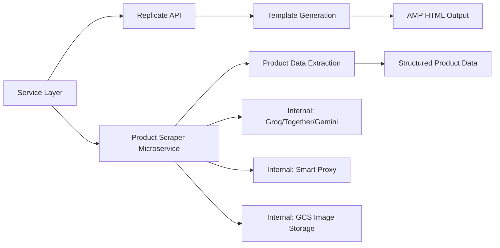
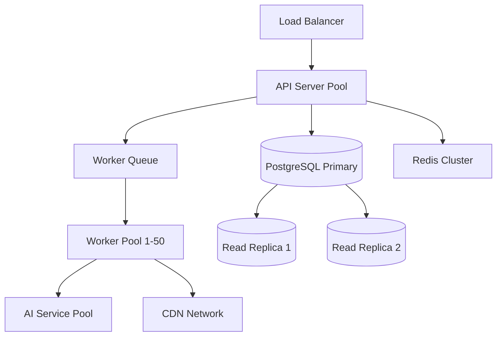

# AMP Email Generation API Platform - Technical Specification

## 1. Overview

### 1.1 Purpose
This specification defines the technical implementation requirements for the AMP Email Generation API Platform - an open API system that generates interactive AMP email templates by integrating AI-powered content generation, universal e-commerce scraping, and seamless third-party integrations while supporting any email service provider.

### 1.2 System Scope
The platform serves as both a standalone email template generation service and an integration component for third-party marketing automation systems, AI agents, and email service providers.

### 1.3 Key Objectives
- Provide open REST API for AMP email template generation
- Support universal e-commerce product scraping from any URL
- Enable third-party AI agent integration with compatible schema
- Maintain cost efficiency under $0.01 per template
- Achieve sub-10-second generation time
- Support enterprise-scale batch processing (10,000+ products)

---

## 2. System Architecture

### 2.1 Architecture Layers

The system follows a five-layer architecture pattern:

``mermaid
graph TD
    A[API Gateway Layer] --> B[Core API Layer]
    B --> C[Service Layer]
    C --> D[AI Processing Layer]
    D --> E[Data Storage Layer]
    
    B --> F[Standard Endpoints]
    B --> G[Third-Party Compatible Endpoints]
    B --> H[Use-Case Specific Endpoints]
    
    C --> I[Template Generation Service]
    C --> J[Product Scraper Service]
    C --> K[Personalization Engine]
    C --> L[CDN Storage Service]
    C --> M[Analytics Service]
    C --> N[Webhook Service]
```

### 2.2 Component Interaction Flow

``mermaid
sequenceDiagram
    participant Client as API Client
    participant Gateway as API Gateway
    participant API as Core API
    participant Scraper as Scraper Service
    participant AI as AI Layer
    participant Storage as Storage Service
    participant CDN as CDN
    
    Client->>Gateway: POST /api/v1/generate
    Gateway->>Gateway: Authenticate & Rate Limit
    Gateway->>API: Forward Request
    
    alt URLs Provided
        API->>Scraper: Extract Product Data
        Scraper->>Scraper Microservice: POST /enriched-extract
        Scraper Microservice-->>Scraper: Return Structured Product Data
        Scraper-->>API: Product Details
    end
    
    API->>AI: Generate AMP Templates (Replicate)
    AI-->>API: Return Templates (3-5 variations)
    
    API->>Storage: Store Templates
    Storage->>CDN: Upload to CDN
    CDN-->>Storage: CDN URLs
    Storage-->>API: Confirm Storage
    
    API-->>Gateway: Template URLs + Metadata
    Gateway-->>Client: Response with URLs
```

### 2.3 Request Processing Flow

The system processes requests through seven distinct stages:

**Stage 1: Input Reception**
- Accept product URLs and/or complete product data
- Receive campaign context (type, goal, brand)
- Process action tree nodes for multi-step workflows
- Capture user context with merge tags
- Collect personalization parameters

**Stage 2: Authentication & Validation**
- Verify API key or JWT token
- Track company and user identifiers
- Check rate limits based on subscription plan
- Validate request schema against OpenAPI specification
- Log request for analytics

**Stage 3: Product Data Processing**
- Evaluate data completeness score
- If URLs only: trigger scraper service
- If partial data: enrich via selective scraping
- If complete data: use provided information directly
- Normalize product data to standard schema

**Stage 4: Content Generation**
- Build generation context from all inputs
- Apply historical learning patterns
- Generate 3-5 template variations via AI
- Create A/B testing alternatives
- Preserve merge tags throughout content

**Stage 5: Template Processing**
- Validate AMP HTML compliance
- Generate fallback HTML version
- Preserve personalization merge tags
- Insert analytics tracking markers
- Optimize for email client rendering

**Stage 6: Storage & Distribution**
- Upload templates to cloud storage (S3/GCS)
- Distribute to CDN edge locations
- Generate signed access URLs
- Store metadata in PostgreSQL
- Cache references in Redis

**Stage 7: Response Formatting**
- Return template CDN URLs
- Provide integration code snippets
- Generate preview links
- Include analytics metadata
- Report cost breakdown

---

## 3. API Endpoint Specifications

### 3.1 Standard API Endpoints

#### 3.1.1 Generate Template Endpoint

**Endpoint**: `POST /api/v1/generate`

**Purpose**: Generate AMP email templates from product URLs or structured product data with campaign and user context.

**Authentication**: Required (API Key in Authorization header)

**Request Schema**:

| Field | Type | Required | Description |
|-------|------|----------|-------------|
| product_urls | string[] | Conditional | Array of e-commerce product URLs (required if products not provided) |
| products | Product[] | Conditional | Structured product data (required if URLs not provided) |
| campaign_context | CampaignContext | Yes | Campaign type and goals |
| campaign_context.type | string | Yes | Values: abandoned_cart, promotional, product_launch, price_drop, back_in_stock |
| campaign_context.goal | string | Yes | Values: acquisition, retention, engagement, conversion |
| user_context | UserContext | No | User personalization data with merge tags |
| user_context.firstName | string | No | Can include {{merge_tag}} format |
| user_context.email | string | No | User email address |
| brand_context | BrandContext | No | Brand styling and voice preferences |
| options | GenerationOptions | No | Generation configuration |
| options.variations | number | No | Number of variations (1-5, default: 3) |
| options.preserve_merge_tags | boolean | No | Preserve personalization tags (default: true) |

**Response Schema**:

| Field | Type | Description |
|-------|------|-------------|
| campaign_id | string | Unique campaign identifier |
| templates | Template[] | Generated template variations |
| templates[].id | string | Template unique identifier |
| templates[].variation_name | string | A/B test variation label |
| templates[].amp_url | string | CDN URL for AMP HTML |
| templates[].fallback_url | string | CDN URL for fallback HTML |
| templates[].content.subject | string | Email subject line |
| templates[].content.preheader | string | Preview text |
| templates[].merge_tags | string[] | Detected merge tags |
| preview_urls | PreviewURLs | Browser-viewable preview links |
| integration_code | IntegrationCode | Code snippets for ESP integration |
| cost | CostBreakdown | Generation cost details |

**Response Example Structure**:
- campaign_id: Unique UUID
- templates: Array of 3-5 variations
- preview_urls: Links for each variation
- integration_code: SendGrid, Resend, AWS SES snippets
- cost: Breakdown by component

#### 3.1.2 Batch Campaign Endpoint

**Endpoint**: `POST /api/v1/batch/campaign`

**Purpose**: Process large-scale campaigns with thousands of products and recipients using asynchronous job processing.

**Authentication**: Required (API Key)

**Request Schema**:

| Field | Type | Required | Description |
|-------|------|----------|-------------|
| campaign_name | string | Yes | Human-readable campaign identifier |
| product_urls | string[] | Yes | Up to 10,000 product URLs |
| recipient_segments | Segment[] | No | Up to 100,000 recipient groups |
| campaign_context | CampaignContext | Yes | Campaign configuration |
| max_concurrent | number | No | Maximum concurrent processing (default: 10) |
| chunk_size | number | No | Products per batch (default: 100) |
| webhook_url | string | No | Callback URL for completion notification |

**Response Schema**:

| Field | Type | Description |
|-------|------|-------------|
| job_id | string | Batch job identifier |
| status | string | Values: queued, processing, completed, failed |
| tracking_url | string | Real-time status monitoring URL |
| estimated_time | string | Estimated completion time |
| products_queued | number | Total products in queue |

#### 3.1.3 Retrieve Template Endpoint

**Endpoint**: `GET /api/v1/templates/{id}`

**Purpose**: Retrieve previously generated template details and content.

**Authentication**: Required

**Path Parameters**:
- id: Template unique identifier

**Response Schema**:

| Field | Type | Description |
|-------|------|-------------|
| template | Template | Complete template object |
| campaign | Campaign | Associated campaign details |
| analytics | Analytics | Performance metrics if available |
| created_at | datetime | Template creation timestamp |

#### 3.1.4 Personalize Template Endpoint

**Endpoint**: `POST /api/v1/personalize`

**Purpose**: Apply recipient-specific personalization to existing templates by resolving merge tags.

**Authentication**: Required

**Request Schema**:

| Field | Type | Required | Description |
|-------|------|----------|-------------|
| template_id | string | Yes | Template to personalize |
| recipient_data | object | Yes | Key-value pairs for merge tags |
| preview_mode | boolean | No | Return preview without sending |

**Response Schema**:

| Field | Type | Description |
|-------|------|-------------|
| personalized_content | string | Resolved AMP HTML |
| fallback_content | string | Resolved fallback HTML |
| merge_tags_applied | string[] | Successfully resolved tags |
| missing_tags | string[] | Unresolved tags |

#### 3.1.5 Preview Template Endpoint

**Endpoint**: `GET /api/v1/preview/{id}`

**Purpose**: Generate browser-viewable preview of template with sample data.

**Authentication**: Optional (public preview links)

**Path Parameters**:
- id: Template identifier

**Query Parameters**:
- variation: Specific variation name (optional)
- format: amp or fallback (default: amp)

**Response**: HTML page with rendered template

### 3.2 Third-Party Compatible Endpoints

#### 3.2.1 ML-Compatible Generation Endpoint

**Endpoint**: `POST /api/v1/ml-compatible/generate-amp-content`

**Purpose**: Compatible endpoint for third-party AI agents and marketing platforms using standardized ML service schema.

**Authentication**: Required

**Request Schema**:

| Field | Type | Required | Description |
|-------|------|----------|-------------|
| companyId | string | Yes | Client company identifier for tracking |
| userId | string | Yes | End user identifier |
| channel | string | Yes | Must be "email" |
| campaignContext | object | Yes | Campaign configuration |
| campaignContext.type | string | Yes | Campaign type identifier |
| campaignContext.goal | string | Yes | Campaign objective |
| actionTreeNodes | ActionTreeNode[] | No | Multi-step workflow nodes |
| userContext | object | No | User personalization data |
| brandContext | object | No | Brand styling preferences |
| productContext | Product[] | No | Product data or URLs |
| contentHistory | object | No | Previous generation history |
| feedback | string | No | Feedback for regeneration |

**ActionTreeNode Schema**:

| Field | Type | Description |
|-------|------|-------------|
| id | string | Node unique identifier |
| description | string | Node purpose description |
| nodeType | string | Values: action, condition, wait |
| indication | string | Values: email, sms, push |
| target | string[] | Target audience segments |
| nodeContext.purpose | string | Step-specific purpose |
| nodeContext.sequence | number | Order in workflow |
| nodeContext.followUpNodes | string[] | Subsequent node IDs |

**Response Schema**:

| Field | Type | Description |
|-------|------|-------------|
| success | boolean | Operation success indicator |
| data | object | Response payload |
| data.campaignId | string | Generated campaign identifier |
| data.nodeContents | NodeContent[] | Content for each action tree node |
| data.templates | Template[] | Standard template format |
| metadata | object | Additional tracking information |

**NodeContent Schema**:

| Field | Type | Description |
|-------|------|-------------|
| nodeId | string | Corresponding action tree node ID |
| content.subject | string | Email subject line |
| content.body | string | Email body content |
| content.preheader | string | Preview text |
| ampUrl | string | CDN URL for AMP version |
| fallbackUrl | string | CDN URL for fallback |
| mergeTags | string[] | Preserved personalization tags |

#### 3.2.2 Action Tree Generation Endpoint

**Endpoint**: `POST /api/v1/action-tree/generate-content`

**Purpose**: Generate content for multi-node workflow campaigns with sequential dependencies.

**Authentication**: Required

**Request Schema**: Similar to ML-compatible with mandatory actionTreeNodes array

**Response Schema**: Returns nodeContents array with generated content for each workflow step

#### 3.2.3 Node-Specific Generation Endpoint

**Endpoint**: `POST /api/v1/node/generate-content`

**Purpose**: Generate content for a single action tree node independently.

**Authentication**: Required

**Request Schema**:

| Field | Type | Required | Description |
|-------|------|----------|-------------|
| node | ActionTreeNode | Yes | Single node definition |
| campaignContext | object | Yes | Campaign configuration |
| productContext | Product[] | No | Product data |

**Response Schema**: Single NodeContent object

#### 3.2.4 Regenerate Content Endpoint

**Endpoint**: `POST /api/v1/regenerate/{contentId}`

**Purpose**: Improve existing content based on feedback or performance data.

**Authentication**: Required

**Path Parameters**:
- contentId: Original content identifier

**Request Schema**:

| Field | Type | Required | Description |
|-------|------|----------|-------------|
| feedback | string | Yes | Improvement instructions |
| performance_data | object | No | Analytics metrics for learning |
| preserve_structure | boolean | No | Keep same layout (default: true) |

**Response Schema**: Updated Template object with new variation

### 3.3 Use-Case Specific Endpoints

#### 3.3.1 Abandoned Cart Campaign

**Endpoint**: `POST /api/v1/use-cases/abandoned-cart/campaign`

**Purpose**: Generate abandoned cart recovery emails with urgency and incentives.

**Request Schema**:

| Field | Type | Required | Description |
|-------|------|----------|-------------|
| cart_id | string | Yes | Shopping cart identifier |
| user_email | string | Yes | Customer email address |
| product_urls | string[] | Yes | Products in abandoned cart |
| abandoned_at | datetime | Yes | Cart abandonment timestamp |
| cart_value | number | Yes | Total cart value |
| currency | string | Yes | Currency code (USD, EUR, etc.) |
| trigger_after_hours | number | No | Delay before sending (default: 2) |
| discount_strategy | string | No | auto, fixed, percentage, none |

**Response Schema**:

| Field | Type | Description |
|-------|------|-------------|
| campaign_id | string | Campaign identifier |
| urgency_level | string | Values: low, medium, high |
| discount_offered | number | Auto-calculated discount if enabled |
| send_after | datetime | Scheduled send time |
| templates | Template[] | Generated variations |

#### 3.3.2 Product Launch Campaign

**Endpoint**: `POST /api/v1/use-cases/product-launch/campaign`

**Purpose**: Generate product announcement emails with feature highlights.

**Request Schema**:

| Field | Type | Required | Description |
|-------|------|----------|-------------|
| product_urls | string[] | Yes | New product URLs |
| launch_date | datetime | Yes | Official launch date |
| early_access | boolean | No | Early access for subscribers |
| highlight_features | string[] | No | Key features to emphasize |
| pre_order_enabled | boolean | No | Enable pre-order links |

**Response Schema**: Standard campaign response with launch-optimized templates

#### 3.3.3 Price Drop Alert

**Endpoint**: `POST /api/v1/use-cases/price-drop/alert`

**Purpose**: Generate price drop notification emails with comparison.

**Request Schema**:

| Field | Type | Required | Description |
|-------|------|----------|-------------|
| product_url | string | Yes | Product URL |
| original_price | number | Yes | Previous price |
| new_price | number | Yes | Current price |
| discount_percentage | number | No | Auto-calculated if not provided |
| limited_time | boolean | No | Add urgency messaging |
| stock_level | string | No | Values: low, medium, high |

**Response Schema**: Template with price comparison visualization

#### 3.3.4 Back in Stock Notification

**Endpoint**: `POST /api/v1/use-cases/back-in-stock/notify`

**Purpose**: Generate back-in-stock alerts for waitlist subscribers.

**Request Schema**:

| Field | Type | Required | Description |
|-------|------|----------|-------------|
| product_url | string | Yes | Restocked product URL |
| waitlist_id | string | Yes | Subscriber waitlist identifier |
| stock_quantity | number | No | Available quantity |
| notify_urgency | boolean | No | Add limited stock messaging |
| related_products | string[] | No | Alternative product suggestions |

**Response Schema**: Template with stock availability messaging

---

## 4. Data Models

### 4.1 Core Entity Definitions

#### Campaign Entity

**Purpose**: Represents a complete email campaign with all associated templates and metadata.

**Attributes**:

| Field | Type | Constraints | Description |
|-------|------|-------------|-------------|
| id | UUID | Primary Key | Internal unique identifier |
| companyId | string | Not Null, Indexed | Client company identifier |
| userId | string | Not Null | End user identifier |
| externalCampaignId | string | Nullable | Third-party platform campaign ID |
| type | enum | Not Null | Values: event_based, audience_based, scheduled |
| status | enum | Not Null | Values: draft, active, completed, failed |
| templates | Template[] | Relation | Associated template variations |
| analytics | Analytics | Relation | Performance metrics |
| metadata | JSON | Nullable | Additional campaign data |
| createdAt | timestamp | Auto | Creation timestamp |
| updatedAt | timestamp | Auto | Last update timestamp |

**Relationships**:
- One campaign has many templates (1:N)
- One campaign has one analytics record (1:1)
- Many campaigns belong to one company (N:1)

#### Template Entity

**Purpose**: Stores individual template variations with content and URLs.

**Attributes**:

| Field | Type | Constraints | Description |
|-------|------|-------------|-------------|
| id | UUID | Primary Key | Template unique identifier |
| campaignId | UUID | Foreign Key | Parent campaign reference |
| variationName | string | Not Null | A/B test variation label (A, B, C, etc.) |
| ampUrl | string(URL) | Not Null | CDN URL for AMP HTML version |
| fallbackUrl | string(URL) | Not Null | CDN URL for fallback HTML |
| content | JSON | Not Null | Template content structure |
| content.subject | string | - | Email subject line |
| content.body | string | - | Email body HTML |
| content.preheader | string | - | Preview text |
| mergeTags | string[] | Default: [] | List of merge tags used |
| ampFeatures | string[] | Default: [] | AMP components used |
| metadata | JSON | Nullable | Template-specific metadata |
| createdAt | timestamp | Auto | Creation timestamp |

**Content Structure**:
- Subject: Email subject line with merge tags preserved
- Body: Complete AMP HTML body content
- Preheader: Optional preview text

#### Product Entity

**Purpose**: Represents e-commerce product data from scraping or direct input.

**Attributes**:

| Field | Type | Constraints | Description |
|-------|------|-------------|-------------|
| id | string | Optional | Product SKU or identifier |
| name | string | Optional | Product name/title |
| price | string/number | Optional | Product price |
| currency | string | Optional | Currency code (USD, EUR, etc.) |
| image | string(URL) | Optional | Primary product image URL |
| url | string(URL) | Optional | Product page URL |
| link | string(URL) | Optional | Affiliate or tracking link |
| description | string | Optional | Product description |
| _source | enum | Internal | Values: provided, scraped |
| _completeness | number | Internal | Data completeness score (0-100) |

**Data Completeness Calculation**:
- Each field contributes to completeness score
- Minimum 60% required for generation
- Missing fields trigger selective scraping

#### Action Tree Node Entity

**Purpose**: Defines multi-step workflow nodes for campaign automation.

**Attributes**:

| Field | Type | Constraints | Description |
|-------|------|-------------|-------------|
| id | string | Primary Key | Node unique identifier |
| description | string | Not Null | Node purpose description |
| nodeType | enum | Not Null | Values: action, condition, wait |
| indication | enum | Not Null | Values: email, sms, push |
| target | string[] | Not Null | Target audience segments |
| nodeContext | JSON | Not Null | Node-specific configuration |
| nodeContext.purpose | string | - | Step-specific purpose |
| nodeContext.sequence | number | - | Order in workflow (1-based) |
| nodeContext.followUpNodes | string[] | - | Subsequent node IDs |
| content | NodeContent | Relation | Generated content for node |

**Node Types**:
- action: Triggers email/sms/push
- condition: Decision point based on user behavior
- wait: Time delay or event wait

#### Analytics Entity

**Purpose**: Tracks campaign and template performance metrics.

**Attributes**:

| Field | Type | Description |
|-------|------|-------------|
| id | UUID | Analytics record identifier |
| campaignId | UUID | Associated campaign |
| templateId | UUID | Specific template (nullable) |
| eventType | enum | Values: generated, sent, opened, clicked, converted |
| eventData | JSON | Event-specific data |
| timestamp | timestamp | Event occurrence time |

**Event Types**:
- generated: Template created
- sent: Email dispatched
- opened: Email opened (if tracking enabled)
- clicked: Link clicked
- converted: Goal achieved

### 4.2 Database Schema Design

#### Companies Table

**Purpose**: Track API client companies and subscription plans.

**Schema**:

| Column | Type | Constraints | Description |
|--------|------|-------------|-------------|
| id | UUID | Primary Key | Internal identifier |
| company_id | VARCHAR(255) | Unique, Not Null, Indexed | External company identifier |
| name | VARCHAR(255) | Nullable | Company name |
| api_key | VARCHAR(255) | Unique, Not Null | API authentication key |
| plan_type | VARCHAR(50) | Default: 'free' | Subscription tier |
| credits_remaining | INTEGER | Default: 1000 | Available generation credits |
| rate_limit_tier | VARCHAR(50) | Default: 'free' | Rate limiting configuration |
| created_at | TIMESTAMP | Default: NOW() | Registration date |
| updated_at | TIMESTAMP | Auto-update | Last modification |

**Indexes**:
- Primary: id
- Unique: company_id, api_key
- Query: plan_type, created_at

#### Campaigns Table

**Purpose**: Store campaign metadata and relationships.

**Schema**:

| Column | Type | Constraints | Description |
|--------|------|-------------|-------------|
| id | UUID | Primary Key | Internal identifier |
| internal_id | VARCHAR(255) | Unique, Not Null | Human-readable ID |
| company_id | VARCHAR(255) | Foreign Key, Indexed | References companies |
| user_id | VARCHAR(255) | Not Null, Indexed | End user identifier |
| external_campaign_id | VARCHAR(255) | Nullable | Third-party platform ID |
| type | VARCHAR(50) | Not Null | Campaign type |
| status | VARCHAR(50) | Not Null | Current status |
| metadata | JSONB | Nullable | Additional data |
| created_at | TIMESTAMP | Default: NOW() | Creation timestamp |
| updated_at | TIMESTAMP | Auto-update | Last update |

**Indexes**:
- Primary: id
- Unique: internal_id
- Foreign Key: company_id → companies(company_id)
- Query: user_id, type, status, created_at

#### Templates Table

**Purpose**: Store generated template content and URLs.

**Schema**:

| Column | Type | Constraints | Description |
|--------|------|-------------|-------------|
| id | UUID | Primary Key | Template identifier |
| campaign_id | UUID | Foreign Key, Indexed | Parent campaign |
| variation_name | VARCHAR(100) | Not Null | Variation label (A, B, C) |
| amp_url | TEXT | Not Null | CDN URL for AMP version |
| fallback_url | TEXT | Not Null | CDN URL for fallback |
| content | JSONB | Not Null | Template content structure |
| merge_tags | TEXT[] | Default: [] | Merge tags array |
| amp_features | TEXT[] | Default: [] | AMP components used |
| metadata | JSONB | Nullable | Additional metadata |
| created_at | TIMESTAMP | Default: NOW() | Creation timestamp |

**Indexes**:
- Primary: id
- Foreign Key: campaign_id → campaigns(id)
- Query: created_at

#### Generation Logs Table

**Purpose**: Audit trail and cost tracking for all generations.

**Schema**:

| Column | Type | Constraints | Description |
|--------|------|-------------|-------------|
| id | UUID | Primary Key | Log entry identifier |
| company_id | VARCHAR(255) | Indexed | Client company |
| user_id | VARCHAR(255) | Indexed | End user |
| campaign_id | UUID | Foreign Key | Associated campaign |
| generation_type | VARCHAR(50) | Not Null | Type of generation |
| products_processed | INTEGER | Not Null | Number of products |
| cost_usd | DECIMAL(10,6) | Not Null | Generation cost |
| duration_ms | INTEGER | Not Null | Processing time |
| success | BOOLEAN | Not Null | Success indicator |
| error_message | TEXT | Nullable | Error details if failed |
| created_at | TIMESTAMP | Default: NOW() | Log timestamp |

**Indexes**:
- Primary: id
- Query: company_id, user_id, created_at, success

#### Analytics Table

**Purpose**: Track campaign and template performance events.

**Schema**:

| Column | Type | Constraints | Description |
|--------|------|-------------|-------------|
| id | UUID | Primary Key | Analytics identifier |
| campaign_id | UUID | Foreign Key, Indexed | Associated campaign |
| template_id | UUID | Foreign Key, Nullable | Specific template |
| event_type | VARCHAR(50) | Not Null | Event category |
| event_data | JSONB | Not Null | Event details |
| created_at | TIMESTAMP | Default: NOW() | Event timestamp |

**Indexes**:
- Primary: id
- Foreign Keys: campaign_id, template_id
- Query: event_type, created_at

#### Personalization History Table

**Purpose**: Store learning patterns for improved personalization over time.

**Schema**:

| Column | Type | Constraints | Description |
|--------|------|-------------|-------------|
| id | UUID | Primary Key | History identifier |
| company_id | VARCHAR(255) | Indexed | Client company |
| user_id | VARCHAR(255) | Indexed | End user |
| patterns | JSONB | Not Null | Learned patterns |
| performance_metrics | JSONB | Not Null | Historical performance |
| updated_at | TIMESTAMP | Auto-update | Last learning update |

**Indexes**:
- Primary: id
- Unique: (company_id, user_id)
- Query: updated_at

---

## 5. Service Layer Architecture

### 5.1 Template Generation Service

**Responsibility**: Orchestrate AI-powered AMP email template generation with variations.

**Key Functions**:

**generateTemplates()**
- Input: Product data, campaign context, user context, options
- Process: Build AI prompt, call Replicate API, generate 3-5 variations
- Output: Array of Template objects with content and metadata

**validateAMPCompliance()**
- Input: Generated HTML content
- Process: Validate against AMP email specification
- Output: Validation result with errors if any

**generateFallback()**
- Input: AMP HTML content
- Process: Strip AMP components, create standard HTML
- Output: Fallback HTML string

**preserveMergeTags()**
- Input: Content with merge tags, tag list
- Process: Ensure tags not altered during generation
- Output: Content with preserved tags

**Interactions**:
- Calls AI Layer for content generation
- Uses Personalization Engine for merge tag handling
- Triggers CDN Storage Service for hosting
- Logs to Analytics Service

### 5.2 Product Scraper Service

**Responsibility**: Integrate with Product Scraper Microservice API for extracting structured product data from any e-commerce URL.

**Architecture**: This is a separately hosted microservice (Cloud Run deployment) that handles all product data extraction independently.

**Microservice Details**:
- **Base URL**: `https://product-scraper-217130114839.us-east1.run.app`
- **Platform**: Google Cloud Run (containerized FastAPI)
- **Region**: us-east1
- **Uptime SLA**: 99.5%
- **Max Concurrent Requests**: 10

**Technology Stack**:
- FastAPI server (Python)
- Playwright for browser automation
- Free-tier AI models (Groq Llama 3 70B, Together AI, Gemini Flash)
- Redis for two-layer caching (HTML + LLM responses)
- Google Cloud Storage for image hosting
- Smart proxy manager with Bright Data integration

**Core Capabilities**:
- Universal e-commerce support (10,000+ platforms)
- Category-aware extraction (12 product categories with 100+ fields)
- Zero-configuration scraping (no site-specific scrapers needed)
- AI-powered extraction (vision + text analysis)
- Smart proxy detection (automatic, saves 70-80% costs)
- Screenshot fallback for JavaScript-heavy sites
- Automatic image upload to GCS with CDN URLs
- Built-in 24-hour caching

**Primary Endpoint - Single Product**:
```
POST /knowledge-base/enriched-extract

Request:
{
  "link": "https://amazon.com/dp/B09KMRWYYJ/",
  "category": "electronics",  // Optional but recommended
  "screenshot": false,         // Force vision-based extraction
  "force_proxy": false        // Force proxy usage
}

Response:
{
  "product_name": "Product Title",
  "price": 17.99,
  "currency": "USD",
  "original_price": 24.99,
  "is_available": true,
  "description": "Product description",
  "brand": "Brand Name",
  "images": ["https://storage.googleapis.com/.../image.jpg"],
  "specifications": "Detailed specs",
  "reviews": [{...}],  // Up to 10 reviews
  "ratings_average": 4.5,
  "ratings_count": 1234,
  "url": "original_url",
  "proxy_used": "Direct",
  "llm_model": "groq-llama3-70b",
  "extraction_cost": 0.0,
  "extraction_time": 16.23
  // + 100+ category-specific fields
}
```

**Bulk Endpoint**:
```
POST /knowledge-base/bulk-enriched-extract

Request:
{
  "links": ["url1", "url2", ...],  // Up to 10,000
  "company_id": "client-id",
  "max_concurrent": 5
}

Response:
{
  "products": [{...}, {...}],
  "count": 2,
  "successful": 2,
  "failed": 0
}
```

**Supported Categories & Fields**:
- Electronics: specifications, warranty, battery_life, connectivity
- Fashion: colors, sizes, material, care_instructions
- Food: ingredients, nutrition_highlights, allergens, dietary
- Beauty: skin_type, ingredients, spf, formulation
- Home: dimensions, assembly_required, style, material
- Books: author, publisher, ISBN, page_count
- Toys: age_range, safety_warnings, educational_value
- Plus 5 more categories with specialized fields

**Performance Metrics**:
- Simple sites: 10-15 seconds
- Complex sites: 20-35 seconds
- Cache hit: < 100ms
- Success rate: 99%+
- Cost per extraction: $0.00 (free-tier LLMs)

**Integration Best Practices**:
1. Include `category` parameter for 15-20% accuracy improvement
2. Use bulk endpoint for multiple products (5x faster)
3. Set client timeout to 65 seconds
4. Cache responses for 24 hours client-side
5. Monitor `extraction_time` and `proxy_used` metrics
6. Implement retry logic for HTTP 500 errors

### 5.3 Personalization Engine

**Responsibility**: Manage merge tags, apply personalization, and learn from history.

**Key Functions**:

**detectMergeTags()**
- Input: Content string
- Process: Regex pattern matching for {{tag}} format
- Output: Array of detected merge tags

**applyPersonalization()**
- Input: Template content, recipient data
- Process: Replace merge tags with actual values
- Output: Personalized content

**learnFromHistory()**
- Input: Company ID, user ID, performance data
- Process: Update personalization patterns
- Output: Updated learning model

**generateRecommendations()**
- Input: Campaign context, historical patterns
- Process: Suggest optimal personalization strategy
- Output: Personalization recommendations

**Merge Tag Format**:
- Standard: {{field_name}}
- Nested: {{user.firstName}}
- Default: {{field_name|default:"value"}}
- Filters: {{price|currency:"USD"}}

### 5.4 CDN & Storage Service

**Responsibility**: Host templates on CDN for global distribution and fast delivery.

**Key Functions**:

**uploadTemplate()**
- Input: Template HTML content, campaign ID, variation name
- Process: Upload to S3/GCS, trigger CDN distribution
- Output: CDN URLs (amp_url, fallback_url)

**generateSignedURLs()**
- Input: Storage path, expiration time
- Process: Create time-limited access URLs
- Output: Signed URL strings

**invalidateCache()**
- Input: Campaign ID or template ID
- Process: Purge CDN cache for updated content
- Output: Invalidation confirmation

**Storage Strategy**:
- Path structure: /campaigns/{campaign_id}/{variation_name}/{amp|fallback}.html
- CDN: CloudFlare or AWS CloudFront
- Caching: 24-hour default TTL
- Compression: Brotli and Gzip enabled

### 5.5 Analytics Service

**Responsibility**: Track generation events, costs, and performance metrics.

**Key Functions**:

**logGeneration()**
- Input: Campaign details, cost, duration, success status
- Process: Insert to generation_logs table
- Output: Log ID

**trackEvent()**
- Input: Event type, campaign ID, event data
- Process: Insert to analytics table, update metrics
- Output: Event ID

**getMetrics()**
- Input: Campaign ID or company ID, date range
- Process: Aggregate analytics data
- Output: Metrics object with KPIs

**calculateCost()**
- Input: Generation parameters (products, variations)
- Process: Sum component costs (scraping, AI, CDN)
- Output: Cost breakdown object

**Tracked Metrics**:
- Templates generated per campaign
- Average generation time
- Cost per template
- Variation performance (if sending tracked)
- Error rates by type

### 5.6 Webhook Service

**Responsibility**: Monitor product changes and trigger alerts.

**Key Functions**:

**registerWebhook()**
- Input: Product URL, webhook URL, trigger conditions
- Process: Store webhook configuration, schedule monitoring
- Output: Webhook ID

**monitorProduct()**
- Input: Product URL
- Process: Periodic scraping, comparison with baseline
- Output: Change detection result

**triggerWebhook()**
- Input: Webhook ID, change data
- Process: HTTP POST to webhook URL
- Output: Delivery confirmation

**Webhook Events**:
- price_drop: Price decreased by threshold
- back_in_stock: Out-of-stock to in-stock
- price_increase: Price increased (configurable)
- product_updated: Description or images changed

**Monitoring Frequency**:
- Standard: Every 6 hours
- Premium: Every 1 hour
- Enterprise: Every 15 minutes

---

## 6. External Services Integration

### 6.1 External Services Architecture



### 6.2 Replicate API Integration

**Purpose**: Generate AMP email template HTML content with variations.

**Service Type**: External third-party AI API

**Model Used**: Custom fine-tuned model or GPT-4 via Replicate

**Input Format**:
```
Context Components:
- Campaign type and goal
- Product data (name, price, description, images from scraper)
- Brand voice and styling preferences
- User personalization markers (merge tags)
- Historical performance patterns

Prompt Structure:
"Generate AMP email template for {campaign_type} campaign
Products: {product_list}
Brand voice: {brand_context}
Personalization: Include {{firstName}}, {{email}} merge tags
Requirements: Valid AMP HTML, mobile-optimized, CTA prominent"
```

**Output Format**: AMP HTML string with embedded merge tags

**Error Handling**:
- Retry with exponential backoff (3 attempts)
- Fallback to alternative model if available
- Log generation failures for analysis
- Return cached similar template if generation fails

**Cost**: $0.0024 per template generation

**Performance**: 5-7 seconds average generation time

### 6.3 Product Scraper Microservice Integration

**Purpose**: Extract structured product data from any e-commerce URL.

**Service Type**: Internal microservice (separately deployed on Google Cloud Run)

**Deployment Configuration**:
- **Base URL**: `https://product-scraper-217130114839.us-east1.run.app`
- **Platform**: Google Cloud Run (containerized FastAPI)
- **Region**: us-east1
- **Uptime SLA**: 99.5%
- **Max Concurrent Requests**: 10

**Technology Stack**:
- FastAPI server (Python)
- Playwright for browser automation
- Free-tier AI models (Groq Llama 3 70B, Together AI, Gemini Flash)
- Redis for two-layer caching (HTML + LLM responses)
- Google Cloud Storage for image hosting
- Smart proxy manager with Bright Data integration

**Core Capabilities**:
- Universal e-commerce support (10,000+ platforms)
- Category-aware extraction (12 product categories with 100+ fields)
- Zero-configuration scraping (no site-specific scrapers needed)
- AI-powered extraction (vision + text analysis)
- Smart proxy detection (automatic, saves 70-80% costs)
- Screenshot fallback for JavaScript-heavy sites
- Automatic image upload to GCS with CDN URLs
- Built-in 24-hour caching

**Primary Endpoint - Single Product**:
```
POST /knowledge-base/enriched-extract

Request:
{
  "link": "https://amazon.com/dp/B09KMRWYYJ/",
  "category": "electronics",  // Optional but recommended
  "screenshot": false,         // Force vision-based extraction
  "force_proxy": false        // Force proxy usage
}

Response:
{
  "product_name": "Product Title",
  "price": 17.99,
  "currency": "USD",
  "original_price": 24.99,
  "is_available": true,
  "description": "Product description",
  "brand": "Brand Name",
  "images": ["https://storage.googleapis.com/.../image.jpg"],
  "specifications": "Detailed specs",
  "reviews": [{...}],  // Up to 10 reviews
  "ratings_average": 4.5,
  "ratings_count": 1234,
  "url": "original_url",
  "proxy_used": "Direct",
  "llm_model": "groq-llama3-70b",
  "extraction_cost": 0.0,
  "extraction_time": 16.23
  // + 100+ category-specific fields
}
```

**Bulk Endpoint**:
```
POST /knowledge-base/bulk-enriched-extract

Request:
{
  "links": ["url1", "url2", ...],  // Up to 10,000
  "company_id": "client-id",
  "max_concurrent": 5
}

Response:
{
  "products": [{...}, {...}],
  "count": 2,
  "successful": 2,
  "failed": 0
}
```

**Supported Categories & Fields**:
- Electronics: specifications, warranty, battery_life, connectivity
- Fashion: colors, sizes, material, care_instructions
- Food: ingredients, nutrition_highlights, allergens, dietary
- Beauty: skin_type, ingredients, spf, formulation
- Home: dimensions, assembly_required, style, material
- Books: author, publisher, ISBN, page_count
- Toys: age_range, safety_warnings, educational_value
- Plus 5 more categories with specialized fields

**Performance Metrics**:
- Simple sites: 10-15 seconds
- Complex sites: 20-35 seconds
- Cache hit: < 100ms
- Success rate: 99%+
- Cost per extraction: $0.00 (free-tier LLMs)

**Integration Best Practices**:
1. Include `category` parameter for 15-20% accuracy improvement
2. Use bulk endpoint for multiple products (5x faster)
3. Set client timeout to 65 seconds
4. Cache responses for 24 hours client-side
5. Monitor `extraction_time` and `proxy_used` metrics
6. Implement retry logic for HTTP 500 errors

### 6.4 Cost Optimization Strategy

**Cost Breakdown by Service**:

| Service | Use Case | Cost per Call | Notes |
|---------|----------|---------------|-------|
| Replicate API | Template generation | $0.0024 | Primary cost driver |
| Product Scraper | Product extraction | $0.00 | Uses free-tier LLMs |
| **Total Variable Cost** | **Per Template** | **$0.0024** | **Scraping is free** |

**Optimization Strategies**:

**Product Scraping** (handled by microservice):
- 24-hour automatic caching
- Smart proxy usage (70-80% cost savings)
- Free-tier LLM utilization
- Bulk processing for efficiency

**Template Generation**:
- Cache similar templates
- Batch generation requests
- Reuse template structures
- Monitor Replicate API usage

**Overall**:
- Primary cost is Replicate ($0.0024/template)
- Product scraping adds $0 cost
- With 70% margin: $0.008 selling price achievable
- At scale (100K templates): $240 annual AI cost

---

## 7. Integration Patterns

### 7.1 Third-Party AI Agent Integration Flow

``mermaid
sequenceDiagram
    participant Agent as Third-Party AI Agent
    participant RAG as Agent RAG Pipeline
    participant AMP as AMP Platform API
    participant CDN as CDN Storage
    participant ESP as Email Service Provider
    
    Agent->>RAG: User triggers campaign
    RAG->>RAG: Generate personalized context
    RAG->>RAG: Build action tree
    RAG->>AMP: POST /ml-compatible/generate-amp-content
    Note over AMP: Process with merge tags preserved
    AMP->>AMP: Generate templates per node
    AMP->>CDN: Upload templates
    CDN-->>AMP: Return CDN URLs
    AMP-->>Agent: nodeContents with URLs
    Agent->>ESP: Send campaign with personalization
    ESP->>CDN: Fetch AMP content
    ESP->>ESP: Apply recipient merge tags
    ESP-->>Agent: Delivery confirmation
```

**Integration Value Proposition**:
- AI agent handles: Personalization, segmentation, timing
- AMP platform handles: Template generation, AMP compliance, CDN hosting
- ESP handles: Actual sending, bounce handling, unsubscribes

### 7.2 Email Service Provider Integration

#### SendGrid Integration

**Configuration**:
- Use Dynamic Templates with AMP support
- Pass CDN URLs as template variables
- Apply personalization at send time

**Example Integration**:
```
Step 1: Generate templates via AMP API
Step 2: Create SendGrid dynamic template
Step 3: Set template variable: {{amp_content_url}}
Step 4: SendGrid fetches content from CDN URL
Step 5: Applies recipient-specific merge tags
Step 6: Delivers email with AMP + fallback
```

#### Resend Integration

**Configuration**:
- Direct AMP HTML in request body
- Fetch content from CDN before sending
- Include fallback HTML automatically

#### AWS SES Integration

**Configuration**:
- Store templates in S3 (accessed by AMP API)
- Use SES template feature with CDN references
- Configure DKIM and SPF for AMP delivery

### 7.3 Direct API Integration Pattern

**Use Case**: Custom applications directly calling AMP API

**Integration Steps**:

**Step 1: Authentication**
- Obtain API key from platform dashboard
- Include in Authorization header: `Bearer {api_key}`

**Step 2: Generate Templates**
- POST to /api/v1/generate with product URLs
- Receive campaign_id and template URLs

**Step 3: Retrieve Content**
- Fetch AMP HTML from CDN URLs
- Optionally cache locally for performance

**Step 4: Apply Personalization**
- Replace merge tags with recipient data
- Use /api/v1/personalize endpoint or handle locally

**Step 5: Send via ESP**
- Pass personalized content to ESP API
- Include both AMP and fallback versions

**Step 6: Track Performance**
- Use analytics endpoints to monitor
- Feed data back for learning

### 7.4 Webhook Integration Pattern

**Use Case**: React to product changes automatically

**Setup Process**:

**Register Webhook**:
- POST to /api/v1/webhooks/register
- Provide product URLs and callback URL
- Specify trigger conditions

**Receive Notifications**:
- Platform monitors products periodically
- Detects changes matching triggers
- POSTs to callback URL with change data

**Auto-Generate Campaigns**:
- Webhook receiver validates payload
- Calls /api/v1/generate with detected changes
- Sends alert emails to subscribers

**Example Use Cases**:
- Price drop alerts for wishlisted items
- Back-in-stock notifications
- Product update announcements

---

## 8. Performance Requirements

### 8.1 Response Time Targets

| Endpoint | Target (p95) | Maximum Acceptable | Optimization Strategy |
|----------|--------------|-------------------|----------------------|
| POST /generate (single product) | < 8 seconds | 15 seconds | AI model optimization |
| POST /generate (5 products) | < 10 seconds | 20 seconds | Parallel scraping |
| POST /batch/campaign | < 500ms | 1 second | Async job queue |
| GET /templates/{id} | < 100ms | 200ms | Redis caching |
| GET /preview/{id} | < 150ms | 300ms | CDN delivery |
| POST /ml-compatible/* | < 12 seconds | 25 seconds | Priority processing |

**Performance Breakdown**:
- Product scraping: 2-3 seconds per product
- AI generation: 5-7 seconds for 3 variations
- Storage & CDN: 1-2 seconds
- Database writes: < 50ms

### 8.2 Scalability Targets

| Metric | Current Capacity | Target Capacity | Scaling Strategy |
|--------|-----------------|----------------|------------------|
| Concurrent API requests | 100 | 1,000+ | Horizontal pod scaling |
| Templates per hour | 1,000 | 10,000 | Worker pool expansion |
| Batch campaign size | 1,000 products | 10,000 products | Queue-based processing |
| Database connections | 50 | 500 | Connection pooling |
| CDN bandwidth | 1 TB/month | 100 TB/month | Multi-region CDN |

**Scaling Architecture**:



### 8.3 Availability & Reliability

**Uptime Target**: 99.9% (< 8.76 hours downtime per year)

**Strategies**:
- Multi-zone deployment for API servers
- Database replication with auto-failover
- Redis cluster for cache redundancy
- Health checks every 30 seconds
- Circuit breakers for AI service calls
- Graceful degradation when AI unavailable

**Monitoring Metrics**:
- API endpoint availability per minute
- Error rate by endpoint and status code
- Database connection pool utilization
- AI service response times and failures
- CDN cache hit ratio

### 8.4 Cost Performance

**Cost Target**: < $0.01 per template generation

**Current Cost Breakdown**:

| Component | Cost per Template | Percentage |
|-----------|------------------|------------|
| AI Generation (Replicate) | $0.0024 | 63% |
| Product Scraping (Groq) | $0.0003 | 8% |
| CDN Hosting (CloudFlare) | $0.0010 | 26% |
| Database & Compute | $0.0001 | 3% |
| **Total Cost** | **$0.0038** | **100%** |

**With 70% margin**: $0.0127 selling price per template

**Optimization Targets**:
- Reduce AI cost via model optimization: -20%
- Improve scraping cache hit rate: -30%
- Negotiate CDN volume pricing: -15%
- Target final cost: $0.0025 per template

---

## 9. Security Specifications

### 9.1 Authentication & Authorization

**API Key Authentication**:
- Format: `amp_key_{32_character_random_string}`
- Storage: Hashed with bcrypt in database
- Transmission: Bearer token in Authorization header
- Rotation: Supported via dashboard with grace period

**JWT Token Authentication** (for session-based access):
- Algorithm: HS256
- Expiration: 24 hours
- Payload: company_id, user_id, plan_type
- Refresh: Sliding window with refresh tokens

**Authorization Levels**:

| Role | Permissions | Use Case |
|------|-------------|----------|
| Read-Only | GET endpoints only | Analytics dashboards |
| Standard | POST /generate, GET endpoints | Normal API usage |
| Admin | All endpoints + webhooks | Full access |
| System | Internal service communication | Background jobs |

### 9.2 Rate Limiting Strategy

**Implementation**: Token bucket algorithm per API key

**Tiers**:

| Plan | Per Minute | Per Hour | Per Day | Burst Allowance |
|------|-----------|----------|---------|----------------|
| Free | 10 | 100 | 1,000 | 15 |
| Starter | 60 | 1,000 | 10,000 | 100 |
| Growth | 300 | 5,000 | 50,000 | 500 |
| Enterprise | Custom | Custom | Unlimited | Custom |

**Rate Limit Headers**:
```
X-RateLimit-Limit: 60
X-RateLimit-Remaining: 47
X-RateLimit-Reset: 1640995200
```

**Exceeded Response**:
- Status Code: 429 Too Many Requests
- Retry-After header with seconds to wait
- Error message with upgrade suggestion

### 9.3 Data Protection

**Encryption at Rest**:
- Algorithm: AES-256-GCM
- Key Management: AWS KMS or Google Cloud KMS
- Encrypted Fields: api_key, email, merge_tag values
- Database: Transparent Data Encryption (TDE)

**Encryption in Transit**:
- TLS 1.3 minimum
- Certificate: Valid SSL from trusted CA
- HSTS enabled with 1-year max-age
- Certificate pinning for mobile SDKs

**PII Handling**:
- Identify PII fields: email, firstName, lastName, address
- Mask in logs: email → e***@example.com
- Retention policy: 90 days for inactive users
- Right to erasure: API endpoint for data deletion

### 9.4 Compliance Requirements

**GDPR Compliance**:
- Data processing agreement available
- User consent tracking for email generation
- Data portability: Export API endpoint
- Right to erasure: Delete user data endpoint
- Privacy policy clearly states data usage

**SOC 2 Type II Controls**:
- Access logging for all API calls
- Encryption standards documented
- Incident response procedures
- Vendor risk management for AI providers
- Annual audit by certified firm

**Security Best Practices**:
- Input validation on all endpoints
- SQL injection prevention via parameterized queries
- XSS prevention in template generation
- CSRF protection for web dashboard
- Regular security scanning and penetration testing

---

## 10. Monitoring & Observability

### 10.1 Key Metrics Dashboard

**Real-Time Metrics** (updated every 30 seconds):

**API Health Metrics**:
- Requests per second (current, avg, peak)
- Average response time by endpoint
- Error rate percentage
- Active API keys
- Rate limit violations per hour

**Generation Metrics**:
- Templates generated today
- Average generation time
- Variations per campaign average
- Success rate percentage
- AI service latency

**Business Metrics**:
- Active companies (total, daily active)
- Revenue today/this month
- Top use case breakdown
- Geographic distribution
- Plan distribution

**Infrastructure Metrics**:
- API server CPU/memory utilization
- Database connection pool usage
- Redis cache hit ratio
- CDN bandwidth usage
- Queue depth and processing rate

### 10.2 Logging Strategy

**Log Levels**:
- ERROR: Failed requests, exceptions
- WARN: Rate limits, retries, degraded performance
- INFO: Successful requests, generation completions
- DEBUG: Detailed processing steps (disabled in production)

**Log Structure** (JSON format):
```
{
  "timestamp": "ISO 8601",
  "level": "INFO|WARN|ERROR",
  "service": "api|worker|scraper",
  "endpoint": "/api/v1/generate",
  "company_id": "masked",
  "request_id": "UUID",
  "duration_ms": 8500,
  "status": 200,
  "message": "Template generated successfully"
}
```

**Log Retention**:
- INFO: 30 days
- WARN: 90 days
- ERROR: 365 days
- Aggregated metrics: Permanent

### 10.3 Alerting Configuration

**Critical Alerts** (immediate notification):
- API downtime > 1 minute
- Error rate > 5% for 5 minutes
- Database connection failures
- AI service complete failure
- Payment processing failures

**Warning Alerts** (within 15 minutes):
- Response time > 15 seconds (p95)
- Error rate > 2% for 15 minutes
- Database connection pool > 80%
- Redis cache hit rate < 70%
- Disk space > 80%

**Notification Channels**:
- PagerDuty for critical alerts
- Slack for warning alerts
- Email digest for daily metrics
- Dashboard for real-time visibility

### 10.4 Analytics API Endpoints

**Campaign Analytics**:
```
GET /api/v1/analytics/campaign/{id}

Response:
{
  "campaign_id": "uuid",
  "templates_generated": 5,
  "variations_created": 3,
  "total_cost_usd": 0.019,
  "generation_time_ms": 8500,
  "products_processed": 2,
  "merge_tags_used": ["firstName", "email"],
  "created_at": "timestamp"
}
```

**Company Analytics**:
```
GET /api/v1/analytics/company/{companyId}

Query Parameters:
- start_date: ISO 8601 date
- end_date: ISO 8601 date
- granularity: day|week|month

Response:
{
  "company_id": "string",
  "period": {
    "start": "date",
    "end": "date"
  },
  "metrics": {
    "campaigns_created": 145,
    "templates_generated": 435,
    "total_cost_usd": 5.52,
    "avg_generation_time_ms": 7800,
    "success_rate_percent": 98.5
  },
  "top_use_cases": [
    {"type": "abandoned_cart", "count": 62},
    {"type": "promotional", "count": 45}
  ]
}
```

---

## 11. Testing Strategy

### 11.1 Unit Testing

**Coverage Target**: > 80% code coverage

**Test Scopes**:

**Service Layer Tests**:
- Template Generation Service
  - Test variation generation (3-5 outputs)
  - Test merge tag preservation
  - Test AMP validation
  - Test fallback generation
- Product Scraper Service
  - Test data extraction accuracy
  - Test completeness calculation
  - Test error handling for invalid URLs
- Personalization Engine
  - Test merge tag detection
  - Test personalization application
  - Test learning pattern updates

**API Endpoint Tests**:
- Request validation (schema compliance)
- Authentication verification
- Rate limiting enforcement
- Response format validation
- Error handling coverage

**Data Model Tests**:
- Entity validation
- Relationship integrity
- JSON field schema validation
- Default value application

### 11.2 Integration Testing

**Test Scenarios**:

**End-to-End Generation Flow**:
1. Submit product URL
2. Verify scraping completion
3. Confirm AI generation triggered
4. Validate template stored to CDN
5. Check database records created
6. Verify response contains valid URLs

**Third-Party Integration Flow**:
1. Submit ML-compatible request
2. Process action tree nodes
3. Generate content per node
4. Return structured node contents
5. Verify merge tags preserved

**Webhook Flow**:
1. Register webhook for product
2. Simulate product change
3. Verify webhook triggered
4. Confirm payload accuracy

**ESP Integration**:
- SendGrid template creation and sending
- Resend API integration
- AWS SES template functionality

### 11.3 Performance Testing

**Load Testing**:
- Gradual ramp-up: 1 → 100 → 500 → 1000 concurrent users
- Sustained load: 500 requests/minute for 1 hour
- Measure response times at each level
- Identify breaking point

**Stress Testing**:
- Exceed normal capacity by 150%
- Identify failure modes
- Test recovery procedures
- Measure degradation patterns

**Batch Processing Testing**:
- Test 10,000 product campaign
- Verify queue handling
- Monitor memory usage
- Confirm all products processed

### 11.4 Security Testing

**Vulnerability Scanning**:
- OWASP Top 10 coverage
- Dependency vulnerability checks
- SQL injection testing
- XSS attempt testing
- Authentication bypass attempts

**Penetration Testing**:
- Quarterly external penetration tests
- API endpoint security review
- Rate limiting bypass attempts
- Data exfiltration prevention

---

## 12. Deployment Architecture

### 12.1 Infrastructure Components

**Compute Layer**:
- API Servers: Containerized (Docker), orchestrated by Kubernetes
- Worker Nodes: Separate pod pool for background jobs
- Auto-scaling: CPU > 70% or queue depth > 100

**Data Layer**:
- PostgreSQL: Primary + 2 read replicas
- Redis Cluster: 3-node cluster for caching
- Object Storage: S3 or Google Cloud Storage
- CDN: CloudFlare or AWS CloudFront

**Network Layer**:
- Load Balancer: Application load balancer with health checks
- API Gateway: Rate limiting, authentication, routing
- DNS: Route53 or Cloud DNS with failover

### 12.2 Deployment Regions

**Primary Region**: US-East (majority of users)

**Secondary Regions**:
- EU-West (GDPR compliance, EU users)
- Asia-Pacific (global coverage)

**Multi-Region Strategy**:
- Active-active for API servers
- Primary-replica for database
- Global CDN distribution
- DNS-based geographic routing

### 12.3 CI/CD Pipeline

**Build Stage**:
1. Code commit to Git repository
2. Automated tests run (unit + integration)
3. Security scanning (dependencies, code)
4. Docker image build
5. Push to container registry

**Deploy Stage**:
1. Deploy to staging environment
2. Run smoke tests
3. Performance validation
4. Manual approval gate
5. Blue-green deployment to production
6. Health check verification
7. Rollback capability maintained

**Deployment Frequency**:
- Hotfixes: As needed (< 1 hour)
- Features: Weekly release cycle
- Infrastructure: Monthly maintenance window

### 12.4 Disaster Recovery

**Recovery Objectives**:
- RTO (Recovery Time Objective): 1 hour
- RPO (Recovery Point Objective): 5 minutes

**Backup Strategy**:
- Database: Continuous replication + hourly snapshots
- Object Storage: Cross-region replication
- Configuration: Version controlled in Git
- Secrets: Encrypted backup in secure vault

**Recovery Procedures**:
1. Detect failure via monitoring
2. Assess impact and root cause
3. Execute failover to secondary region
4. Restore from latest backup if needed
5. Verify system functionality
6. Post-mortem and prevention measures

---

## 13. Cost Model & Pricing

### 13.1 Infrastructure Cost Breakdown

**Monthly Infrastructure Costs** (at 100,000 templates/month scale):

| Component | Cost | Notes |
|-----------|------|-------|
| Compute (API + Workers) | $500 | Kubernetes cluster |
| Database (PostgreSQL) | $200 | Primary + replicas |
| Cache (Redis) | $100 | 3-node cluster |
| Object Storage | $50 | S3/GCS storage |
| CDN Bandwidth | $300 | CloudFlare |
| AI Services | $380 | Replicate + Groq |
| Monitoring & Logging | $70 | DataDog/New Relic |
| **Total Infrastructure** | **$1,600** | |

**Per-Template Variable Costs**:

| Component | Cost | Percentage |
|-----------|------|------------|
| AI Generation | $0.0024 | 63% |
| Product Scraping | $0.0003 | 8% |
| CDN Delivery | $0.0010 | 26% |
| Database & Compute | $0.0001 | 3% |
| **Total Variable** | **$0.0038** | **100%** |

### 13.2 Pricing Tiers

**Subscription Plans**:

| Plan | Monthly Price | Included Templates | Additional | Features |
|------|--------------|-------------------|------------|----------|
| **Free** | $0 | 100 | Not available | Basic API, 3 variations, Standard support |
| **Starter** | $49 | 500 | $0.10 each | All features, 5 variations, Email support |
| **Growth** | $199 | 2,500 | $0.08 each | Priority support, Webhooks, Analytics |
| **Scale** | $499 | 10,000 | $0.05 each | Dedicated support, SLA, Custom limits |
| **Enterprise** | Custom | Unlimited | Volume pricing | Custom contract, Dedicated infrastructure |

**Unit Economics** (at $0.10 per template):
- Variable cost: $0.0038
- Contribution margin: $0.0962
- Margin percentage: 96.2%

### 13.3 Revenue Projections

**Q1-Q4 Targets**:

| Quarter | Active Companies | Templates/Month | MRR | ARR |
|---------|-----------------|----------------|-----|-----|
| Q1 | 100 | 10,000 | $5,000 | $60,000 |
| Q2 | 500 | 50,000 | $25,000 | $300,000 |
| Q3 | 2,000 | 200,000 | $100,000 | $1,200,000 |
| Q4 | 5,000 | 500,000 | $250,000 | $3,000,000 |

---

## 14. Developer Experience

### 14.1 SDK Support

**Official SDKs**:

**Python SDK**:
```
Installation: pip install amp-email-client
Features: Full API coverage, async support, type hints
Documentation: https://docs.amp-platform.com/sdk/python
```

**Node.js SDK**:
```
Installation: npm install @amp-platform/client
Features: TypeScript support, Promise-based, webhook helpers
Documentation: https://docs.amp-platform.com/sdk/nodejs
```

**PHP SDK**:
```
Installation: composer require amp-platform/php-sdk
Features: PSR-7 compatible, Guzzle-based
Documentation: https://docs.amp-platform.com/sdk/php
```

**Ruby SDK**:
```
Installation: gem install amp_email
Features: Rails integration, ActiveRecord support
Documentation: https://docs.amp-platform.com/sdk/ruby
```

### 14.2 Documentation Resources

**API Reference**: https://docs.amp-platform.com/api
- Complete endpoint documentation
- Request/response schemas
- Authentication guides
- Error code reference

**Integration Guides**: https://docs.amp-platform.com/guides
- Quick start tutorial (< 15 minutes)
- Use case specific guides
- ESP integration walkthroughs
- Webhook setup instructions

**Code Examples**: https://github.amp-platform/examples
- Example projects for each SDK
- Common use case implementations
- Third-party integration samples

**Interactive Tools**:
- Postman Collection: Pre-configured API requests
- OpenAPI Spec: Machine-readable API definition
- Sandbox Environment: Test without charges

### 14.3 Developer Support

**Support Tiers**:

| Plan | Support Level | Response Time | Channels |
|------|--------------|---------------|----------|
| Free | Community | Best effort | Forum, documentation |
| Starter | Email | 24 hours | Email |
| Growth | Priority Email | 12 hours | Email, chat |
| Scale | Dedicated | 4 hours | Email, chat, phone |
| Enterprise | 24/7 Support | 1 hour | All channels, Slack |

**Self-Service Resources**:
- Comprehensive documentation
- Video tutorials
- Community forum
- Stack Overflow tag: amp-email-platform
- GitHub discussions

---

## 15. Success Metrics

### 15.1 Technical KPIs

| Metric | Target | Measurement Method | Review Frequency |
|--------|--------|-------------------|------------------|
| API Uptime | 99.9% | Uptime monitoring tools | Daily |
| Response Time (p95) | < 200ms | APM metrics | Hourly |
| Generation Time (p95) | < 10s | Application logs | Hourly |
| Generation Success Rate | > 98% | Error tracking | Daily |
| CDN Cache Hit Rate | > 90% | CDN analytics | Daily |
| Database Query Time (p95) | < 50ms | Database monitoring | Hourly |

### 15.2 Business KPIs

| Metric | Q1 | Q2 | Q3 | Q4 | Measurement |
|--------|----|----|----|----|-------------|
| Active Companies | 100 | 500 | 2,000 | 5,000 | Unique API keys used |
| Templates/Month | 10K | 50K | 200K | 500K | Total generations |
| MRR | $5K | $25K | $100K | $250K | Monthly recurring revenue |
| API Adoption Rate | 20% | 40% | 60% | 75% | Companies using API vs total |
| Customer Retention | 85% | 88% | 90% | 92% | Monthly cohort analysis |
| NPS Score | 40 | 50 | 60 | 70 | Quarterly survey |

### 15.3 Product KPIs

| Metric | Target | Purpose |
|--------|--------|---------|
| Time to First Template | < 5 minutes | Onboarding effectiveness |
| Average Variations per Campaign | 3.5 | Feature utilization |
| Scraping Accuracy | > 95% | Product data quality |
| Merge Tag Preservation Rate | 100% | Personalization reliability |
| Template AMP Validation Rate | 100% | Technical quality |
| Third-Party Integration Usage | > 30% | Ecosystem growth |