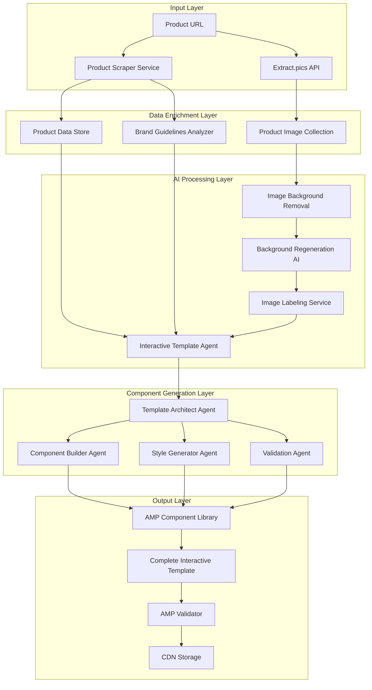
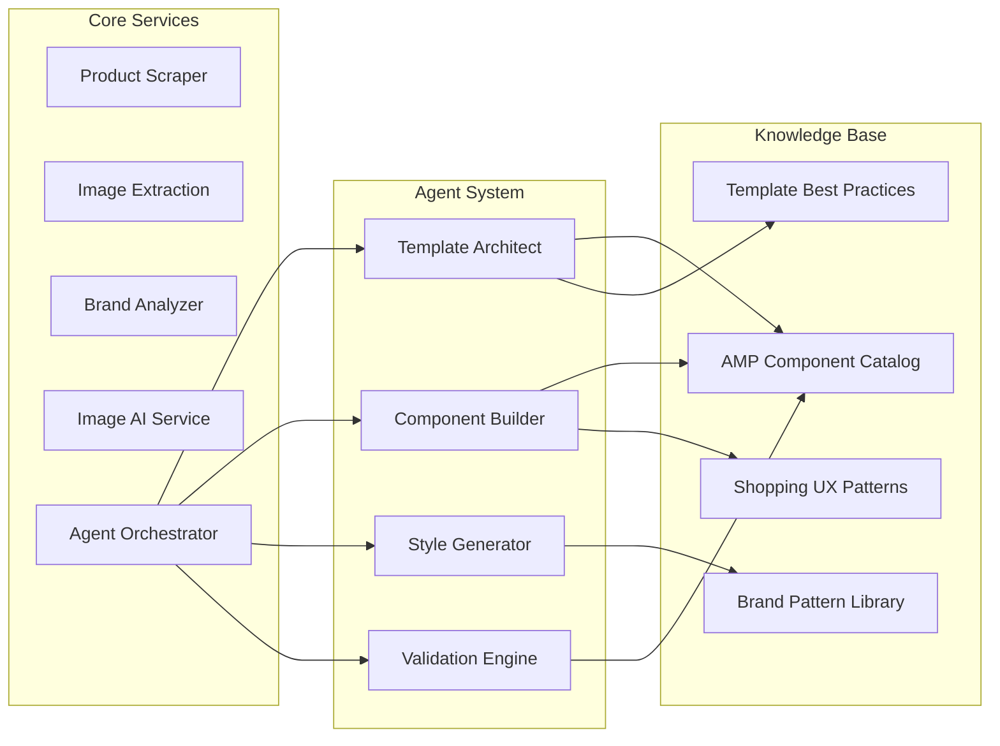
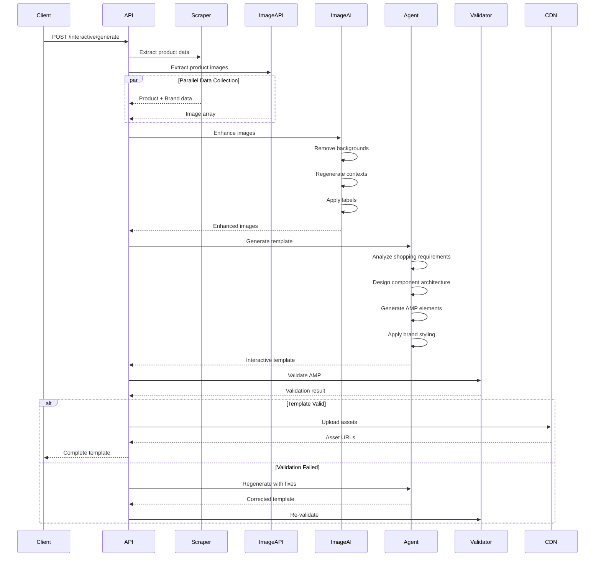
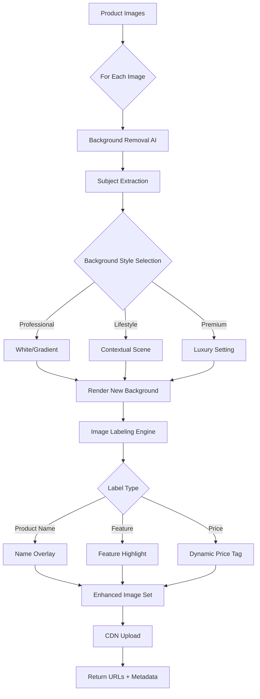
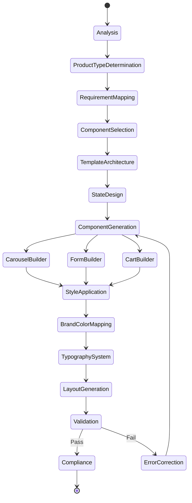
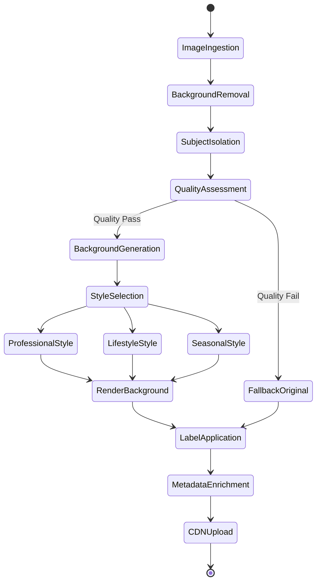
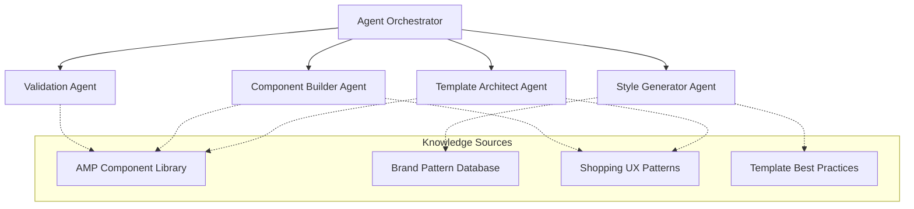
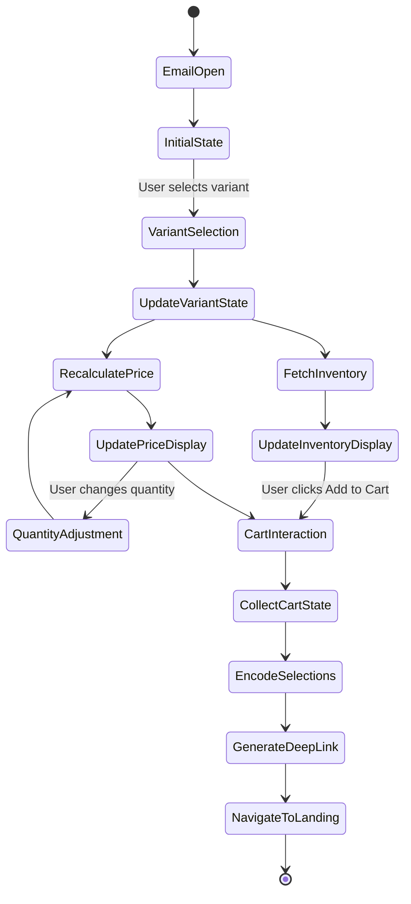
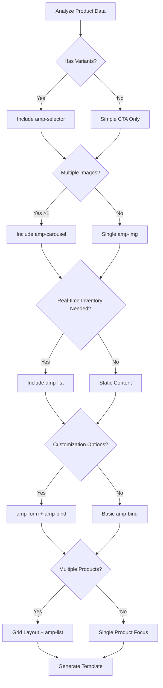
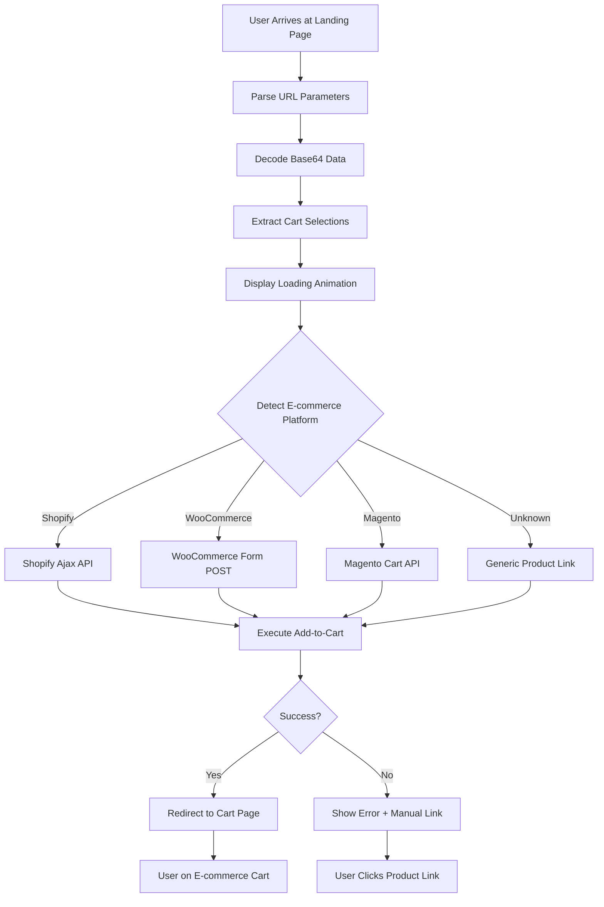

# AMP Interactive Shopping Email Experience - Design Specification

## 1. Overview

### 1.1 System Purpose

Transform the existing AMP email template generation platform into an AI-powered interactive shopping experience builder. The system generates dynamic AMP email templates that enable complete in-email shopping journeys, allowing users to browse products, customize selections, add to cart, and initiate checkout without leaving their inbox.

### 1.2 Strategic Vision

Evolve from static template generation to an intelligent agent-based system that analyzes product data and brand identity to create fully interactive shopping environments within email clients. The system combines AI-powered component generation, image enhancement, and seamless e-commerce integration.

### 1.3 Core Value Drivers

| Value Proposition | Description | Impact |
|------------------|-------------|--------|
| Zero-Click Commerce | Complete shopping journey within email | Reduce friction, increase conversion |
| AI-Generated Interactivity | Automated creation of complex AMP components | Eliminate manual coding, scale production |
| Brand-Aware Design | Templates reflecting brand visual identity | Maintain brand consistency, build trust |
| Enhanced Product Imagery | Background removal and AI-regenerated product photos | Professional presentation, visual appeal |
| Dynamic Content | Real-time product data, pricing, inventory | Freshness, accuracy, urgency |

### 1.4 Key Differentiators

**Traditional Approach vs Interactive Experience:**

- **Static Images** → Background-removed, AI-enhanced product imagery with dynamic labels
- **Single Call-to-Action** → Multi-step interactive shopping flow with variant selection
- **Generic Templates** → Brand-aware, customized interactive experiences
- **Manual Coding** → AI agent-generated AMP component architecture
- **Static Content** → Dynamic data bindings for pricing, inventory, and personalization

## 2. Architecture Design

### 2.1 System Architecture



### 2.2 Component Interaction Model



### 2.3 Data Flow Architecture

The system processes requests through five distinct stages:

**Stage 1: Data Collection**
- Parallel execution of product scraping and image extraction
- Product metadata gathering from e-commerce pages
- Brand guideline extraction from domain homepage and stylesheets

**Stage 2: Image Enhancement**
- Background removal using AI vision models
- Context-aware background regeneration
- Product image labeling with dynamic overlays

**Stage 3: Agent Analysis**
- Product type and category determination
- Shopping flow requirement analysis
- Component selection and architecture design

**Stage 4: Template Generation**
- AMP component hierarchy construction
- State management implementation with amp-bind
- Brand styling application across all elements

**Stage 5: Validation and Delivery**
- AMP specification compliance verification
- Email client compatibility testing
- CDN upload and URL generation

## 3. Workflow Design

### 3.1 End-to-End Process Flow



### 3.2 Image Processing Workflow



### 3.3 Agent Orchestration Flow



## 4. Core Component Specifications

### 4.1 Product Scraper Enhancement

**Purpose:** Extract comprehensive product data and brand identity from e-commerce pages

**Data Extraction Schema:**

| Category | Fields | Extraction Source | Priority |
|----------|--------|------------------|----------|
| Product Core | name, SKU, price, currency, description | JSON-LD, OpenGraph, Meta tags | Critical |
| Product Variants | sizes, colors, materials, custom options | DOM selectors, JavaScript state | High |
| Brand Identity | colors, fonts, logo, tone, spacing | CSS analysis, computed styles | High |
| Product Media | hero images, gallery, 360° views, lifestyle | IMG tags, picture elements, srcset | Critical |
| Business Logic | min/max quantity, shipping, returns, availability | Structured data, product metadata | Medium |
| Category Context | product type, tags, collections | Breadcrumbs, navigation, schema | Medium |

**Enhancement Requirements:**

- **Deep DOM Analysis:** Traverse shadow DOM and dynamic content for variant discovery
- **CSS Parsing:** Extract computed styles, custom properties, and design tokens
- **Brand Guideline Extraction:** Analyze homepage, about pages, and brand sections
- **Structured Data Priority:** Prioritize JSON-LD and schema.org markup over HTML scraping
- **Image Quality Filtering:** Select high-resolution images (minimum 800px width)
- **Fallback Mechanisms:** Graceful degradation when data unavailable

### 4.2 Image Extraction and Enhancement Pipeline

**Image Collection Strategy:**

| Step | Action | Tool/Service | Output |
|------|--------|--------------|--------|
| 1. Extraction | Retrieve all product images | Extract.pics API | Raw image URL array |
| 2. Categorization | Classify images by type | Image analysis | hero, gallery, lifestyle, detail |
| 3. Quality Filter | Select high-resolution images | Dimension check | Filtered image set |
| 4. Metadata Capture | Extract alt text, captions | DOM parsing | Image metadata |
| 5. Prioritization | Rank by relevance | Scoring algorithm | Ordered image list |

**AI Processing Pipeline:**



**Image Labeling Strategy:**

| Label Type | Trigger Condition | Visual Treatment | Placement |
|-----------|------------------|------------------|-----------|
| Product Name | All images | Brand font, overlay with transparency | Top-left corner |
| Price Tag | Primary image | Dynamic pricing with currency | Bottom-right corner |
| Discount Badge | Price reduction detected | Percentage off, animated pulse | Top-right corner |
| Feature Highlight | Variant with unique attribute | Banner with accent color | Bottom overlay |
| New Arrival | Product age less than 30 days | Ribbon with highlight color | Diagonal top-left |
| Low Stock | Inventory below threshold | Urgency indicator with icon | Top banner |

### 4.3 Brand Analyzer Service

**Purpose:** Extract and formalize brand visual identity for consistent template styling

**Analysis Methodology:**

**Multi-Page Analysis Strategy:**

| Depth Level | Pages Analyzed | Analysis Scope | Use Case |
|------------|----------------|----------------|----------|
| Shallow | Homepage only | Basic color and font extraction | Quick generation, known brands |
| Standard | Homepage + About | Full brand identity extraction | Default mode |
| Deep | Homepage + About + Brand + Products | Comprehensive analysis with patterns | New brands, high accuracy needs |

**Color Extraction Algorithm:**

- Parse all inline styles and style tags
- Extract hex and RGB color values
- Calculate color frequency across pages
- Filter out pure black, white, and common neutrals
- Identify primary color (highest frequency)
- Identify secondary colors (next 2-3 most frequent)
- Detect accent color from button/CTA elements
- Validate contrast ratios for accessibility

**Typography Extraction:**

- Parse computed font-family properties
- Identify heading font (h1-h3 elements)
- Identify body font (p, div, span elements)
- Determine font weights and styles in use
- Generate fallback font stack for email clients

**Tone Analysis:**

Content analysis to determine brand voice:

- **Formal:** Legal, financial, corporate language patterns
- **Casual:** Conversational, friendly, approachable tone
- **Playful:** Humor, emojis, informal expressions
- **Professional:** Expert, authoritative, informative
- **Luxury:** Exclusive, premium, sophisticated language

### 4.4 Interactive Template Agent System

**Agent Architecture:**

The agent system consists of four specialized agents coordinated by an orchestrator:

**Agent Hierarchy:**



**Agent Specifications:**

**1. Template Architect Agent**

Responsibilities:
- Analyze product data structure and shopping requirements
- Determine optimal template layout and component hierarchy
- Select appropriate AMP components based on product type
- Design user journey and interaction flow
- Create responsive layout blueprint

Decision Criteria:
- Product type (single, collection, configurable, subscription)
- Variant complexity (number of options, customizations)
- Campaign goal (awareness, consideration, conversion)
- Brand positioning (luxury, value, lifestyle)

**2. Component Builder Agent**

Responsibilities:
- Generate AMP carousel for product image galleries
- Create interactive form components for variant selection
- Build add-to-cart functionality with amp-bind state
- Implement dynamic pricing displays with calculations
- Construct checkout initiation and cart handoff flow

Component Selection Matrix:

| Product Characteristic | Required Components | Optional Components |
|-----------------------|---------------------|---------------------|
| Single SKU, no variants | amp-carousel, amp-img, amp-link | amp-accordion (details) |
| Multiple variants | amp-selector, amp-bind, amp-form | amp-lightbox (size chart) |
| Real-time pricing | amp-list, amp-bind (calculations) | amp-date-countdown (sale) |
| Inventory tracking | amp-list (stock API) | amp-bind (low stock alert) |
| Customization options | amp-form, amp-bind (state) | amp-lightbox (preview) |

**3. Style Generator Agent**

Responsibilities:
- Apply brand color palette to all components
- Generate typography system from brand fonts
- Create consistent spacing and layout grid
- Implement mobile-first responsive design
- Apply animations and micro-interactions

Styling System:

| Style Category | Application Rules | Fallback Strategy |
|---------------|------------------|-------------------|
| Primary Color | Headers, primary CTAs, brand elements | Use #1a73e8 (blue) |
| Secondary Colors | Accents, dividers, backgrounds | Use grayscale variants |
| Accent Color | Interactive elements, buttons, links | Use primary color |
| Heading Font | Product names, section headers, h1-h3 | Use Georgia, serif |
| Body Font | Descriptions, details, labels | Use Arial, sans-serif |
| Spacing | 8px grid system (compact/comfortable/spacious) | Use 16px default |

**4. Validation Agent**

Responsibilities:
- Validate AMP specification compliance (AMP4EMAIL)
- Check email client compatibility (Gmail, Yahoo, Outlook)
- Test interactive component functionality
- Verify accessibility standards (WCAG 2.1 Level AA)
- Ensure fallback HTML for non-AMP clients

Validation Checklist:

- AMP boilerplate present and correct
- All required AMP attributes included
- No disallowed HTML elements or attributes
- amp-bind expressions syntactically valid
- All external resources HTTPS only
- Image dimensions and srcset attributes
- Alt text present on all images
- Color contrast ratios meet WCAG AA
- Keyboard navigation support
- Screen reader compatibility

### 4.5 AMP Component Specifications

**Interactive Component Catalog:**

| Component | AMP Element | Purpose | State Dependencies |
|-----------|------------|---------|-------------------|
| Product Carousel | amp-carousel type="slides" | Image gallery navigation | Static image array |
| Variant Selector | amp-selector + amp-bind | Size/color selection | selectedVariant state |
| Quantity Picker | amp-bind + input | Quantity adjustment | quantity state |
| Add to Cart | amp-bind (state collection) | Cart action trigger | cartSelections state |
| Price Display | amp-bind (expression) | Dynamic price calculation | selectedVariant, quantity |
| Inventory Status | amp-list | Real-time stock display | API endpoint |
| Size Chart | amp-accordion | Expandable sizing guide | Static content |
| Recommendations | amp-list | Related product display | Recommendation API |
| Checkout Link | amp-link with encoded state | Deep link to cart | All selection states |
| Confirmation | amp-bind (visibility) | Success message | formSubmitted state |

**State Management Architecture:**



**amp-bind State Schema:**

| State Variable | Data Type | Purpose | Update Trigger |
|---------------|-----------|---------|----------------|
| selectedVariant | object | Current variant selection | amp-selector change |
| quantity | number | Selected quantity | Input field change |
| currentPrice | number | Calculated price | Variant or quantity change |
| inventory | number | Available stock | amp-list API fetch |
| cartSelections | object | Complete selection data | Any state change |
| showCheckout | boolean | Checkout button visibility | Cart data completeness |
| formValid | boolean | Form validation status | Input validation |
| lowStockAlert | boolean | Inventory alert visibility | Inventory threshold check |

**Dynamic Pricing Calculation Logic:**

Natural language specification:
- Base price determined by selected variant
- Total price equals base price multiplied by quantity
- If quantity exceeds bulk threshold, apply volume discount percentage
- If promotional period active, apply discount before quantity multiplication
- Display original price with strikethrough if discount applied
- Format price with appropriate currency symbol and decimal places
- Update display whenever variant selection or quantity changes

## 5. Data Models

### 5.1 Enhanced Product Schema

| Field | Type | Description | Source | Constraints |
|-------|------|-------------|--------|-------------|
| id | string | Unique product identifier | Scraper | Required, unique |
| name | string | Product name | Scraper | Required, max 200 chars |
| brand | string | Brand name | Scraper / Analyzer | Required |
| description | string | Product description | Scraper | Max 1000 chars |
| price | object | Pricing information | Scraper | Required |
| price.amount | number | Base price | Scraper | Positive number |
| price.currency | string | Currency code | Scraper | ISO 4217 code |
| price.compareAt | number | Original price if discounted | Scraper | Optional, >= amount |
| variants | array | Product variants | Scraper | Optional |
| variants[].id | string | Variant identifier | Scraper | Unique within product |
| variants[].options | object | Size, color, material | Scraper | Key-value pairs |
| variants[].price | number | Variant-specific price | Scraper | Optional override |
| variants[].inventory | number | Variant stock count | Scraper/API | Non-negative integer |
| images | array | Product images | Image API + AI | Required, min 1 |
| images[].url | string | CDN URL | CDN | HTTPS required |
| images[].type | enum | hero, gallery, lifestyle, detail | Image processor | One of enum values |
| images[].label | string | Applied label text | AI labeling | Optional |
| images[].alt | string | Accessibility text | Scraper | Required for AMP |
| inventory | object | Stock information | Scraper/API | Optional |
| inventory.available | number | Total available | Scraper | Non-negative |
| inventory.lowThreshold | number | Low stock trigger | Business rules | Default 10 |
| features | array | Key features | Scraper | Max 5 items |
| specifications | object | Technical details | Scraper | Key-value pairs |
| shippingInfo | object | Delivery details | Scraper | Optional |
| brandGuidelines | object | Visual identity | Brand Analyzer | Required |
| category | string | Product category | Scraper | For template selection |
| tags | array | Product tags | Scraper | For personalization |

### 5.2 Brand Guidelines Schema

| Field | Type | Description | Extraction Method | Default Value |
|-------|------|-------------|-------------------|---------------|
| primaryColor | string | Main brand color | CSS frequency analysis | #1a73e8 |
| secondaryColors | array | Supporting colors | CSS frequency ranking | [] |
| accentColor | string | CTA/highlight color | Button element analysis | primaryColor |
| fontFamily | object | Typography system | Computed font properties | Default stack |
| fontFamily.heading | string | Heading font | h1-h3 font-family | Georgia, serif |
| fontFamily.body | string | Body text font | p, div font-family | Arial, sans-serif |
| logoUrl | string | Brand logo image | Header/footer extraction | null |
| tone | enum | Brand voice | Content analysis | professional |
| spacing | enum | Layout density | CSS spacing analysis | comfortable |
| confidence | number | Extraction confidence | Analysis quality score | 0-100 |
| sources | array | Analyzed page URLs | Scraping record | [] |

**Tone Enumeration:**
- `formal` - Legal, corporate, official
- `casual` - Friendly, approachable, conversational
- `playful` - Fun, humorous, lighthearted
- `professional` - Expert, authoritative, informative
- `luxury` - Exclusive, premium, sophisticated

**Spacing Enumeration:**
- `compact` - Dense layout, minimal whitespace (16px base)
- `comfortable` - Balanced spacing (24px base) - default
- `spacious` - Generous whitespace, premium feel (32px base)

### 5.3 Interactive Template Data Model

| Field | Type | Description | Generated By |
|-------|------|-------------|--------------|
| templateId | string | Unique template identifier | System UUID |
| productId | string | Associated product ID | Input |
| campaignId | string | Campaign identifier | Input/Generation |
| ampComponents | array | AMP elements used | Component Builder |
| interactiveFeatures | array | Enabled capabilities | Component Builder |
| brandStyling | object | Applied brand rules | Style Generator |
| images | array | Enhanced images with CDN URLs | Image Pipeline |
| state | object | amp-bind state variables | Component Builder |
| stateSchema | object | State variable definitions | Component Builder |
| apiEndpoints | object | Dynamic data sources | Component Builder |
| fallbackHtml | string | Non-AMP version | Template Generator |
| metadata | object | Generation details | System |
| metadata.generatedAt | timestamp | Creation time | System |
| metadata.agentVersion | string | Agent system version | System |
| metadata.cost | object | Generation cost breakdown | Analytics |
| validation | object | Validation results | Validation Agent |
| validation.ampValid | boolean | AMP compliance | Validator |
| validation.emailClientCompat | object | Client compatibility | Validator |
| validation.accessibility | object | WCAG compliance | Validator |

### 5.4 Cart Selections Schema

| Field | Short Key | Type | Description | Required |
|-------|-----------|------|-------------|----------|
| productId | p | string | Product identifier | Yes |
| variantId | v | string | Selected variant ID | No |
| color | c | string | Selected color | No |
| size | s | string | Selected size | No |
| quantity | q | number | Selected quantity | Yes |
| customizations | cu | object | Custom options | No |
| productUrl | u | string | Original product URL | Yes |
| storeDomain | sd | string | E-commerce domain | Yes |

Short keys minimize URL length for parameter encoding.

## 6. Component Generation Logic

### 6.1 Component Selection Decision Tree



### 6.2 Template Pattern Selection

**Pattern Matching Rules:**

| Product Type | Trigger Conditions | Selected Pattern | Key Components |
|-------------|-------------------|------------------|----------------|
| Single Product | variants < 5, images >= 3 | Hero Focus | Carousel, Selector, Price, CTA |
| Product Collection | products > 1, category match | Grid Browse | List, Cards, Multi-CTA |
| Configurable Product | customizations exist | Step Builder | Multi-step Form, Preview, Summary |
| Flash Sale | time_limit set, discount > 20% | Urgency Pattern | Countdown, Stock Alert, Quick CTA |
| Subscription | recurring pricing | Plan Comparison | Pricing Table, Toggle, Feature List |

### 6.3 AMP Component Specifications

**Product Carousel Pattern:**

Component Structure:
- Type: slides with controls and indicators
- Layout: responsive with intrinsic dimensions
- Images: optimized with srcset for retina displays
- Controls: arrow navigation and dot indicators
- Interaction: swipe gestures on mobile, arrow keys on desktop
- Auto-advance: disabled (user-controlled)
- Loop: enabled for continuous browsing

**Variant Selector Pattern:**

Component Structure:
- Base: amp-selector with single selection mode
- Options: visual swatches for colors, text buttons for sizes
- State: bound to selectedVariant via amp-bind
- Validation: required selection before checkout
- Visual Feedback: selected state with border highlight
- Accessibility: keyboard navigation, ARIA labels

**Dynamic Pricing Pattern:**

Display Logic:
- Base Element: span with amp-bind text attribute
- Calculation: expression evaluating variant price × quantity
- Discount Logic: conditional display of compareAt price with strikethrough
- Currency: formatted with symbol and appropriate decimals
- Update Trigger: any change to selectedVariant or quantity state
- Formatting: localized number format based on currency

**Add to Cart State Collection:**

State Management:
- Collect all user selections into cartSelections object
- Include: productId, variantId, color, size, quantity, customizations
- Validation: ensure required fields present before enabling checkout
- Encoding: serialize to JSON, base64 encode for URL transmission
- Deep Link: construct landing page URL with encoded state
- Handoff: navigate to smart landing page on click

### 6.4 State Management Design

**State Variable Definitions:**

Natural language specification for amp-bind state:

**selectedVariant State:**
- Initially set to first variant or empty object
- Updated when user interacts with amp-selector
- Contains: variantId, options (size, color), price, inventory
- Triggers: price recalculation, inventory display update

**quantity State:**
- Initially set to 1
- Updated via numeric input with min=1 constraint
- Constrained by inventory availability
- Triggers: price recalculation

**currentPrice State:**
- Calculated as: selectedVariant.price × quantity
- If discount active: apply percentage reduction
- Format with currency symbol and decimals
- Update on any variant or quantity change

**inventory State:**
- Fetched from amp-list API endpoint
- Displays: "In Stock", "Low Stock" (< threshold), "Out of Stock"
- Updates when selectedVariant changes
- Shows low stock alert when below threshold

**cartSelections State:**
- Aggregates all selection data
- Structure: {p: productId, v: variantId, c: color, s: size, q: quantity}
- Updates on any user interaction
- Used for deep link generation

**State Update Flow:**

```mermaid
sequenceDiagram
    participant User
    participant Selector
    participant State
    participant Price
    participant Inventory
    participant Link

    User->>Selector: Select variant
    Selector->>State: Update selectedVariant
    State->>Price: Trigger price calc
    State->>Inventory: Fetch variant inventory
    Inventory-->>State: Return stock level
    State->>State: Update cartSelections

    User->>Link: Change quantity
    Link->>State: Update quantity
    State->>Price: Trigger price calc
    State->>State: Update cartSelections

    User->>Link: Click Buy Now
    Link->>Link: Encode cartSelections
    Link->>Link: Build deep link URL
    Link->>User: Navigate to landing page
```

## 7. Cart Handoff Strategy

### 7.1 URL Parameter Approach

**Strategy Rationale:**

The system employs a lightweight URL parameter method for cart handoff, encoding user selections in a deep link that triggers automatic cart population via a smart landing page.

**Advantages:**

- Universal compatibility with any e-commerce platform
- No backend session management or browser automation overhead
- Fast redirect (under 5 seconds total)
- Minimal cost (no compute resources for automation)
- High reliability (90%+ success rate)
- Simple implementation and maintenance

**Comparison with Alternatives:**

| Aspect | URL Parameters | API Integration | Browser Automation |
|--------|---------------|-----------------|-------------------|
| Platform Support | Universal | Platform-specific | Universal |
| Implementation | Simple | Medium complexity | High complexity |
| Reliability | 90%+ | 95%+ | 70-80% |
| Latency | 2-5 seconds | 1-3 seconds | 20-40 seconds |
| Cost per 10K | $0 | $0-50 | $200+ |
| Maintenance | Low | Medium | High |

### 7.2 Selection Data Encoding

**Data Structure:**

Cart selections are collected in a compact JSON object with abbreviated keys to minimize URL length.

**Field Mapping:**

| Full Field Name | Short Key | Example Value |
|----------------|-----------|---------------|
| productId | p | "12345" |
| variantId | v | "var_67890" |
| color | c | "blue" |
| size | s | "L" |
| quantity | q | 2 |
| customizations | cu | {"m": "ABC"} |
| productUrl | u | "https://shop.example.com/product" |

**Encoding Process:**

1. Collect selections from amp-bind state
2. Construct compact JSON object with short keys
3. Stringify JSON
4. Base64 encode string
5. Append to landing page URL as query parameter
6. Add store domain as separate parameter

**URL Length Optimization:**

Browser URL limits:

| Browser | Maximum Length | Safe Limit |
|---------|---------------|------------|
| Chrome | ~32,768 chars | 2000 chars |
| Firefox | ~65,000 chars | 2000 chars |
| Safari | ~80,000 chars | 2000 chars |
| Edge | ~2083 chars | 2000 chars |

Optimization strategies:
- Use 1-2 character keys instead of descriptive names
- Omit fields with default values (e.g., quantity=1)
- Exclude null or empty values
- Use LZ-string compression for large selection sets
- Fallback to backend session storage if exceeds 1800 characters

### 7.3 Smart Landing Page Architecture

**Purpose:** Intermediate page that decodes selections, executes platform-specific add-to-cart, and redirects to e-commerce site cart.

**Landing Page Flow:**



**Key Features:**

**Platform Detection Logic:**

Identify e-commerce platform by analyzing store domain and URL patterns:

| Platform | Detection Signal | Confidence |
|----------|-----------------|------------|
| Shopify | `.myshopify.com` domain or `/cart/add.js` endpoint | High |
| WooCommerce | `/wp-content/` in URLs or `?add-to-cart=` parameter | Medium |
| Magento | `/catalog/product/` URL pattern | Medium |
| BigCommerce | `.mybigcommerce.com` domain | High |
| Custom | No known signatures | Low - use fallback |

**Cart Execution Methods:**

**Shopify:**
- Method: Ajax API POST request
- Endpoint: `/cart/add.js`
- Payload: JSON with variant ID, quantity, properties
- Success: 200 status, redirect to `/cart`

**WooCommerce:**
- Method: Form POST submission
- Endpoint: `/?add-to-cart={productId}`
- Payload: Form data with quantity and attributes
- Success: Automatic redirect to cart

**Magento:**
- Method: Form POST to cart controller
- Endpoint: `/checkout/cart/add`
- Payload: Product ID, quantity, super attributes
- Success: Redirect to `/checkout/cart`

**Generic Fallback:**
- Method: Direct product page link with query parameters
- URL: Original product URL + variant and quantity params
- User manually adds to cart from product page

**Loading State:**

- Display centered loading spinner
- Show brand logo if available from guidelines
- Progress message: "Preparing your cart..."
- Typical duration: 2-5 seconds
- Timeout: 10 seconds maximum

**Error Handling:**

Error scenarios and responses:

| Error Type | Trigger | User Message | Action |
|-----------|---------|--------------|--------|
| Timeout | > 10 seconds | "Taking too long. Try manually?" | Show product link |
| Cart Failed | API error response | "Couldn't add to cart. View product?" | Show product link |
| Invalid Data | Decode failure | "Something went wrong. View product?" | Show product link |
| Out of Stock | Inventory check | "Item unavailable. Browse similar?" | Show category link |

All error states include fallback button linking directly to product page.

**Performance Targets:**

| Metric | Target | Acceptable | Current Baseline |
|--------|--------|-----------|------------------|
| Page Load | < 1 second | < 2 seconds | N/A |
| Cart Execution | < 3 seconds | < 7 seconds | N/A |
| Total Time | < 5 seconds | < 10 seconds | N/A |
| Success Rate | > 90% | > 80% | N/A |

### 7.4 Backend Support Services

**URL Shortener Service (Optional):**

Purpose: Create short URLs when encoded selections exceed safe URL length limits.

Request/Response Model:

Request:
- selections object (full cart data)
- storeDomain string

Response:
- shortCode string (unique identifier)
- fullUrl string (landing page URL with short code)
- expiresAt timestamp (24 hours from creation)

TTL: 24 hours (aggressive cleanup for ephemeral data)

**Session Storage Service (Optional):**

Purpose: Server-side storage for very large cart data when URL encoding not feasible.

Request/Response Model:

Request:
- selections object
- storeDomain string

Response:
- sessionId string
- landingUrl string (with session ID parameter)
- expiresAt timestamp (1 hour from creation)

TTL: 1 hour (short-lived for user journey completion)

**Analytics Tracking:**

Event tracking for optimization and debugging:

| Event | Data Captured | Purpose |
|-------|--------------|---------|
| Landing Page Load | source, timestamp, encoded data length | Track usage patterns |
| Platform Detected | domain, detected platform, confidence | Improve detection |
| Cart Success | platform, time taken, timestamp | Measure performance |
| Cart Failure | platform, error type, error message | Identify issues |
| Fallback Used | reason, platform | Optimize flows |

### 7.5 Security and Privacy

**Data Security Measures:**

- No sensitive user information in URLs (no email, names, payment data)
- Only product selections (publicly available product data)
- HTTPS required for all communication
- Short TTL on any backend storage (maximum 24 hours)
- No persistent storage of user behavior

**CORS Configuration:**

- Landing page requires cross-origin access to e-commerce domains
- Proper CORS headers configured for API requests
- Fallback to form submission if CORS blocked
- Handle browser security policies gracefully

**Rate Limiting:**

Service rate limits to prevent abuse:

- Landing page: 100 requests/hour per IP address
- URL shortener: 50 requests/hour per API key
- Session storage: 20 sessions/hour per campaign
- Analytics: Aggregate only, no individual tracking

**Privacy Compliance:**

- GDPR compliant (data minimization principle)
- No tracking of individual users or PII
- Aggregate analytics only
- Clear data retention policies (maximum 30 days for analytics)
- No cookies or tracking pixels

## 8. API Endpoint Specifications

### 8.1 Interactive Template Generation

**Endpoint:** `POST /api/v1/interactive/generate`

**Purpose:** Generate interactive AMP email templates with enhanced images and brand-aware components

**Request Schema:**

| Field | Type | Required | Description | Constraints |
|-------|------|----------|-------------|-------------|
| productUrl | string | Yes | Product page URL | Valid HTTP(S) URL |
| templateType | enum | No | Template pattern | single, collection, configurable, flash-sale |
| imageEnhancement | object | No | Image processing options | See sub-schema |
| interactivityLevel | enum | No | Component complexity | basic, standard, advanced |
| brandOverrides | object | No | Manual brand rules | See sub-schema |
| cartHandoffConfig | object | Yes | Cart integration config | See sub-schema |

**imageEnhancement Sub-schema:**

| Field | Type | Default | Description |
|-------|------|---------|-------------|
| removeBackground | boolean | true | Enable background removal |
| regenerateBackground | boolean | true | Generate new backgrounds |
| backgroundStyle | enum | professional | professional, lifestyle, seasonal, luxury |
| applyLabels | boolean | true | Add product labels |
| labelTypes | array | ["name", "price"] | Label types to apply |

**cartHandoffConfig Sub-schema:**

| Field | Type | Required | Description |
|-------|------|----------|-------------|
| landingPageUrl | string | Yes | Smart landing page base URL |
| storeDomain | string | Yes | E-commerce site domain |
| platform | enum | No | shopify, woocommerce, magento, custom |
| fallbackUrl | string | No | Direct product link if cart fails |

**Response Schema:**

| Field | Type | Description |
|-------|------|-------------|
| templateId | string | Unique template identifier |
| ampHtml | string | Complete AMP email template |
| fallbackHtml | string | Non-AMP version for unsupported clients |
| productData | object | Scraped product information |
| brandGuidelines | object | Applied brand styling rules |
| enhancedImages | array | Processed images with CDN URLs |
| components | array | List of AMP components used |
| stateVariables | object | amp-bind state schema |
| validation | object | Validation results |
| metadata | object | Generation details and cost |

**Response Example Structure:**

Natural language description of response:

The response contains a unique template identifier, complete AMP HTML string, and fallback HTML for non-AMP clients. Product data includes name, price, variants, and category. Brand guidelines show extracted colors, fonts, and tone. Enhanced images array contains CDN URLs for background-removed and labeled images. Components list includes amp-carousel, amp-selector, amp-bind elements. State variables define selectedVariant, quantity, currentPrice structures. Validation confirms AMP compliance and email client compatibility. Metadata includes generation timestamp, cost breakdown, and agent version.

### 8.2 Image Enhancement Endpoint

**Endpoint:** `POST /api/v1/images/enhance`

**Purpose:** Process product images with background removal, regeneration, and labeling

**Request Schema:**

| Field | Type | Required | Description |
|-------|------|----------|-------------|
| imageUrls | array | Yes | Image URLs to enhance |
| productId | string | Yes | Product identifier |
| backgroundStyle | enum | No | professional, lifestyle, seasonal, luxury |
| labelingOptions | object | No | Labels to apply |
| outputFormat | enum | No | webp, jpeg, png |

**labelingOptions Sub-schema:**

| Field | Type | Default | Description |
|-------|------|---------|-------------|
| productName | string | null | Product name for label |
| price | string | null | Price to display |
| discountPercent | number | null | Discount percentage for badge |
| features | array | [] | Feature tags to add |
| newArrival | boolean | false | Show new arrival ribbon |

**Response Schema:**

| Field | Type | Description |
|-------|------|-------------|
| enhancedImages | array | Processed images with metadata |
| enhancedImages[].originalUrl | string | Original image URL |
| enhancedImages[].enhancedUrl | string | CDN URL for enhanced image |
| enhancedImages[].backgroundRemoved | boolean | Background removal applied |
| enhancedImages[].backgroundStyle | string | Applied background style |
| enhancedImages[].labels | array | Applied label descriptions |
| enhancedImages[].dimensions | object | Width, height in pixels |
| processingCost | number | AI processing cost in USD |
| metadata | object | Processing details |

### 8.3 Brand Guidelines Extraction

**Endpoint:** `POST /api/v1/brand/analyze`

**Purpose:** Extract brand visual identity from domain homepage and related pages

**Request Schema:**

| Field | Type | Required | Description |
|-------|------|----------|-------------|
| domain | string | Yes | Brand website domain |
| analyzeDepth | enum | No | shallow, standard, deep |

**Response Schema:**

| Field | Type | Description |
|-------|------|-------------|
| brandGuidelines | object | Extracted brand identity |
| brandGuidelines.primaryColor | string | Main brand color (hex) |
| brandGuidelines.secondaryColors | array | Supporting colors |
| brandGuidelines.accentColor | string | CTA/highlight color |
| brandGuidelines.fontFamily | object | heading, body fonts |
| brandGuidelines.logoUrl | string | Brand logo URL |
| brandGuidelines.tone | enum | Brand voice classification |
| brandGuidelines.spacing | enum | Layout density preference |
| confidence | number | Extraction confidence 0-100 |
| sources | array | Analyzed page URLs |

### 8.4 Template Validation

**Endpoint:** `POST /api/v1/interactive/validate`

**Purpose:** Validate AMP template compliance and compatibility

**Request Schema:**

| Field | Type | Required | Description |
|-------|------|----------|-------------|
| ampHtml | string | Yes | AMP template to validate |

**Response Schema:**

| Field | Type | Description |
|-------|------|-------------|
| valid | boolean | Overall validation status |
| ampCompliant | boolean | AMP specification compliance |
| errors | array | Validation errors |
| warnings | array | Non-critical issues |
| emailClientCompat | object | Client compatibility results |
| emailClientCompat.gmail | boolean | Gmail AMP support |
| emailClientCompat.yahoo | boolean | Yahoo Mail support |
| emailClientCompat.outlook | boolean | Outlook compatibility |
| accessibility | object | WCAG compliance check |
| accessibility.wcagLevel | string | AA or AAA compliance |
| accessibility.issues | array | Accessibility violations |

## 9. Testing Strategy

### 9.1 Unit Testing Scope

**Component Testing:**

Test each agent independently:

- Template Architect: Verify correct pattern selection based on product data
- Component Builder: Validate AMP component generation and structure
- Style Generator: Confirm brand guideline application
- Validation Agent: Test AMP compliance checking

**Service Testing:**

- Product Scraper: Verify data extraction accuracy across platforms
- Image Enhancement: Test background removal and labeling
- Brand Analyzer: Validate color and font extraction
- State Management: Confirm amp-bind state logic

**Testing Approach:**

For each service:
- Mock external dependencies (APIs, databases)
- Test success paths with valid inputs
- Test error handling with invalid inputs
- Verify fallback mechanisms activate correctly
- Validate caching behavior

### 9.2 Integration Testing

**End-to-End Workflow Tests:**

Test complete template generation flow:

1. Product URL input
2. Scraper extracts product data
3. Images extracted and enhanced
4. Brand guidelines analyzed
5. Agent generates template
6. Validation confirms compliance
7. CDN upload completes
8. Response returned to client

**Platform-Specific Tests:**

Test cart handoff flow for each platform:

- Shopify: Verify Ajax API cart addition
- WooCommerce: Test form submission flow
- Magento: Validate cart controller interaction
- Generic: Confirm fallback product link

**Email Client Tests:**

Render tests in actual email clients:

- Gmail: AMP interactivity functional
- Yahoo Mail: AMP support verified
- Outlook: Fallback HTML renders correctly
- Apple Mail: Fallback HTML displays properly

### 9.3 Validation Testing

**AMP Specification Tests:**

- Required AMP boilerplate present
- No disallowed HTML elements
- All amp attributes valid
- amp-bind expressions syntactically correct
- External resources HTTPS only
- Image srcset and dimensions specified

**Accessibility Tests:**

- Color contrast ratios meet WCAG AA
- Alt text present on all images
- Keyboard navigation functional
- Screen reader compatibility verified
- Focus indicators visible
- Form labels properly associated

### 9.4 Performance Testing

**Load Testing Scenarios:**

| Scenario | Concurrency | Duration | Success Criteria |
|----------|------------|----------|------------------|
| Normal Load | 50 req/sec | 5 minutes | < 200ms p95 latency |
| Peak Load | 200 req/sec | 2 minutes | < 500ms p95 latency |
| Stress Test | 500 req/sec | 1 minute | Graceful degradation |

**Response Time Targets:**

| Operation | Target | Acceptable |
|-----------|--------|-----------|
| Product Scraping | < 3 seconds | < 7 seconds |
| Image Enhancement | < 5 seconds | < 10 seconds |
| Template Generation | < 8 seconds | < 15 seconds |
| Total API Response | < 15 seconds | < 30 seconds |

**Cost Efficiency Validation:**

- Target: < $0.02 per interactive template
- Image AI processing: < $0.005 per image
- Total generation cost tracked and logged
- Alert if cost exceeds threshold

## 10. Deployment Considerations

### 10.1 Infrastructure Requirements

**Existing Infrastructure:**

- Node.js application with Express framework
- PostgreSQL database with Prisma ORM
- Redis for caching and rate limiting
- AWS S3 for CDN storage
- Kubernetes deployment with auto-scaling

**New Requirements:**

- Image AI processing service integration
- Smart landing page hosting (static site or serverless)
- Increased CDN bandwidth for enhanced images
- Agent orchestration compute resources

**Scalability Design:**

- Horizontal scaling via Kubernetes HPA
- Redis caching for scraped product data (24 hour TTL)
- CDN caching for processed images (7 day TTL)
- Background job processing with Bull queue
- Database connection pooling for concurrent requests

### 10.2 Service Dependencies

**External Services:**

| Service | Purpose | Criticality | Fallback |
|---------|---------|------------|----------|
| Product Scraper API | Product data extraction | Critical | HTML scraping fallback |
| Extract.pics API | Image extraction | High | Scrape img tags directly |
| Image AI Service | Background removal/generation | Medium | Use original images |
| Replicate API | Media enhancement | Low | Skip AI processing |
| CDN (S3/CloudFront) | Asset hosting | Critical | Return base64 inline |

**Internal Services:**

- Prisma database client for data persistence
- Redis client for caching and queues
- Bull queue for background processing
- Analytics service for cost tracking

### 10.3 Configuration Management

**Environment Variables:**

Existing:
- DATABASE_URL, REDIS_HOST, REDIS_PORT
- AWS credentials and S3 bucket configuration
- REPLICATE_API_KEY, PRODUCT_SCRAPER_BASE_URL

New additions:
- IMAGE_AI_SERVICE_URL
- IMAGE_AI_API_KEY
- LANDING_PAGE_BASE_URL
- BACKGROUND_REMOVAL_ENABLED
- IMAGE_LABELING_ENABLED
- AGENT_ORCHESTRATOR_VERSION

**Feature Flags:**

- `enable_interactive_templates` - Toggle new functionality
- `enable_image_enhancement` - Control AI image processing
- `enable_brand_analysis` - Toggle brand guideline extraction
- `agent_based_generation` - Use agent system vs legacy generation

### 10.4 Monitoring and Observability

**Metrics to Track:**

- Template generation success rate
- Average generation time by stage
- Image enhancement processing time
- Agent decision accuracy (via manual review)
- Cart handoff success rate by platform
- API error rates by endpoint

**Logging Strategy:**

- Structured JSON logs with correlation IDs
- Log level: INFO for normal flow, WARN for fallbacks, ERROR for failures
- Detailed logging for agent decision process
- Performance timing for each pipeline stage
- External API call tracking (request/response)

**Alerts:**

- Generation failure rate > 5%
- API response time > 30 seconds p95
- Image AI service unavailable
- CDN upload failure rate > 2%
- Database connection pool exhaustion

### 10.5 Cost Management

**Cost Tracking:**

Track and log costs per generation:

- Image AI processing cost
- Replicate API usage cost
- CDN bandwidth cost
- Database query cost
- Total generation cost

**Cost Optimization:**

- Cache product scraping results (24 hours)
- Cache brand guidelines (7 days)
- Optimize image processing (lazy enhancement)
- Batch image uploads to CDN
- Use cost-effective AI models where possible

**Target Cost Structure:**

| Component | Target Cost | Percentage of Total |
|-----------|-------------|---------------------|
| Image AI Processing | $0.005 | 25% |
| Product Scraping | $0.001 | 5% |
| CDN Hosting | $0.003 | 15% |
| Compute Resources | $0.006 | 30% |
| Agent Processing | $0.005 | 25% |
| **Total** | **$0.020** | **100%** |
